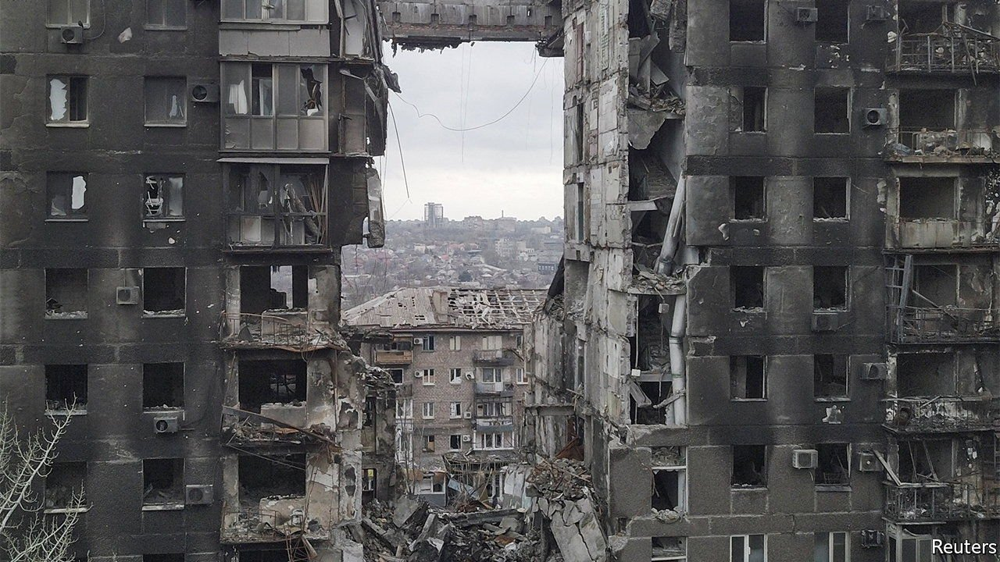
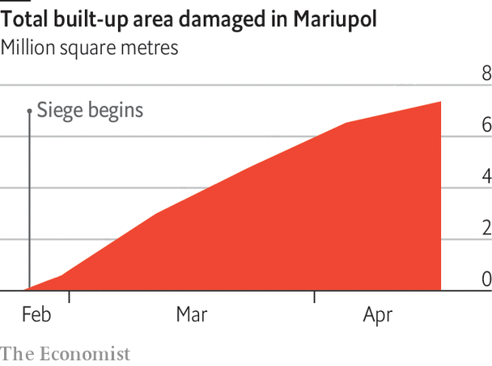

###### Scorched earth

# Nearly half of Mariupol has suffered grave damage 

##### Satellite images show that 90% of ruined buildings were residential 

 

> Apr 23rd 2022 


After failing to conquer Ukraine’s capital, Russia has sent the bulk of its forces to the country’s east. If its army assaults the full Donbas region in the way it has attacked Mariupol, Ukraine’s most-bombarded city, there may not be much left to “liberate” once the fighting ends. 

 Russia has reduced Mariupol’s defenders to a small garrison in a steelworks. The death toll is unknown, because journalists and aid workers cannot enter the city safely. In contrast, destroyed buildings are visible from space. And satellite data suggest that since the war began, 45% of the city’s built-up area has been gravely damaged. 


 To produce this estimate, we used freely available data from the synthetic-aperture radar (sar) aboard Sentinel-1, a European satellite duo. sar bounces microwaves off the Earth’s surface and measures the energy “echo” when they return. It works 24 hours a day, and is not thwarted by clouds. 

 The strength of the echo depends on the roughness of the reflecting surface. Rubble creates stronger signals than smooth roofs do. It also alters where the returning wave is in its cycle when it reaches the satellite. 

 Because of variation in measurement and atmospheric conditions, sar yields slightly different results each time a satellite flies over a given location, even if there are no changes on the ground. To minimise the impact of these small fluctuations, we used three snapshots for each area: two taken before an attack, and one afterwards. In damaged regions, the third image should differ much more from the first two than the first two do from each other. 


 To test this method’s accuracy, we used a map of part of Mariupol compiled by experts at the un Satellite Centre, who pored over satellite photos taken on March 14th and logged locations where they could visually identify destruction. Based on sar data from mid-March, our model flagged as damaged 92% of the areas marked by the un, and classified as unscathed 85% of places where the un did not find damage. 

 


 Applying this model to all of Mariupol using data from April 17th yields a grim tally. Since early March the share of the city’s footprint that has been severely damaged has risen by an average of 0.8 percentage points per day. It is now 45%, representing some 20,000 buildings throughout the city. Measured by area, industrial sites, such as the steelworks where Ukraine’s last soldiers are holed up, have been the hardest hit. But in terms of sheer numbers, more than 90% of damaged buildings were residential. It is likely that at least a third of Mariupol’s pre-war inhabitants no longer have homes to which they can return. ■


