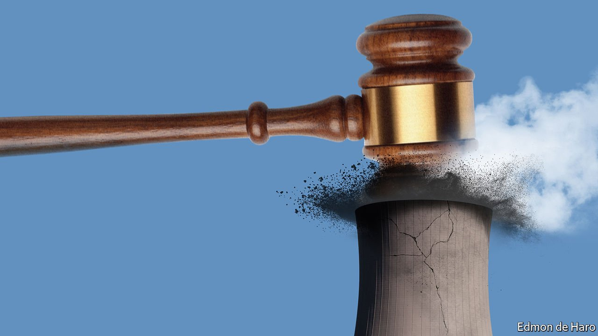

###### Going to court for the climate

# Lawsuits aimed at greenhouse-gas emissions are a growing trend 

##### And better science could make them more precise 

 

> Apr 21st 2022 

I N AUGUST 2018 ClientEarth, an environmental organisation based in London, paid €20 ($23) for ten shares in Enea, a power company based in Poland. The trans action bought the lawyers at Client Earth a tiny stake in Ostroleka C, a one-gigawatt coal-fired power station Enea was about to build 120km north of Warsaw. It also bought them the standing they needed to stop the company from building it.

The lawsuit ClientEarth filed against Enea’s directors a couple of months later alleged that, in pursuing the project, they were failing to act in shareholders’ best interests. Ostroleka C, the lawyers argued, was destined to become a stranded asset: one which, in the increasingly decarbonised world of European electricity generation, would be unable to operate profitably. It therefore presented an “indefensible” financial risk. In July 2019, a judge in Poznan ruled in their favour. Construction was abandoned a few months later. Enea and its partner, Energa, wrote off the 1bn zloty ($250m) invested in it. There will probably never be another coal-fired plant built in Poland.


Lawsuits to fight carbon emissions began to make themselves felt in the mid-2000s. After the Paris agreement of 2015 they reached a new level (see chart). The Sabin Centre for Climate Change Law in New York and the Grantham Research Institute in London collate data on cases which cite climate science, climate policy, emissions reduction or efforts to adapt to the consequences of climate change as a significant factor. More than 1,000 of the 1,951 cases on the Grantham institute’s list were filed post-Paris.

 


This is in part because Paris brought a broader awareness of climate change. But it is also because the 2015 agreement made things actionable in a way that they had not been before. The deal in Paris committed governments to keeping the increase in average global temperature since the 19th century well below 2°C. Climate science allows the greenhouse-gas emissions compatible with that goal to be quantified.

Those two things give imaginative lawyers a lot to work with. And because Paris is a global agreement, they have a lot of venues to work in. The Grantham list includes cases in 41 countries and 13 international or regional courts and tribunals.

There are three reasons the trend is likely to continue. One is that as more countries put their Paris pledges, and the updates to them made in Glasgow last year, into law there are more opportunities for lawyers to pounce. A second is that success breeds success. According to the Grantham data, as of 2021 58% of cases outside America which had been concluded had outcomes favourable to the parties seeking more action on climate. Only 32% of results had been unfavourable.

The third is that more lawyers are getting interested and more activists are trying to interest them. Organisations and individuals fed up with the slow pace of change brought about by political dealmaking and activism on the streets see the courts as a promising new front in the fight against emissions.

Most of the cases to date have been attempts to get governments to live up to what are seen as their commitments. This approach’s most striking success has been in the Netherlands. In November 2013 the Urgenda Foundation, an environmental organisation, and 900 Dutch citizens sued their government on the basis that its emissions targets were too weak to keep the country safe. In December 2019 the Dutch Supreme Court upheld a lower court’s ruling in their favour. The government was ordered to ensure that emissions at the end of 2020 were at least 25% lower than 1990 levels, rather than the 17% it had adopted. The revised target was met—just.

In a review of climate litigation published in July 2021, Joana Setzer and Catherine Higham, who work on climate governance at the Grantham institute, identified 37 subsequent cases that built on Urgenda’s approach in challenging a government’s climate strategy. The approach has had successes in France, Ireland and, most impressively, Germany.

In February 2020 a group of young Germans led by Luisa Neubauer, a climate activist, sued their government for failing to set climate targets that were in line with the Paris agreement goals. A year later the Federal Constitutional Court found in favour of the plaintiffs; it ruled that the government had a duty to protect future generations and that the nation’s emissions budget could not be consumed by one generation at the expense of the next. As a result of the ruling, Germany’s climate-change act was amended to aim for a 65% reduction in greenhouse-gas emissions by 2030, relative to 1990 levels, instead of the 55% previously required.

The Paris agreement was specifically designed not to be binding on America—if it had been, it would have needed ratification by the Senate, something it would not have achieved. But that has not stopped lawsuits alleging that the government is failing to live up to commitments on the climate which plaintiffs claim to find in the country’s constitution. In August 2015, 21 American citizens aged 19 or younger (as well as a plaintiff listed as “Future Generations”) filed Juliana v United States, a suit against the federal government alleging that it had violated their rights to “life, liberty and property” by allowing “dangerous levels” of fossil fuel to be burnt. The case is still ongoing.

As in Poland, so in Japan

If most of the cases to date have been against governments, though, lawsuits against companies associated with large emissions, especially fossil-fuel companies, and the institutions which finance them are multiplying. Sometimes, as with Ostroleka C, these are based on the interests of shareholders; sometimes they are based on damage to the environment or the rights of the public; sometimes they are based on specific harms caused by past emissions or brought about through misinformation. Those involved frequently draw parallels between these cases and the lawsuits which clobbered Big Tobacco in the late 1990s and the class-action suits that bankrupted dozens of companies selling asbestos insulation from the 1960s on.

For ClientEarth and similar organisations the idea is not just to change the behaviour of single companies. They want to mount “strategic” lawsuits designed to change the way that whole industries think. The Enea suit is a case in point. After its Polish success, ClientEarth used similar tools in a campaign against a coal-fired plant that J-Power, a Japanese utility, was building in Ube. It developed a financial-risk assessment and, with Japanese investors, wrote formal letters to the board, as it had done with Enea. “Having established the principle in Europe…the letter in Japan brought a director from the company to me,” says James Thornton, ClientEarth’s CEO. “The end of the meeting, essentially, was him saying ‘I see your point’.” In April 2021 J-Power announced that it was abandoning its plans for the plant, citing competition from renewables.

As the number and diversity of climate lawsuits grows, companies are taking them more seriously. Financial-risk disclosure statements filed annually to America’s Securities and Exchange Commission show that the lawyers and auditors working for some companies increasingly consider climate litigation to pose a material risk. On reviewing statements filed by several fossil-fuel companies between 2014 and 2021, The Economist found that prior to 2016 those which mentioned climate litigation at all made only passing reference to it. Some continue in this vein: ExxonMobil does not explicitly mention climate litigation in any of its filings, despite being a defendant in numerous cases.

Since Paris, though, several big fossil-fuel companies, including Chevron, ConocoPhillips and Shell, have been systematically including climate lawsuits as a potential material risk. Having made scant mention of such litigation previously, in 2016 Chevron listed “private” climate litigation as a “potential” risk. By 2020, the company was referring to a risk of “increased investigations and litigation” related to climate change. Shell’s disclosures refer to climate lawsuits for the first time in 2017. In its 2021 filing it had a paragraph on the various climate lawsuits that had been brought against it, including 21 pending in America as of December 31st 2021. It concluded that there was “a high degree of uncertainty” regarding outcomes, “as well as [the lawsuits’] potential effect on future operations, earnings, cashflows and Shell’s financial condition”.

One of the cases it was referring to was that brought by Milieudefensie, another Dutch environmental organisation, in April 2019. Like the Urgenda case which inspired it, this suit began in The Hague’s district court; it also used some of the same lawyers and arguments. Its thrust was that, like the Dutch government, Shell had a duty of care towards Dutch citizens under the country’s civil code and the European Convention on Human Rights, which guarantees the right to life. By failing to take adequate steps to avoid dangerous climate change, the plaintiffs said, Shell was unlawfully endangering lives.

In May 2021 the court found in favour of the plaintiffs and ordered Shell to reduce its emissions in 2030 by 45% relative to 2019 levels. Remarkably, the 45% cut was not just to the emissions for which the company and its suppliers were directly responsible, but also to those produced when consumers burn Shell’s oil. Shell has appealed. Pending a new decision, though, it must comply. That ruling is widely expected to trigger similar cases elsewhere. Tessa Khan, a climate and human-rights lawyer, says she expects it to do for oil and gas companies what the Urgenda case did for governments.

Dude, where’s my shoreline?

The impact of such litigation extends beyond the fossil-fuel companies being sued. The Network for Greening the Financial System, a group of 114 central banks and financial regulators, deems climate litigation to be a “growing source of risk” above and beyond the legal fees and potential damages to be paid to plaintiffs. Being caught up in a high-profile lawsuit and its associated news cycle can have reputational costs that spill over to others in the same sector. In a report published in November 2021, the NGFS concluded that the risk of litigation should be factored into a company’s credit risk.

It may also affect a company’s value. Dr Setzer and her colleagues are collecting data on the effects that new litigation and judgments have on public companies’ share prices. It would be wrong, though, to assume that the market’s response is always to the company’s disadvantage. Shell’s shares have not fared too badly since the Milieudefensie decision. Mr Thornton likes to point to the fact that Enea ’S share price rose 3.2% the day after the judge ruled against the company on Ostroleka C. That suggests some investors thought the stranded-asset argument was a good one, though others may just have liked the certainty which comes when a problem goes away.

Corporate defendants argue that providing a structure for the transition away from fossil fuels is a matter for policymakers, not judges. Donny Ching, Shell’s legal director, points to the complex trade-offs that are needed in a world where, as the Paris agreement allows, different countries move at different speeds in different sectors. “Leaving [these trade-offs] in the hands of a court, I think, is really oversimplifying it,” he says.

In America, New Zealand and other jurisdictions some judges have agreed and dismissed cases on those grounds. Others have found in favour of the plaintiffs but declared that the fix was outside their remit and bounced the issue back to legislators. The Milieudefensie case, where the judges mandated quantitative emissions-reduction targets, is a notable exception.

Fossil-fuel companies also argue that having a patchwork of legal decisions in different courts and different countries will not add up to a cohesive and effective solution to climate change. Not all judges are convinced, though, that the limitations of any single ruling constitute grounds for inaction. As Germany’s Federal Constitutional Court said when ruling on the Neubauer case, the fact that “no state can resolve the problems of climate change on its own…does not invalidate the national obligation to take climate action.”

Companies are also going to the courts themselves, in America and elsewhere. Early in 2021, after the Dutch government decided to phase out coal by 2030, RWE and Uniper, two German energy companies, sued it for anticipated unfair losses. Three other energy companies have made similar arguments in cases about the pace of decarbonisation requirements in America, Italy and Slovenia. ExxonMobil is using an obscure Texan rule to pursue Californian municipal officers involved in a case against the oil giant which alleges that it participated in climate-misinformation campaigns. The company says the case violates its first-amendment rights.

The past use of misinformation is the basis of a number of other cases. Another source of harm sometimes cited is a company’s failure to adapt to climate change it could have foreseen. Arkema, a chemicals company, was sued over a chemical fire at a Texas plant that spewed toxic smoke for days after hurricane Harvey in 2017: the ultimately unsuccessful lawsuit alleged that it had not properly prepared for the risks of storms and floods, which climate change is exacerbating.

Seeking damages for what has gone before is not a strategic response to future emissions, which is why Ms Khan says she hopes the Milieudefensie ruling will inspire “cases that seek to change business models rather than extract compensation for past harm”. But when it comes to the costs of adapting to damage already on the way, some plaintiffs feel that such compensation could come in very handy.

In 2008, in one of the earlier examples of this approach, the village of Kivalina, precariously located on a stretch of low-lying Alaskan coastline, argued in a suit against more than 20 energy companies that it needed $95m-400m to move the whole settlement somewhere safer. More recently, San Francisco and Oakland sued BP, Chevron, ConocoPhillips, ExxonMobil and Shell in pursuit of funds to help them adapt to future sea level rises.

Fractional culpability

The UN Environment Programme’s finance initiative argues that by making future costs material today such suits could lower the barriers to adaptation. But for that to happen the plaintiffs have to win. So far they have not. Kivalina’s case was thrown out; the California cities’ suit, after bouncing around various lower courts, was sent back to them by America’s Supreme Court in June 2021 . It is likely, though, that some such case will eventually make it to the Supreme Court; oil companies seem to quite like the prospect.

One of the problems with such suits is that, even if a case can be made that climate change has or will produce specific harms, finding someone to blame for them is hard. That is what makes the case against RWE brought by Saúl Luciano Lliuya, a Peruvian farmer and mountain guide, particularly interesting.

 


Mr Luciano Lliuya’s beef is that his property is at risk of being damaged by a dwindling glacier in the mountains above it; a lake fed by the glacier’s meltwater is threatening to break its banks. In 2021, a paper by researchers at Oxford University found that emissions due to human activity were responsible for 85-105% of the 1°C warming in the region since 1880.

At the time that Mr Luciano Lliuya filed his case RWE was Europe’s largest emitter. According to a much cited 2014 report led by Richard Heede, a researcher with the Climate Accountability Institute, an environmental organisation based in Colorado, RWE is one of 90 “carbon majors”: companies that are collectively responsible for 63% of the carbon dioxide and methane emitted between 1751 and 2010. Mr Heede’s analysis lays 0.47% of all historical emissions at RWE’s door. So Mr Luciano Lliuya’s lawyers are suggesting the company should pay 0.47% of what it would cost their client to protect his property. The case was initially dismissed, but in 2017 a German appeals court deemed it admissible. Evidence is currently being gathered for what legal scholars believe will be a landmark test of how well various forms of attribution science hold up in court.

If sophisticated approaches like that in the Oxford study find favour in this case or others, suits seeking money to deal with future harms may leave behind the coastal properties which have dominated the arena to date (rising sea levels are an easy form of damage to attribute to climate change). As temperatures continue to rise and extreme weather events become progressively more extreme, the odds that they were caused by climate change increase. To wit: after temperatures in the Canadian village of Lytton hit a whopping 49.6°C in summer 2021, attribution models suggested it was “virtually impossible” that such an event would have happened in the absence of climate change. The day after the record was set, with temperatures and drought levels still exceptionally high, a wildfire burned Lytton to the ground.

Asked whether that remarkable event has yet been used as the basis of a lawsuit Mr Thornton says he doesn’t know. But, he adds, it's not a bad idea. There are doubtless already lawyers on the case. ■

For more coverage of climate change, register for , our fortnightly newsletter, or visit our 

