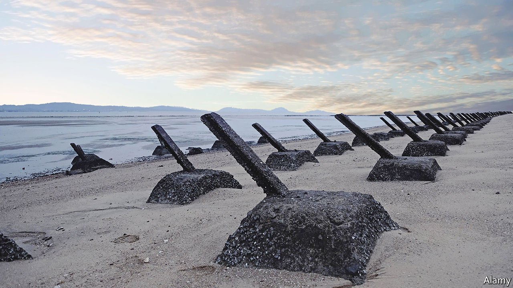

###### How to become a porcupine

# How to deter China from attacking Taiwan 

##### What Taiwan can learn from Ukraine about resisting invasion 

 

> Apr 23rd 2022 

THEY MAY be on the other side of the world, but few are watching the war in Ukraine more intently than the Taiwanese. The battle for survival of a young democracy against a bullying, autocratic neighbour that scorns its right to self-determination could one day be their own. When Xi Jinping and Vladimir Putin, the despotic presidents of China and Russia respectively, say their friendship has “no limits”, Taiwan shudders.

Two obstacles prevent the mainland from forcing “reunification” with Taiwan, which it deems part of Chinese territory, even though the island has had a separate government since 1949. One is the 180km-wide strait of Taiwan. The other is America’s military might. But China is fast building the wherewithal to overcome both. Some American commanders think China might attack before the end of the decade.


An invasion of Taiwan would be a disaster in several ways. It could snuff out one of Asia’s most admirable democracies. Because Taiwan produces the world’s most advanced computer chips, it would wreak havoc in the global economy. Breaching the “first island chain” that girds the mainland from Japan to Malaysia would also grant China’s armed forces unfettered access to the open ocean. That would endanger Japan and overturn the American-made order in the Indo-Pacific.

To prevent such a calamity, Taiwan, America and its allies must act on the (evolving) . The most important lesson is that the threat is real, and it is better to prepare now than to have to improvise in the heat of battle. Ukraine has shown how a stout fighting spirit, brave leadership, a resilient population—and Western arms—can keep at bay a bigger enemy. The better Taiwan prepares, the less likely China is to risk an invasion.

So Taiwan should think harder about defence. Its decision to rely less on conscripts and build a more professional force is a good one. But it should continue to provide military training to all men (and why not women, too?) and create a territorial defence force. It should also increase its military budget, which stands at about 2% of GDP—low for a country in such danger (Israel spends 5.6%). Just as Germany recently has, it should give spending a big boost as a signal of intent. It cannot hope to outspend China, whose defence budget is 20 times larger, or field more soldiers. Instead it will have to concentrate on becoming indigestible.

Luckily Taiwan already has a sound military doctrine to build on, the “Overall Defence Concept”, issued in 2017 but not fully embraced by the top brass. It is a “porcupine” strategy, based on ubiquitous mobile and concealable defensive weapons, especially missiles for use against ships and planes. This would mean giving up at least some of the expensive jets, ships and submarines Taiwan is currently seeking—but many of those are likely to be blown up when the shooting begins anyway.

Such a shift would be a huge gamble. In today’s “grey zone” conflict Taiwan faces constant harassment, such as incursions near its airspace that must be met by a stretched air force. Although Taiwan, as an island, is harder to invade than Ukraine, it is also harder to resupply. It may have to fight alone for weeks or months. And it cannot be certain whether or how soon America would come to its aid. The priority must be to hold out. Look at Ukraine: the longer it has fought, the more help it has received.

America can ease the transition. In return for military reform, it should provide more support. This should include upgrading political and military contacts, selling or giving more weapons, providing overt training and hosting joint exercises. Taiwan has pitifully little experience of operating with friendly forces. America should draw up and rehearse detailed plans—not least with Japan and other allies—to respond to a range of crises, from a naval blockade of Taiwan to an invasion.

All this will infuriate China. That is why President Joe Biden should be careful to maintain “strategic ambiguity”, whereby America helps Taiwan defend itself but does not state clearly that it would go to war with China if it invaded. In the case of Ukraine, in contrast, he has said explicitly that America will not join the fighting for fear of starting “World War III”.


Promising to fight for Taiwan, as some advocate, would do little to deter China, which already assumes America will do so. And such a promise would, at the very least, cause a diplomatic crisis. Better, therefore, to focus on practical steps to sharpen Taiwan’s quills. A year ago this newspaper called Taiwan “the most dangerous place on Earth”. America and Taiwan must encourage China to see it that way, too. ■

Read more of our recent coverage of the 

