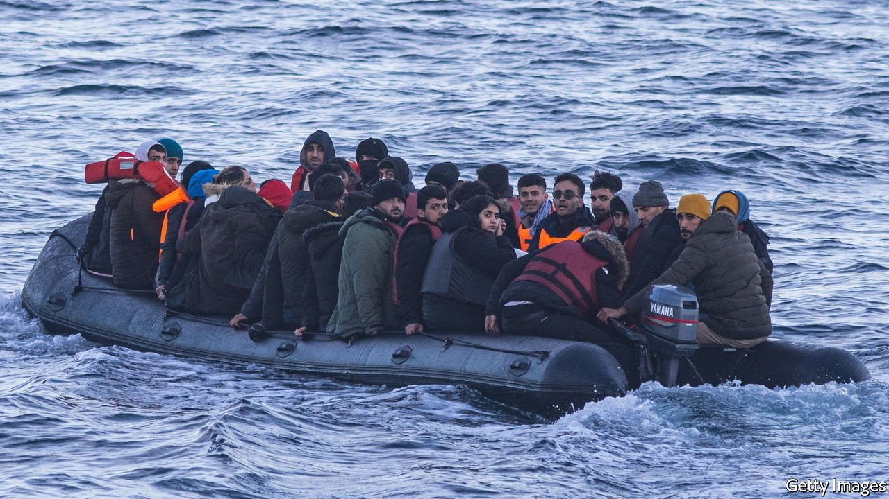

###### Somebody else’s problem

# Shipping asylum-seekers to Rwanda could wreck the Refugee Convention 

##### The fact that Britain's plan could work is what makes it so dangerous 

 

> Apr 23rd 2022 

BRITAIN WAS one of the first countries to ratify the Refugee Convention of 1951, which spelled out countries’ obligations to protect fugitives from persecution who had arrived in their territories and not return them to danger. The convention was “an excellent instrument”, said Selwyn Lloyd, a Conservative minister in the Foreign Office. No country in Europe was doing as much to help refugees, boasted another minister.

The country still leads the world in devising new ways of dealing with refugees. Now, however, Britain is leading in the opposite direction. The Conservative government is perturbed by the growing number of people (some 29,000 last year) who reach Britain in small boats crossing the Channel from France. On April 14th it signed a memorandum of understanding with Rwanda which would allow it to fly asylum-seekers who reach Britain’s shores straight to the African country without listening to their claims. Rwanda, which gets cash as part of the deal, will consider whether to grant them asylum—in Rwanda. They will not be allowed back to Britain.


If the Conservatives pull this off, it will be a perilous new step for the world’s refugee system. Britain is not trying to process asylum claimants offshore, as Australia did when it interned boat people in Nauru and Papua New Guinea. Nor is it trying to push asylum-seekers back to the country they arrived from, as America has done since covid-19 hit (although it will soon relent) and as the European Union has done with Syrians who cross from Turkey to Greece. , regardless of where they came from.

The plans have been attacked by the Labour Party, refugee groups and the Archbishop of Canterbury. Even the most senior civil servant in the Home Office has demurred. None of that will worry the government, which relishes scraps with such softies. And many of their objections are the wrong ones.

Critics claim that the Rwanda scheme will be costly, like Australia’s, and that it may not work as intended. Judges could strike it down. Britain may end up sending so few people to Rwanda that asylum-seekers will not be deterred from crossing the English Channel. But it is not clear that an asylum system ought to be cheap. And if Britain fails to send many asylum-seekers to Rwanda (as has happened with Denmark, which signed a much vaguer deal with the country last year) it will embarrass the British government but no one else.

The much greater danger is that the plan works. If Britain manages to send thousands of asylum-seekers to Africa, others are likely to get the message and not try to come to Britain at all. Few refugees would find Rwanda congenial. Boris Johnson, Britain’s prime minister, calls it “that dynamic country” and “one of the safest...in the world”; his home secretary, Priti Patel, says it has “many, many interests in common” with Britain. Such praise is overblown. Rwanda may be orderly, but it is also extremely poor and has one of Africa’s scariest, most repressive governments. Britain has accurately criticised its human-rights violations in the past, although it may refrain from now on. Dealing with an autocrat messes with your moral compass.

If asylum-seekers steer clear of Britain, other rich democracies will surely wonder why they should adhere strictly to decades-old conventions. They too are likely to start cutting deals to offload their asylum-seekers onto poorer countries, no matter how autocratic. The world will stumble towards a new system for processing refugees, in which money buys immunity from claims. The countries most able to accommodate desperate people will end up doing even less than they do today.

Calais, not Kigali

Some of Mr Johnson’s and Ms Patel’s arguments are right. They correctly observe that the Channel crossing is dangerous and that asylum-seekers must pay smugglers to arrange the journey. The sight of ever more people crammed into dinghies irks voters, who can be generous towards immigrants when a crisis is in the news—witness their enthusiasm for welcoming Hong Kongers and Ukrainians. It is genuinely difficult to balance control of borders and compassion towards refugees.

But if chaos, danger and illegality are the problems, a better solution exists. France has suggested that Britain ought to process asylum claims on French turf. That would create new problems, the greatest of which is that Britain would almost certainly receive more asylum claims than it does now (lacking a moat, France gets twice as many). But it would clean up the mess in the Channel and on the north coast of France, where would-be asylum-seekers wait in awful conditions for a chance to cross. It would entail no soul-sapping deal with an autocrat. And it would uphold the principle that protecting refugees is a shared obligation, not something to buy your way out of. ■

