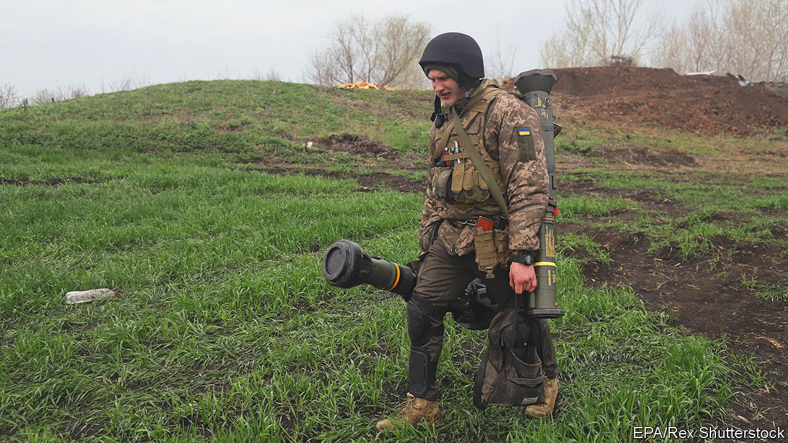

###### Give them the tools

# The West needs to send Ukraine more and better weapons 

##### The next phase of the war may be harder—and just as important 

 

> Apr 23rd 2022 

T HE BATTLE of Kyiv may be over, at least for now, but the battle of Donbas is b. On April 18th Ukraine’s government reported a wave of attacks along a 400km stretch of the front lines, mostly in the Donbas region, parts of which have been under the control of Russian-backed separatists since 2014. Vladimir Putin wants to grab the rest of Donbas, along with other bits of southern and eastern Ukraine. That may not sound as important as the siege of Kyiv, but the consequences of a Russian victory would be almost as bad.

Mr Putin has little to show for his war so far, which has succeeded mainly in killing civilians, mangling his own forces and levelling much of eastern Ukraine. The loss of an untold number of Russian soldiers (more than 20,000, according to the Ukrainians),  and the flagship of Russia’s Black Sea fleet, the , has been humiliating. If the latest push makes headway, Russia’s dictator can claim vindication, while Ukraine will be left divided and disheartened. Russia might then choose to press its advantage, or simply “freeze” the conflict, leaving a devastated Ukraine to slide into dysfunction. Either way, Mr Putin would have prevented Ukraine from becoming the prosperous, pro-Western rebuke to his own rule that he so clearly fears.


It would be rash to assume that Russian forces will be as incompetent in the east as they previously were in the north, around the capital. For a start, they are now attacking from their home territory, not the temporary positions in Belarus they had taken up under the pretence of conducting “exercises”. Their supply lines will be shorter. And they will seek to fight on relatively open terrain where, in contrast to the forests around Kyiv, it will be easier for the invaders to spread out and harder for the defenders to ambush them.

Ukraine needs more help. The Western response so far, particularly that of America, has been remarkable. A steady flow of weapons, especially portable anti-tank and anti-aircraft missiles, made a huge difference in the defence of Kyiv. But to hold the Russians back along a long front, let alone force them to retreat from the territory seized since the war began on February 24th, will take heavier weapons too: tanks, planes, artillery and an abundant supply of ammunition to go with them.

This is not a simple matter. Ukrainian forces use mainly Soviet-era weaponry. In the short term, they need more of it: things like Mi G fighter jets and T-72 tanks, as well as S-300 missiles and Gvozdika howitzers. NATO countries that used to be Soviet satellites, such as the Czech Republic, Poland and Slovakia, have stocks of such kit, and have given Ukraine some of it. They should hand over more. But it will soon run out, and cannot be replenished, so the West needs to start supplying the more modern armaments used by most NATO countries, and training Ukrainian soldiers to use them. This week America, Britain and Canada said they would provide Ukraine with heavy artillery—a step in the right direction.

The good news is that NATO’s supply lines into Ukraine, mainly from Poland, are now well established. So far, Russia has not found an effective way to disrupt them. If the weapons continue to flow and the war grinds on, Russia’s economy, only around the size of Spain’s even before the war began and economic sanctions were imposed, will not be able to keep supplying weapons on the same scale that NATO can. If Mr Putin is to be defeated, and Ukraine allowed to determine its own future, it is not just the Ukrainian soldiers in Donbas, currently being pummelled by Russian jets, missiles and artillery, who will have to keep their nerve. NATO must be steadfast, too. ■

Read more of our recent coverage of the 

