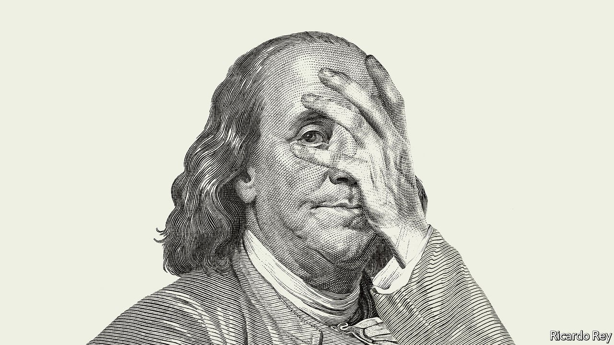

###### The Fed that failed

# Why the Federal Reserve has made a historic mistake on inflation 

##### What comes next will set the path for the world economy 

 

> Apr 23rd 2022 

It is the Fed, however, that had the tools to stop inflation and failed to use them in time. The result is the worst overheating in a big and rich economy in the 30-year era of inflation-targeting central banks. The good news is that inflation may have peaked at last. But the Fed’s 2% target will remain a long way off—forcing agonising choices on the central bank. Apologists for America’s policymakers point to annual price rises of 7.5% in the euro area and 7% in Britain as evidence of a global problem, driven by the soaring price of commodities, especially since Russia’s invasion of Ukraine. Nearly three-quarters of the euro zone’s inflation is attributable to rocketing energy and food prices.

America, though, benefits from abundant shale gas, and its higher incomes mean that staples have a smaller effect on average prices. Strip out energy and food and the euro zone’s inflation is 3%—but America’s is 6.5%. Also, America’s labour market, unlike Europe’s, is clearly overheating, with wages growing at an average pace of nearly 6%. Recent falls in the prices of oil, used cars and shipping probably mean that inflation will fall in the coming months. But it will stay far too high, given the underlying upward pressure on prices.

Uncle Sam has been on a unique path because of Mr Biden’s excessive $1.9trn fiscal stimulus, which passed in March 2021. It added extra oomph to an economy that was already recovering fast after multiple rounds of spending, and brought the total pandemic stimulus to 25% of GDP—the highest in the rich world. As the White House hit the accelerator, the Fed should have applied the brakes. It did not. Its hesitancy stemmed partly from the  during the pandemic, and also from the tendency of policymakers to fight the last war. For most of the decade after the global financial crisis of 2007-09 the economy was hung over and monetary policy was too tight. Predicting inflation’s return was for those who wore tinfoil hats.

Yet the Fed’s failure also reflects an insidious change among central bankers globally. As our special report in this issue explains, around the world many are dissatisfied with the staid work of managing the business cycle and wish to take on more glamorous tasks, from fighting climate change to minting digital currencies. At the Fed the shift was apparent in promises that it would pursue a “broad-based and inclusive” recovery. The rhetorical shift ignored the fact, taught to every undergraduate economist, that the rate of unemployment at which inflation takes off is not something central banks can control.

In September 2020 the Fed codified its new views by promising not to raise interest rates at all until employment had already reached its maximum sustainable level. Its pledge guaranteed that it would fall far behind the curve. It was cheered on by left-wing activists who wanted to imbue one of Washington’s few functional institutions with an egalitarian ethos.

The result was a mess which the Fed is only now trying to clear up. In December it projected a measly 0.75 percentage points of interest-rate rises this year. Today an increase of 2.5 points is expected. Both policymakers and financial markets think this will be enough to bring inflation to heel. They are probably being too optimistic again. The usual way to rein in inflation is to raise rates above their neutral level—thought to be about 2-3%—by more than the rise in underlying inflation. That points to a federal-funds rate of 5-6%, unseen since 2007.

Rates that high would tame rising prices—but by engineering a recession. In the past 60 years the Fed has on only three occasions managed significantly to slow America’s economy without causing a downturn. It has never done so having let inflation rise as high as it is today.

An American contraction therefore hangs over the global economy as part of a trio of risks, along with Europe’s energy security and China’s struggle to suppress covid-19. Poor and middle-income countries in particular have a lot to lose from sharply higher rates at the Fed, which will tempt away capital and weaken their exchange rates, especially if a global downturn saps demand for their exports at the same time.

Does the Fed have the stomach to inflict such economic pain? Many economists advocate higher inflation, because in the long run interest rates would go up in tandem, lifting them further away from zero, below which they are hard to cut in a crisis. Inflation is already helping the federal government by shrinking the real value of its debts. Around 2025, when the Fed reviews its , it will have the chance to raise the target. There is nothing special about 2%, except the fact that the Fed has promised it in the past.

My word is my bond

Inflation that is stable and modestly above 2% might be tolerable for the real economy, but there is no guarantee the Fed’s stance today can deliver even that. And breaking promises has consequences. It hurts long-term bondholders, including foreign central banks and governments which own $4trn-worth of Treasury bonds. (A decade of 4% inflation instead of 2% would cut the purchasing power of money repaid at the end of that period by 18%.) It might add an inflation risk premium to America’s cost of borrowing. And if even America broke its inflation promises in tough times, investors might worry that other central banks—many of which are looking over their shoulders at indebted governments—would do the same. In the 1980s the recessions brought about by Paul Volcker’s Fed laid the foundations for inflation-targeting regimes worldwide. Every month inflation runs too hot, part of that hard-won credibility ebbs away. ■

For subscribers only: to see how we design each week’s cover, sign up to our weekly 

