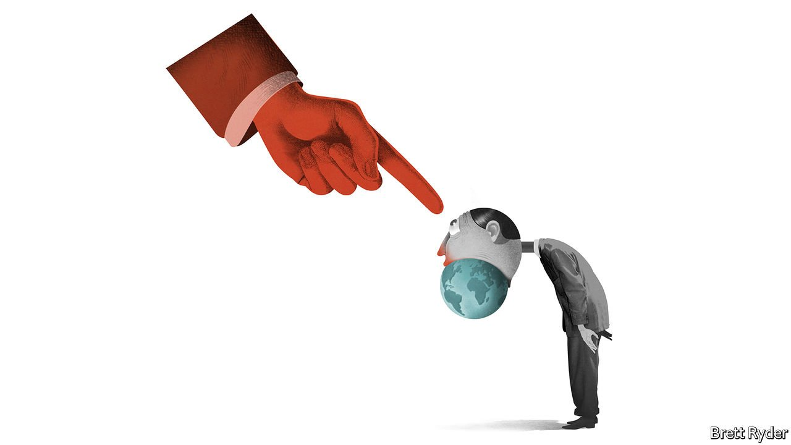
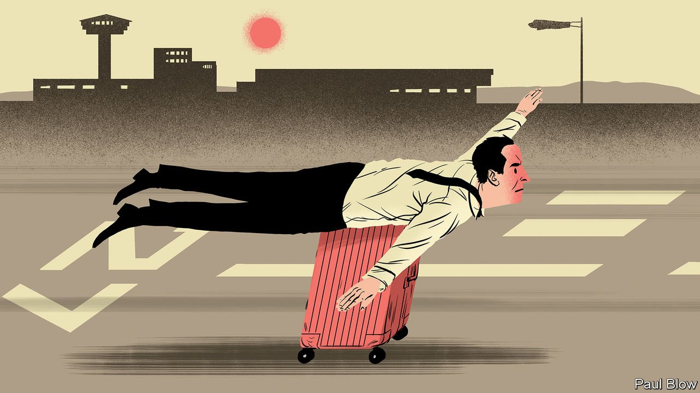

###### On Ukraine and the EU, business ethics, Britain, Hungary, hotels, water

# Letters to the editor 

##### A selection of correspondence 

 

> Apr 23rd 2022 


Ukraine in the EU

To focus on the eligibility of Ukraine as a candidate for European Union membership looks at only one part of a complicated equation (, April 2nd). You underestimate the perils of enlargement—Britain and Hungary are the two outstanding examples of failed membership, though others come close—and ignore the frailty of EU governance, which makes it impossible for the Brussels institutions to take on and internalise the national problems of newcomers. Emmanuel Macron has observed that as the EU gets to be more federal, accession becomes more challenging.


Instead of pushing a membership bid, which, as you say, even if successful would take a very long time, it would be better for Ukraine to aim for a new category of EU affiliate membership. This implies a swift upgrading of Ukraine’s current association agreement. Affiliation would be open to all the EU’s neighbours that choose to trade within its regulatory orbit, requiring respect for its values but not adherence to its objectives of political, economic and monetary union.

Affiliate membership should be underpinned by participation in a new security architecture for Europe, established jointly by the EU and NATO, offering protection for Ukraine. Of course, this means eventual EU treaty change, but that forms a valid agenda for Mr Macron’s second mandate.

ANDREW DUFF

Former member of the European Parliament

Cambridge

 


Business morality

column on war and wokery (April 2nd) critiqued Jeffrey Sonnenfeld’s promotion of business ethics. The column reckoned that unelected executives making “moral choices on behalf of customers and employees could undermine faith in democracy”. However, com pany executives do indeed make moral choices, and on a daily basis. Every decision one makes, or avoids making, is a moral and ethical one. The question then is not whether chief executives should make ethical decisions, but if they will do so consciously and deliberately, or passively and mindlessly. Whether one agrees with any particular decision or action is one thing, but Mr Sonnenfeld’s crusade to make such decisions clear, reasoned and well articulated should be praised, not derided.

M. ANDREW MCCONNELL

Chief executive

Rented

Atlanta

McDonald’s leaving Russia or Nike featuring Colin Kaepernick in its advertisements are calculated choices. Indeed, in a world where voters are faced with at best only two real options at elections, perhaps the instantaneous ability to vote with one’s feet on which company to buy from or work for is more democratic than the ballot box.

DOMINIC KING

Bath

 


Judges v the government

Your report on the efforts by Suella Braverman, the British government’s attorney-gen eral, to rein in the judiciary identified a deliberate political strategy at play (“”, April 9th). However, it missed the main contradiction in Ms Braverman’s argument that the judiciary is pitching itself against the authority of the people. For instance, in the case of the prorogation of Parliament, judicial rulings protected the sovereignty of that body. So in fact the judiciary is protecting the people from a government that is abusing its power. If such an abuse were to take place in a foreign country we would see it as an autocratic attack on democracy. This behaviour in Britain needs to be called out for what it is. The road to autocracy is a slippery slope.

STAFFORD LLOYD

Fareham, Hampshire

 


Liberals v the people

You say that “there is no cure” for the populist politics practised by Viktor Orban, Hungary’s prime minister (“”, April 9th). There is a cure for Orbanism, and it is the same as the cure for Trumpism. It is to listen to the concerns of the large number of people who vote for right-wing populists and engage with them. Instead, liberals usually denounce those people as, in Hillary Clinton’s unfortunate word, “deplorables”.

In 2010, Gordon Brown came across Gillian Duffy on the campaign trail for that year’s general election. An ordinary woman, she was no right-wing racist, but a lifelong Labour voter. She was concerned about immigration. Instead of engaging with her (perhaps explaining the benefits of immigration) Mr Brown turned his back and called her a bigot. Labour has not been in power since.

The current divisiveness and polarisation of politics works both ways. As long as liberals are too holier-than-thou to engage with those who vote for the likes of Mr Orban and Donald Trump then populists will find it easy to attract votes from people who feel no one else listens to them.

ANNE-LOUISE CROCKERShoreham, Kent

 


No respite from work

Regarding the future of business travel, video-conferencing has blurred the boundary between work and hotel as much as work and home (“”, March 26th). Cancelling meetings because of travel no longer holds true. Executives who cross time zones can expect longer days. Hotels can expect more in-room service requests. Can I get breakfast delivered at 4am? Can I connect the hotel’s TV to my laptop? As hotel rooms become backgrounds, there will be a premium on nice ones.

PROFESSOR DAVID SINTON

University of Toronto

 


Liquid markets

“” (April 2nd) did a fair job at capturing the reality of water supply in California. There are other important points that apply to California and other water-scarce regions in the world. The price of water generally reflects its cost of delivery rather than its scarcity. Higher prices often reflect infrastructure costs (for a desalination plant, for instance) rather than the opportunity cost of running dry.

“Conservation” in California may look good relative to historical use, but roughly 50% of residential water in California is used for landscaping. The state’s cities need not fear a shortage, since water can always be taken from agriculture, which uses approximately 80% of the state’s “developed” water.

The environment, which receives the remaining “undeveloped” water, is under extreme stress because of diversions for human use. Desalination is indeed important for the state, but it is no solution to bigger issues with agricultural over-appropriation and underpricing of increasingly scarce water.

DAVID ZETLAND

Lecturer in political economy

Leiden University College

The Hague

You underestimate the ingenuity of Californians in using less water. For years now they have practised “If it's yellow, let it mellow; if it's brown, flush it down” as part of their toilet routine.

Another very popular bathroom practice is to shower with a friend. This not only saves water, but allows you to soap-up those hard to reach places. And you get to know your friend better.

ANTHONY SWEENEY

Darien, Connecticut

