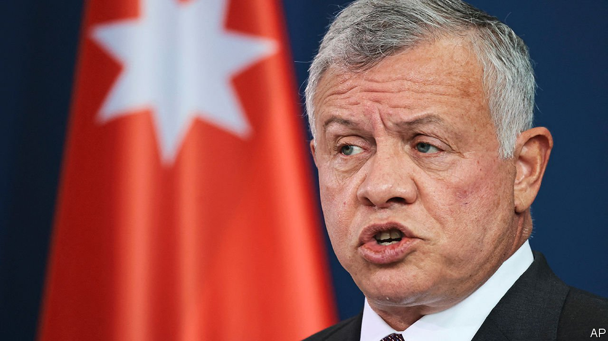

###### Unhappy royals

# Jordan’s troubled king and his bothersome brother 

##### Rivalry within the royal family is threatening the kingdom’s stability 

 

> Apr 21st 2022 

AFTER 23 YEARS on the throne, King Abdullah looks tired, aloof and despairing of his kingdom. While his counterparts in the Gulf unveil grand visions, he sounds short of ideas: his favourite way to tackle a problem is to create a committee. As more Arab states normalise ties with Israel, Jordan’s strategic importance as a front-line state has dwindled. So has aid from Saudi Arabia and the Gulf, which used to be a primary source of revenue given Jordan’s lack of natural resources. Meanwhile prices for ordinary folk have soared; nearly half the young are jobless, and the economy—in the words of a disgruntled former prime minister—is bankrupt. In sum, Jordan and its king are unhappy.

Mockery of the monarch has become more frequent. Leaks about his plethora of properties in America and Britain have forced Abdullah and his family to deny that they have squirrelled national wealth abroad. His recent sojourn in Frankfurt for back surgery has been prompting catty comments about the state of Jordan’s health service. The decision to level a poor neighbourhood near the palace, supposedly for aesthetic reasons, has enraged some of the Bedouin who were living there.


To cap it all, Abdullah faces a lingering leadership crisis. Last year he put his half-brother, Hamzah, under house arrest for plotting what palace officials said was a coup. Efforts to patch up the row have failed. Hamzah has asked for the king’s forgiveness but has not been freed. The more the king tries to sideline him, the more he becomes a focus for popular grievances. Hamzah’s likeness to their father, King Hussein, who reigned from 1952 until his death in 1999, and his mastery of Bedouin Arabic evoke nostalgia for better times. “The efforts to silence Hamzah are increasing his popularity and turning him into a threat,” says a former official. A Western military expert calls him “trouble”.

By contrast King Abdullah looks and sounds more British. His mother, née Toni Gardiner, a British colonel’s daughter, was the only one of King Hussein’s four wives not to be formally crowned queen. Hamzah was said by some to have been his father’s favourite. His mother, Queen Noor, an American partly of Levantine heritage who lives mainly abroad, wrote in an autobiography that King Hussein intended Abdullah to be a placeholder for a decade until Hamzah was ready to reign. This may be conjecture. In any event, Hamzah was displaced as crown prince in 2004, and in 2009 Abdullah promoted his own son, Hussein, to the role. A fraternal feud has festered ever since.

Hamzah is now sending mixed signals. On April 3rd he declared that he was discarding his royal title. “From the matter of honesty to God and conscience, I see nothing but to transcend and abandon the title of prince,” he tweeted. Some say he is tired of the military cars at his gates and the headlights that shine at his windows at night, so wants to drop out of the race. But the word “transcend” makes others surmise he still aspires to higher things. His mother has dubbed him “sharif”, a title his forebears used before they established monarchies (in Iraq as well as Jordan), claiming leadership of all Arabs.

A succession struggle between Hamzah, with his Bedouin accent, and Crown Prince Hussein, whose mother is Palestinian, could dangerously widen the kingdom’s old cleavage between the indigenous Bedouin and Jordanians of Palestinian descent who are now more numerous.

For all their economic woes, Jordanians still prize their country’s enviably longstanding stability above all. Whatever his faults, their king is something of a rarity in the region for having no blood on his hands. But cracks in the monarchy are causing jitters. Jordanians want their kingdom to serve as a regional crossroads, not as a cockpit of royal intrigue. ■

