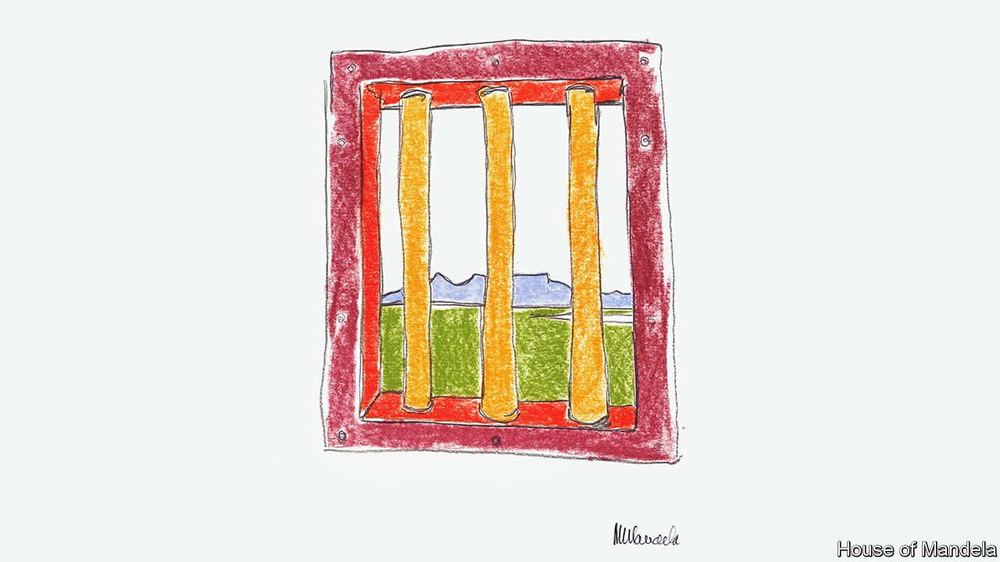

###### Monetising Madiba

# Making money from Nelson Mandela’s name 

##### A boutique hotel and NFTs are the latest examples of Madiba’s lucrative legacy 

 

> Apr 21st 2022 

ONE ROOM is named “Rolihlahla”, his forename at birth. Another is “46664”, his prison number on Robben Island. A third is “Madiba”, his clan name. And the most luxurious suite? That is simply “Mr President”.

Sanctuary Mandela, a boutique hotel that opened in September, is evidence of the power of the brand built around Nelson Mandela, South Africa’s first democratically elected president. The hotel is owned by the Nelson Mandela Foundation (NMF), a charity established by Mandela when he stepped down.


Before his death in 2013, Mandela charmed money out of rich Americans, who accounted for 80% of donations to the NMF and included the likes of Bill Clinton and the Gates Foundation. But recently American funders have “turned inwards” to domestic causes, laments Sello Hatang, the NMF’s CEO. Others have been scared off by the corruption that has spread in South Africa since Mandela left office in 1999.

Fortunately his foundation owns about a dozen valuable trademarks, including “46664”. It sometimes uses them to boost its coffers, for instance with a hotel or branded clothing. It also approves a few of the many licensing requests it gets. But it tries not to cheapen the former president’s legacy. A Nelson Mandela burger, Mr Hatang suggests, would be a no-no. “We are trying to maintain the stature of the man.”

But the foundation does not have a monopoly on making money from Mandela. Last month the Liliesleaf Farm and Museum sold an NFT, or non-fungible token (an electronic chit to a digital artwork) of Mandela’s arrest warrant from 1961. The money may help reopen the museum, which was once a safe house for anti-apartheid groups. It shut last year, partly because of covid-19.

And last month Makaziwe Mandela, Madiba’s surviving daughter from his first marriage, auctioned NFTs of his paintings (pictured). Mrs Mandela and two of her children run House of Mandela, a retailer. Among other things it sells a range of $5 wines inspired by the family clan— “noble, respected, trusted”. In December the government halted an auction, also involving Mrs Mandela, of the key used to lock her father’s cell at Robben Island, on the grounds that the item is state property. (Mrs Mandela did not respond to requests for comment but has reportedly said that the earnings would have funded a memorial garden.)

“You can’t stop the family,” says Mr Hatang, since they have the name, too. Though critics accuse Madiba’s descendants of exploiting his legacy, there is perhaps a broader lesson from all of the ventures. Economics is about scarcity. So long as South Africa lacks leaders in the mould of Mandela, his value will endure.

