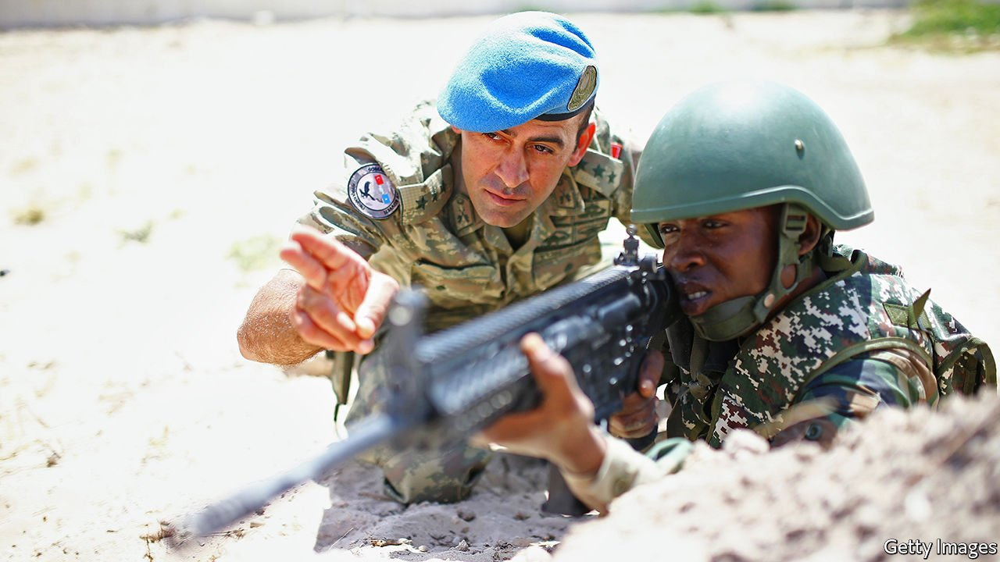
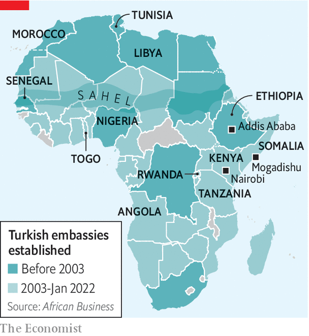
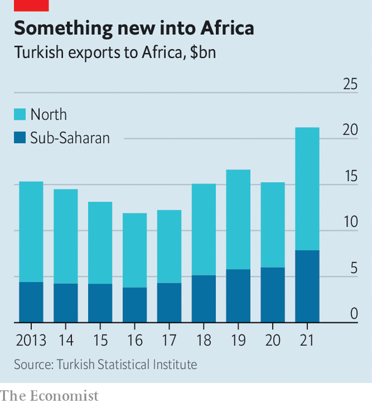

###### The call of the south

# Turkey is making a big diplomatic and corporate push into Africa 

##### It is sending engineers and soap operas, but also guns and soldiers 

 

> Apr 23rd 2022 

THE RECEP TAYYIP ERDOGAN hospital in Mogadishu, the capital of Somalia, is named after Turkey’s president. It has 47 intensive-care beds, more than any other in the country, but it does not treat covid-19 patients. “If we did, we would have to isolate them,” explains Asir Eraslan, the manager, “and we would not have enough room to treat the bomb victims.” These keep on coming because of an insurgency by al-Shabab, an affiliate of al-Qaeda, and clashes between rival clans.

Along one of Mogadishu’s main roads, packed with armoured vehicles and red tuk-tuks (motorised rickshaws), locals point out where bombs have ripped through crowds. During your correspondent’s visit, security forces were on the lookout for two suicide-bombers.


Given the violence and risk of kidnapping, Mogadishu attracts few foreigners. Few aside from Turks, that is. One Turkish company has renovated and operates the port. Another runs a hotel and the international airport, from which Turkish Airlines flies daily to Istanbul. Turkish firms have repaired the city’s main roads and the parliament building, with funding from Turkey’s development agency. At its biggest foreign military base, Turkish officers have trained and equipped more than 5,000 Somali soldiers and police commandos.

Perhaps more distinctive even than the size of Turkey’s presence in Somalia is its boots-on-the-ground approach, helped by a common religion. “In Somalia one of the advantages of being a Turk is that you pray at the same mosques as everyone else,” says Kadir Mohamud, a Somali businessman. Non-Turkish companies and embassies tend to operate from the guarded “green zone” around the airport. “We are the only ones in the field,” says Mehmet Yilmaz, the Turkish ambassador. With its own herd of dwarf antelope and a sweeping view of the Indian Ocean, his embassy is Turkey’s biggest anywhere, too.

Somalia is a striking example of Mr Erdogan’s broader push into Africa in search of markets, resources and diplomatic influence. Only two decades ago Turkey had very little interest in Africa below the Sahara. Instead it looked west and dreamed of joining the European Union. But as relations with the West have cooled, Turkey has pivoted south. The turning point was in 2011 when Mr Erdogan, flanked by Turkish businessmen, aid officials and Muslim charities, visited Somalia, then in the grip of a drought and civil war. His visit, the first by a non-African leader in about two decades, marked the start not just of Turkey’s involvement in the Horn of Africa but of deeper ties across the continent.

In 2009 Turkey had just a dozen diplomatic missions in Africa. Now it has 43. Ambassadorial glad-handing has helped businesses expand. Turkish Airlines, which flew to only four African cities in 2004, now flies to more than 40. Trade with the continent has expanded greatly, to $29bn last year, of which $11bn was with sub-Saharan Africa, an almost eight-fold increase since 2003. So has construction, where Turkish firms are chipping away at the dominance of Chinese ones, helped no doubt by a drop in lending by China. Turkish officials reckon that Turkish firms have completed some $78bn worth of African projects, including airports, stadiums and mosques. Last year Tanzania awarded a Turkish firm a $1.9bn contract to build a modern railway line.

 


Turkey is also gaining clout through aid. Previously it gave money mainly through international agencies such as the UN. In 2003 some 60% of Turkish aid was channelled this way. By 2019 that share had plummeted to 2%. These days Turkish flags adorn packages of food, schools and wells. “Turkey is known for giving a blank cheque, particularly when you’re in desperate need of economic or military aid,” says Abel Abate Demissie, who works for Chatham House, a British think-tank, in Addis Ababa, Ethiopia’s capital.

Yet there is a harder edge, too. Mr Erdogan, who has readily sent his army into the many-sided civil war in Syria, has also started flexing his muscles in Africa. He has, for instance, dispatched Turkish soldiers and Syrian mercenaries to Libya to fight against Khalifa al-Haftar, a warlord then backed by Egypt, France, Russia and the United Arab Emirates (UAE).

Turkey and France, after sparring in Libya, have also locked horns in west Africa, the Sahel and the Maghreb, where Mr Erdogan has challenged French influence by playing on France’s image as a colonial oppressor. In Somalia Mr Erdogan faced off against Saudi Arabia and the UAE when their spat with Qatar, which is friendly with Turkey’s government, spilled over into a proxy struggle in the Horn of Africa.

Arms are the plan

Turkey has also signed military pacts with several African countries, most recently Nigeria, Senegal and Togo. Many are keen to take advantage of Turkey’s experience in counterinsurgency. Tellingly, an increasing share of African ambassadors appointed to Turkey are active or retired generals.

Turkey’s aim is not to get involved in wars, but rather to sell weapons. It is not in the same league as countries such as Russia, which provided 30% of all arms sold to sub-Saharan Africa in 2016-20, or China (20%), according to the Stockholm International Peace Research Institute. But last year Turkey’s sales surged seven-fold to $328m. In the first two months of this year they approached $140m.

Turkey’s top products are drones of the sort currently bombing Russian tanks in Ukraine. They have been seen in Ethiopia, Libya, Morocco and Tunisia. Other countries, including Angola, Nigeria and Rwanda, are thinking of buying them. “Wherever we went, they asked us for unarmed and armed drones,” said Mr Erdogan after a visit to Africa last year. Somalia would also like more arms, but cannot get them because of a UN embargo. “Turkey is giving us everything they can give,” says Abdulkadir Mohamed Nur, Somalia’s defence minister. “But right now they can only give us small weapons.”

Unlike America, Africa’s fourth-largest arms supplier, which stops sales to African countries that use them to commit war crimes, Turkey seems unconcerned about how its kit is used. Its drones, which helped turn the tide in Ethiopia’s civil war, have reportedly killed dozens of civilians. Because of Turkey’s silence about this, Ethiopia sees it as one of its very few trusted allies. Somalia’s president, Mohamed Abdullahi Mohamed, known to his people as Farmaajo, has used Turkish-trained soldiers against his rivals, to cling to power after his term expired more than a year ago, says Matt Bryden of Sahan Research, a Nairobi-based think-tank. “We do not dictate, and we do not tell anyone what to do,” says an official in Ankara, Turkey’s capital.

 


Like China and Russia, which have expanded their reach in Africa in recent years, Turkey touts its policy of non-interference as a selling point. Mr Erdogan presents Turkey as a rising power and the champion of a fairer world order. “Turkey is coming in with no colonial baggage whatsoever,” says Wamkele Mene, the secretary-general of the African Continental Free Trade Area (AfCFTA). “That’s an advantage.” Mr Erdogan takes this a step further, arguing baselessly that colonialism persists. “The British, the French and the Western colonisers,” he said earlier this year, “continue to loot Africa’s diamonds, its gold and its mines.”

In truth, Turkey is not above strong-arming African governments. Last year its security agents in Kenya abducted the nephew of Fethullah Gulen, whom Turkey accuses of spearheading a failed coup in 2016. He was snatched right outside the police headquarters with the connivance of Kenyan officials and flown to Turkey, flouting a court order barring his deportation. Turkey has also pressed African countries to close schools set up by Mr Gulen’s Islamist movement.

Turkey’s interest in Africa is reciprocated. The number of African embassies in Turkey has tripled in two decades, to 37. At least 14,000 students from Africa have received scholarships to study in Turkey over the past decade. Africans are also buying property in Turkey, not least since spending $250,000 on a house brings a Turkish passport. Ankara has emerged as a hub of the Somali diaspora. Turkish soap operas, which are winning audiences across the continent, are spreading soft power.

Still catching up

Though Turkey’s involvement in Africa has grown fast, occasionally bringing confrontation with other outside powers, its economic, military and diplomatic reach is still nowhere near as extensive as those of America, China and the continent’s former colonial powers. China’s government reckons its two-way trade with Africa was worth $254bn last year, dwarfing Turkey’s $29bn. Turkey’s military aid carries nothing like the punch of Western powers. America has about 6,000 troops and supporting civilians deployed in Africa, where they battle al-Shabab in Somalia and jihadists in the Sahel, and train African counter-terrorist forces across the continent. France, too, deploys roughly 5,000 troops, many of them in the Sahel. This is reflected in popular opinion. In a survey conducted for The Economist in March by Premise, a data firm, 72% of Kenyans and 58% of Nigerians named America as the most reliable security partner.

Yet Turkey seems ready to play a long game. Its recent launch of TRT Français, a French-language edition of its state propaganda channel, clearly had an African audience in mind. And by providing aid and security assistance, Turkey hopes that in time it will reap durable rewards. “Right now, we are the ones in need,” says Mr Nur, Somalia’s defence minister, talking of Turkey. “But when there is an opportunity, we will give our friends a chance others cannot have, because they helped us when we needed it most.” ■

