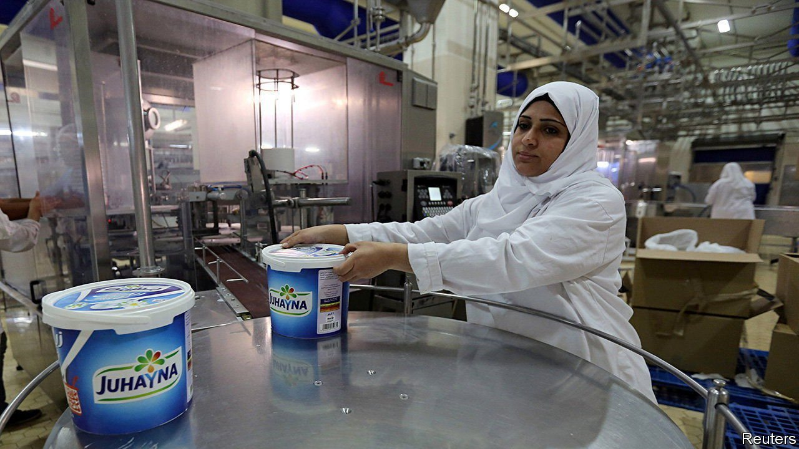

###### The sour milky way

# Why Egypt isn’t open for business 

##### Despite pro-business talk, the army grabs whatever it wants 

 

> Apr 21st 2022 

EGYPTIANS OFTEN complain that their country produces little of value. Juhayna, the country’s largest dairy and juice maker, has been a notable exception. Its red and blue cartons are a staple in Egyptian homes. Its milk and yogurt are sold across the Middle East and Africa. It is one of the most valuable companies on Cairo’s stock exchange and a darling of foreign investors. In most countries it would be considered a national champion. But under Egypt’s military rulers it has faced a Mafia-style shakedown. Its fate illustrates the flaws of the Egyptian economy.

Juhayna’s troubles began when the Egyptian state decided to take it over. After its founder, Safwan Thabet, refused to hand over a controlling stake, he was thrown into a prison notorious for torture. When his son, Seif, refused the same deal, he joined his father in jail.


The state accuses the Thabets of funding terrorism. Safwan’s grandfather and uncle had been leading lights in the Muslim Brotherhood, a religious and political movement. In 2013, after a government dominated by the Brothers was overthrown in a coup led by General Abdel-Fattah al-Sisi, the group was labelled as terrorist and outlawed. The Thabets insist they have nothing to do with it. Though father and son have been in jail for more than a year, the courts have not heard their case.

The Thabets were once part of the establishment. Safwan was chummy with Egypt’s previous autocrat, Hosni Mubarak. He flew abroad with state delegations to woo investors and advised ministers. After Mr Sisi became president in 2014, the older Thabet donated 50m Egyptian pounds ($7m) to the Long Live Egypt fund for development projects. Mr Sisi happily took cash from members of the Thabet family, despite their supposed links to terrorism.

Egypt has borrowed $20bn (about 5% of its GDP) from the IMF since 2016, making it the fund’s second-largest recipient after Argentina in that period. It is negotiating a fresh loan after the war in Ukraine prompted nervy investors to flee, which caused a hard-currency crunch. The IMF has praised Egypt for swiftly taking painful (and unpopular) austerity measures.

But it has also complained that Egypt’s government is stifling the private sector. One survey shows that it has shrunk in all but nine months since 2016. Mr Sisi makes pro-business noises in public. But his generals, who dominate chunks of the economy, make a mockery of the free market.

Take another case. Ramy Shaath is a successful businessman whose company produces electronic devices that track the usage of electricity, water and gas for state utility companies. When he refused to let a military firm share his technology, the utility firms began cancelling contracts. “We started going bankrupt. And not because we were underperforming, but because the army was pressuring us,” says Mr Shaath. A critic of Mr Sisi’s politics, he was sent to jail for more than two years on unspecified terrorist charges but, like the Thabets, was never tried.

Last December Mr Sisi was shown on television browbeating three owners of construction firms into accepting delays for payments from the state for building roads and bridges. The businessmen grinned sheepishly and yielded. What would have happened if they had refused? Though the army gets special tax breaks and customs exemptions, the government lauds it for saving the public from greedy merchants and speculators. During the current holy month of Ramadan, soldiers hand out meat at subsidised prices. But when in 2019 a new state firm entered the lucrative market for certifying meat as halal (compliant with Islam), the agriculture ministry banned private competitors. Up shot the price of the certificates.

Last year Egypt launched Silo Foods Industrial City, a complex of food factories overseen by the army. The firm’s slogan, “The World has a New Taste”, echoes Juhayna’s, “The World has a Beautiful Taste.” The company wants to open a milk factory of its own. After Seif Thabet was arrested, he offered to run its operations for a token salary if the state laid off Juhayna and freed him and his father. The offer was rebuffed.

Few businessmen dare stand up to the army. The Thabets’ treatment shows what might happen if they do. “If they took [Juhayna], they would destroy it. I’m not handing over what my father built,” Seif has lamented from prison. In a video posted on Facebook last year his mother begged Mr Sisi to free her son and husband. When it went viral she was summoned for questioning and told to shut up, or suffer the same fate. Last month she died of cancer. The regime prevented hundreds of mourners from attending her funeral.

Though GDP has grown since the bail-out in 2016, the economy is in poor shape. Egypt has failed to build up its manufacturing base. Exports are sluggish. By the latest reckoning its current-account deficit had widened to $18.4bn. The poverty rate has risen. Last month the central bank devalued the Egyptian pound by 14%. At the first sign of distress, sales of short-term treasury bills have faded. Mr Sisi has persuaded friendly Gulf states to deposit billions of dollars in the central bank and pledge investment. But cases like Juhayna’s are hardly likely to encourage foreign investors to come knocking. ■

