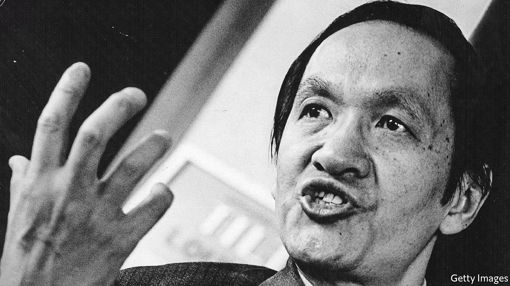

###### A taste for freedom

# Peng Ming-min fought for the idea of “one China and one Formosa” 

##### A leading advocate of Taiwan’s independence, he died on April 8th, aged 98 

 

> Apr 21st 2022 

WHEN HE WAS a boy, few would have singled out Peng Ming-min as a future firebrand. Born in 1923 in Taiwan, then widely known as Formosa, he was bookish and other-worldly, with his main extra-curricular passion being baseball not politics. But by the time he had become a successful academic, four decades later, Taiwan’s peculiar and unhappy international position had virtually forced him into taking a political stand—one that was to lead him to jail, escape into exile and, eventually, a job as a presidential adviser, after a failed run at the top job himself.

In 1895 Taiwan had been ceded “in perpetuity” to Japan by decaying imperial China, in an effort to placate Japanese expansionism. Mr Peng’s father, the fourth generation of the family on the island, was a successful doctor and set great store by academic success. Ming-min did not disappoint. He was a school star, one of the few Formosans of his generation able to compete at the highest level with Japanese students, winning a place at university in Japan itself. To his father’s disappointment, he did not want to study medicine. To his relief, his son relented over his first love, French literature and philosophy, compromising on law and political science. He became a respected authority on international law, especially in the new fields of the law of the air and, later, space.


He was lucky to survive Japan. In an American air-raid on a ferry in 1945, he lost his left arm (this had one accidental benefit in later life, rescuing him from an unpromising career in banking, where new recruits had to count banknotes), and was close enough to Nagasaki on August 9th to see the mushroom cloud. Japan’s defeat meant the end of its occupation of his homeland. At the Cairo conference in 1943, China’s leader, Chiang Kai-shek, secured the agreement of Churchill and Roosevelt that after the war Taiwan would be returned to China. Just as in 1895, the views of the island’s inhabitants were not thought worth considering.

On going home Mr Peng found Taiwan not so much liberated as under a reign of terror. Chiang’s Nationalist troops were “a rabble of scavengers”, for whom the native Formosans were a “conquered people”. In February 1947, after the police beat up an old woman selling cigarettes without a licence, local resentment boiled over into an island-wide insurrection, put down at the cost of thousands of lives, including many members of the local social and intellectual elite. For the next four decades, Taiwan was to be ruled as a harsh, one-party dictatorship, with the Nationalists’ rule bolstered by the arrival of 1.5m-2m refugees from mainland China as the civil war there ended in their defeat in 1949. The Nationalists continued to claim sovereignty over all of China (and Mongolia).

But Mr Peng was doing well. He had married and had a son. He completed his studies in Taipei and went on to Montreal and Paris, gaining promotions at home, a growing international reputation, and even a job advising Taiwan’s—ie, in those days, “China’s”—delegation at the United Nations. He also earned the envy of some of his colleagues that a mere Formosan should be doing so well. Gradually he began to suspect that part of the secret of his success might be to show that “Formosans were being given their proper place”. But he still shunned politics, writing in 1972 in his memoir, “A Taste of Freedom”, that he thought of himself “only as a member of an academic elite, removed from active political affairs”.

This became untenable. An authority on international law, how could he lend his prestige to the government’s nonsense about recovering the mainland, and connive in its discrimination against Formosans like himself? In 1964 he and two friends drafted a “Declaration of Formosan Self-Salvation” insisting that the world must recognise the truth “that there is one China and one Formosa”. It is as simple as that: Taiwan is its own country.

But it was a fairly efficient police state. The knock on the door came before the manifesto was distributed. He was sentenced to eight years in prison. His international fame and contacts must have been a help. He was not tortured, and was freed to house arrest the following year, from where he achieved an elaborate escape in 1970 via Hong Kong to Sweden, disguised as a “goofy-looking beatnik” and carrying a guitar case. This was a huge embarrassment to the authorities, who suspected, wrongly, that the CIA had spirited Mr Peng out. China was also suspicious that America was trying to foster Taiwan independence, and Zhou Enlai raised the case with Henry Kissinger on his secret visit to Beijing in 1971. But Mr Peng did move to America, taking up a professorship at the University of Michigan, from where he became a prominent international spokesman for Taiwan’s opposition, and in 1981 was one of the founders of the Formosan Association for Public Affairs, which remains an influential pro-Taiwan lobby.

His next homecoming was a happier one. He had spurned an invitation from Chiang Kai-shek’s son and successor, Chiang Ching-kuo, to come back as a free man, provided he accepted the dogma about regaining the mainland. But martial law had been lifted in 1987 and opposition parties legalised. So in November 1992 a crowd greeted him at Taipei airport. In 1994 he joined the most important of these, the Democratic Progressive Party (DPP), and such was his prestige that he became its candidate in the country’s first free presidential elections in 1996. He made a point by speaking Taiwanese, not the mainlanders’ Mandarin, in a televised debate, but was trounced by the Nationalist incumbent, Lee Teng-hui, himself a native of the island. Four years later, the DPP did win the presidency, as it did again in 2020.

Of the “three principal objectives” outlined in Mr Peng’s manifesto in 1964, two had been achieved: nobody now disagreed with the acknowledgment that “return to the mainland is absolutely impossible”; and the constitution has been rewritten to that of a functioning democracy. The third, that Taiwan should participate in the UN, however, is more remote than ever, and the threat of violent Chinese intervention to end its de facto independence does not diminish. Mr Peng’s ideas, once so seditious, have become mainstream. But no more achievable. ■

