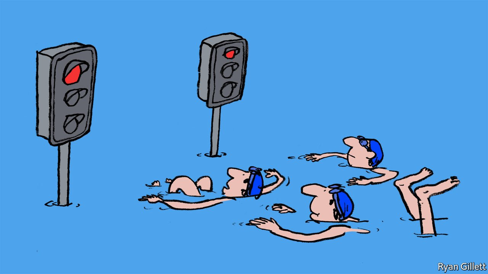

###### Out, dammed spot

# A sound way towards reversible vasectomies 

##### Researchers test a means to block—and neatly unblock—men’s reproductive ductwork 

 

> Apr 23rd 2022 

THE MOST reliable means of contraception for men—and one that cannot fail or be forgone in the heat of the moment—is a vasectomy. But the procedure is largely irreversible: it involves stopping the flow of sperm from the testes by cutting conduits known as the vas deferens and sealing them or tying them off. A reconnection, after a reconsideration, is no small task.

Researchers are now examining a different tack: blocking the vas deferens using compounds that combine to form a barrier that can later be removed. Lab trials have involved four separate injections to establish a sperm-proof barrier, which could later be dissolved using a blast of focused, infrared light.


Aware that repeated injections into the penis might affect men’s willingness to undergo such a procedure, Wanhai Xu, a urologist at Harbin Medical University in China, and colleagues propose a different idea: a barrier that can be put in place with one injection and broken down with ultrasound.

Dr Xu’s recipe includes three parts, principally a polymer known as a hydrogel that thickens inside the body and is already approved for medical use. Crucially, in that gel were plenty of thioketals, compounds that fall apart when exposed to reactive, oxygen-containing molecules, plus just a sprinkle of titanium dioxide—an inert material that, when exposed to ultrasound, releases just those molecules.

To check their work, Dr Xu’s team employed a few dozen male rats. Some were given a traditional vasectomy, others an injection of the new material and the rest injected with saline, as a control. Each was then permitted to follow its essential nature with four females. Only those rats given the saline sired offspring.

The real test, as the team reports in ACS Nano, a nanotechnology journal, came next: half the rats given the new treatment were exposed to a blast of ultrasound. That evidently dissolved the hydrogel in the creatures’ pipes: they could again reproduce, while those not thusly blasted stayed sterile.

What works in rats, alas, does not always work in humans, so further trials will be needed. But Dr Xu is hopeful that these findings represent a sound idea for a reversible contraceptive—with fewer sticking points.

To enjoy more of our mind-expanding science coverage, , our weekly newsletter.

