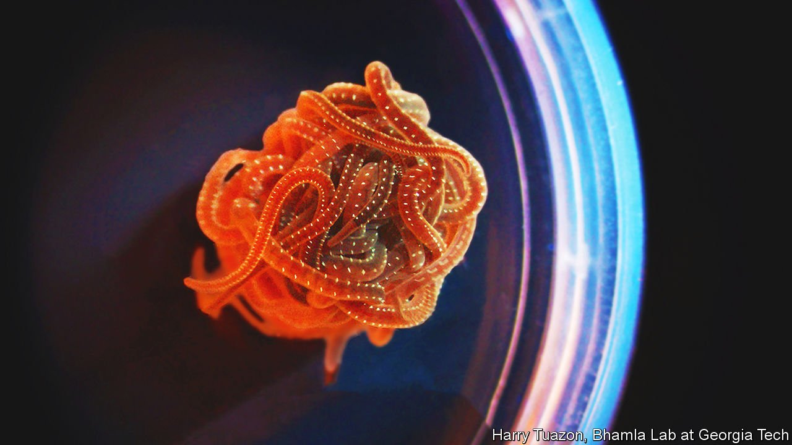

###### Twists and turns

# How balls of blackworms avoid the knotty step 

##### Thousands of them can disperse in thousandths of a second 

 

> Apr 23rd 2022 

MANY ANIMALS find safety in herds, colonies, schools or swarms. But few species opt for the technique of the stringy, water-dwelling blackworm Lumbriculus variegatus, a creature that at a few centimetres in length is far longer than it is wide. In trying times, for instance when water is scarce, tens of thousands of them can swiftly wriggle together into a tangled ball, to seek a wetter environment and save from desiccation all but the poor creatures on the blob’s periphery. How they escape that situation, however, had until recently been a mystery both to biologists and to anyone who knows about knots.

Saad Bhamla, a professor of bioengineering at the Georgia Institute of Technology, has made his career investigating such unusual talents. He was first intrigued by the motion of these blackworm blobs. But another behaviour was even more beguiling. If the blob is spooked in some way, for example by a bright flash of light, it dissolves back into its thousands of constituents in mere thousandths of a second. Dr Bhamla was perplexed: how do they manage not to knot?


He came across research by Jorn Dunkel and Vishal Patil, two mathematicians both then at the Massachusetts Institute of Technology who had turned their attention to knots (the abstraction of which turns out to be rich pickings for the mathematically minded). He put the conundrum to them, and a truly interdisciplinary team was assembled.

The trio first had to work out what was going on in the midst of a blackworm super organism. So they froze one solid and scanned it with ultrasound. An analysis of the scans revealed that each worm was tangled up with, on average, 1.7 others. The quick-release dissolution of a blob, then, required each worm only to free itself from a couple of neighbours. But then plenty more knotting opportunities arose as thousands more made a break for freedom.

To analyse that, the team had to consider how the worms get around in the first place, and that is where Dr Bhamla’s expertise came in. He knew that blackworms tend to weave left and right when searching for food but that, when alarmed, they snap into a corkscrew shape and spiral away at speed—occasionally switching the corkscrew motion of their bodies from clockwise to anti-clockwise and back.

Dr Patil, who is now based at Stanford University and who presented the team’s preliminary results at a recent meeting of the American Physical Society, discovered that this technique may be what saves the worms from repeated entanglement. He created a computer model of the balls, complete with the physical particulars of the worms’ bodies. The resulting simulation revealed that they would struggle to get out by making a beeline for the exit, or by weaving left and right. What worked best for a speedy escape was not just a corkscrew motion but one that periodically changed between clockwise and anti-clockwise directions.

Dr Bhamla says this kind of finding may be of use in the field of so-called soft-active matter—the study of collective action by a great many self-propelled individuals (biological or mechanical) acting independently. Never mind all that: what is certain is that he is delighted to have unravelled a knotty problem. ■

To enjoy more of our mind-expanding science coverage, , our weekly newsletter.

