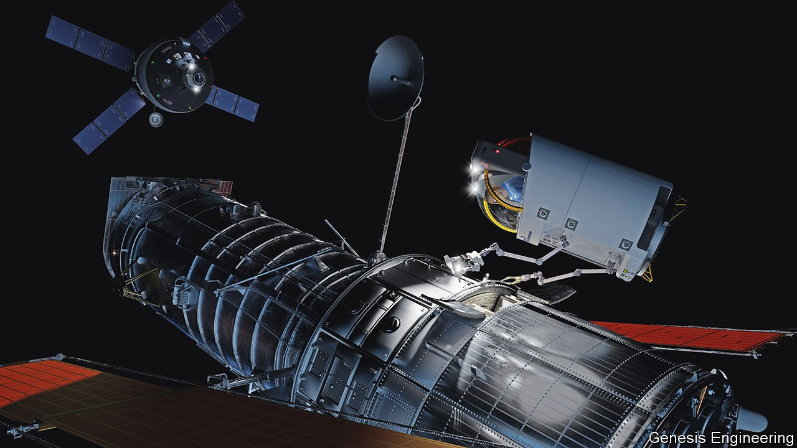

###### Human space flight

# Spacesuits are showing their age 

##### Astronauts’ wardrobes are in need of a makeover 

 

> Apr 23rd 2022 


FIXING PANELS on the International Space Station (ISS) is a bit like doing car repairs while wearing stiff oven gloves and standing on a skateboard. That, at least, is the way Kate Rubins, an astronaut at NASA, America’s space agency, describes it. And she has spent 300 days orbiting Earth on board the station, so she should know.

Today’s bulky spacesuits weigh (or, for pedants, have a mass that is) nearly a third more than those sported by the Apollo astronauts who walked on the Moon in the 1960s and 1970s. To complicate matters further, the free fall of orbit lacks the dampening effects on Newton’s first and third laws of motion (things move for ever unless acted on by a force, and every action results in an equal and opposite reaction) which are offered by the Moon’s gravitational field and solid surface. Spacewalkers must therefore think far more carefully about the consequences of their actions than Moonwalkers need to.


Add in the fact that most systems in spacesuits used today were designed in the early 1980s, giving plenty of time for their flaws to become apparent (in 2013, for example, an Italian astronaut on the ISS nearly drowned when more than a litre of cooling water pooled inside his helmet). Add further that NASA hopes to return astronauts to the Moon at some point in the 2020s and it is clear the time has come for an upgrade. NASA has a long list of features it would like to modify or add. But Chris Hansen, head of extravehicular activity at the agency, says the immediate objective is to develop suits that permit far more body movement than the rigid ones which, as he puts it, had Apollo Moonwalkers “hopping around like bunnies and falling over”.

Tailoring away

NASA’s quest for new suit designs has not, however, gone well. In August 2021 Paul Martin, its inspector-general, concluded that 14 years and $420m had been spent for meagre results. Mr Martin also said that despite NASA’s intention to double that sum over the following few years, it would still not produce spacesuits in time for a Moon landing that was then planned for 2024 (and now delayed to 2025). So, learning yet again a lesson that it really ought to have taken on board by now, the agency is farming out suit design to the private sector. The idea is to come up with something that can be adapted for use both in orbit and on the lunar surface. The winner will be announced next month.

As Dr Hansen’s remarks foreshadow, an important criterion of success in this competition will be a spacesuit’s flexibility. One contender is Astro, a suit proposed jointly by three firms: Collins Aerospace, of Charlotte, North Carolina; ILC Dover, of Newark, Delaware; and Oceaneering, of Houston, Texas. Astro makes extensive use of Vectran, a synthetic fibre tougher than the Kevlar employed in bulletproof garments. This is made using a liquid-crystal polymer that confers both strength and the necessary flexibility.

Wearers of such a suit should be able to reach up and bend down, gestures that would be impossible in today’s spacesuits. According to Dan Burbank, a former astronaut who helped assemble the ISS in orbit and who is now a technologist at Collins, they could even perform press-ups, at least when gravitationally bound to the surface of the Earth.

A version of Astro designed for Moonwalks would allow treks of perhaps 10km, a distance that dwarfs those managed by Apollo astronauts. This lunar hiking kit would be fitted with special boots and a “breadcrumb-trail” display on its face shield to show the occupant where he or she had been—and thus, crucially, how to get back home.

For spacewalks in Earth orbit, however, some people question the need for suits at all. Instead, they propose miniature spacecraft fitted with thrusters and robotic arms. Genesis Engineering Solutions, a firm in Maryland, is going down this route with what it calls the Single-Person Spacecraft (SPS). The thrusters use compressed nitrogen—though, in an emergency, they could also tap into the craft’s air tanks. The arms were originally designed for defusing bombs, making them far more dexterous than an astronaut’s gloved hand; they can be controlled either by the spacewalker or by a remote operator. If all goes well the SPS will be used on Orbital Reef, a commercial space station being built by firms including Blue Origin and Sierra Space, and scheduled for launch in the late 2020s.

The SPS, Genesis believes, offers several advantages over conventional spacesuits. For one thing, no airlock is needed to permit entry to and exit from a space station. Instead, the craft docks directly with the station, so the two share their air until the hatches between them are closed. That means a pilot can shimmy in and out of an SPS with little fuss. In contrast, for a suited spacewalker to leave and return to the mothership requires an airlock to be pumped down for exit and then pumped up for re-entry. Given that pumping down is never completely efficient, this inevitably leaks part of a station’s air supply.

Another key difference is that a spacecraft can operate at atmospheric pressure. Pressurising a suit to this extent, however, increases its rigidity, making its gloves in particular so stiff as to be useless for manual tasks. The pressure inside a spacesuit is therefore normally held at about one-third of an atmosphere. But this would not deliver enough oxygen for an astronaut to breathe if standard air were used. So pure oxygen is employed instead.

One consequence of that pressure drop is a risk of decompression sickness, in which nitrogen gas emerges from the bloodstream in painful and dangerous bubbles. So before suiting up spacewalkers must undergo a so-called pre-breathe of pure oxygen to purge the blood of nitrogen. A pure-oxygen atmosphere is also a fire hazard. That is not a theoretical risk. Three Apollo astronauts were killed by fire in a ground test in 1967 because their capsule contained such an atmosphere.

Spacesuits bring a third safety hazard, too, according to Brand Griffin, who leads the SPS effort at Genesis. He says that the shielding on an SPS provides protection against fast-moving debris and micro meteoroids that would puncture a suit. Were this to happen, the vacuum of space would cause the astronaut’s body fluids to vaporise. And yet another advantage of a spacecraft is that, if a pilot were somehow incapacitated, its thrusters could be remotely controlled and docked with the mothership more easily than a spacewalker could be hauled back into an airlock.

The downside to miniature spacecraft is price. An SPS will, according to Genesis, cost nearly $70m—around four times the price of a spacesuit. But lower running costs may compensate for such upfront expenditure. With tasks including adjusting a suit to the astronaut who will wear it (for they are not bespoke items), donning and doffing it, and sterilising its interior after use, a single spacewalk requires about 63 hours of labour on board the ISS, not counting the excursion itself. For an inkling of the expense involved in this, consider that the charge-out rate for a NASA astronaut’s services on the ISS is $130,000 an hour. Blue Origin, the moving spirit behind Orbital Reef, reckons that, once such costs are factored in, an SPS will end up being the cheaper option.

Suited spacewalks are, in any case, so dangerous that NASA is discouraging the operators of planned commercial space stations like Orbital Reef from engaging in them. As for space tourists, extravehicular outings have always been out of the question, no matter how dazzling the experience would be. The SPS will change that, says Brent Sherwood, Blue Origin’s head of advanced development programmes. He foresees “tourist-proof”, automated excursions as part of package holidays in space.

Haute couture

Even if it works as intended, though, the SPS will not end the need for spacesuits. Gateway, a lunar-orbiting international space station, the assembly of which is planned to start sometime after November 2024, has been designed for outings from it to happen in suits, not single-astronaut spaceships. Orbital Reef will, for its part (and despite NASA’s scepticism), support suited spacewalks as well as the SPS. That system, after all, has yet to prove itself.

Moreover, spacesuit technologists have other ideas up their sleeves. ILC Dover, for example, plans to simplify suited spacewalking by delivering life support via an umbilical cord. This would limit mobility but cut costs sharply, says Dan Klopp, head of business development at the firm. “Suitports” are also promising. With these, an astronaut would climb into the back of a spacesuit attached to the outside of a vehicle. After the spacesuit and vehicle had been sealed, the suit could be detached with no airlock required, as with the SPS.

Hovering over all of this, it should be acknowledged, is the question of whether spacewalks and Moonwalks by people actually achieve anything that robots (either remotely controlled or fully autonomous) cannot. To ask that, though, is to challenge the whole reason for crewed space flight. And that would never do, would it? ■

To enjoy more of our mind-expanding science coverage, , our weekly newsletter.

