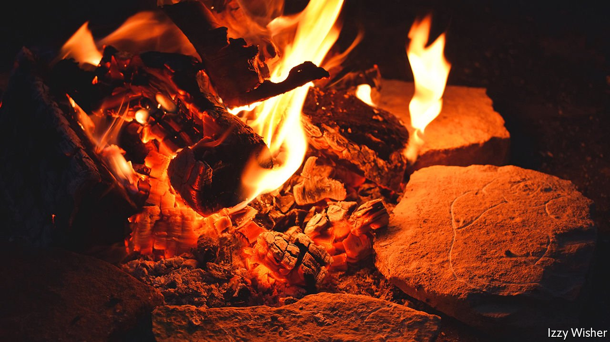

###### Light entertainment

# Why 15,000-year-old art might have been displayed in firelight 

##### Markings on prehistoric art hint at an early attempt at animation 

 

> Apr 23rd 2022 


THE BRITISH MUSEUM has in its care more than 8m artefacts. Visitors can see a mere 80,000 of them or so on display at any one time. Partly that is a blunt matter of space and variety. Few museums can display all they have and many cycle through their collections to give visitors new experiences on successive visits. But it is also about context. Curators have plenty of prehistoric objects in the basement that they know to be significant and interesting, even if they do not know what those objects were for.

Artefacts are dug up over the course of centuries by teams with varying skills or commitment to book-keeping. Objects end up in archives, entirely shorn of their context. For finds whose purpose or beauty is not readily apparent, or for those that do not fit neatly into an archaeological tale that explains that purpose, eternal repose in the basement is likely.


That is why results from Andy Needham and colleagues at the University of York and the University of Durham, published this week in the journal PLOS ONE, may prove to be so valuable. The team believes, tentatively, that it has discovered evidence of a fireside art gallery from 15,000 years ago.

They started by hauling up 54 carvings that had languished for decades in the British Museum’s vaults. First excavated in the 1860s at Montastruc in France, near Toulouse, these “plaquettes”—flat, mostly limestone slabs about the size of a postcard—were made by the Magdalenian people. This seemingly art-minded culture spread throughout western Europe between roughly 23,000 and 14,000 years ago. The Montastruc slabs feature carved depictions of then-common local wildlife, such as the ibex and cattle-like aurochs.

While cataloguing the plaquettes’ appearance, Dr Needham was struck by how many of them had pink edges. This “rubefaction” occurs when iron impurities within limestone begin to oxidise; it happens at temperatures of around 200°C, approximately the heat felt at the edge of a wood fire. Much hotter than that, and the material would turn grey.

The pinkness suggested a few possibilities. Perhaps the plaquettes had ended up buried and later fires had burned above them. Or they might have outlived their aesthetic appeal and experienced second lives as cooking stones. Or, more intriguingly, perhaps they were deliberately set near to fires for purely cultural reasons. That thought would be interesting enough to chew over, but the researchers have gone one hypothesis further: that the fire was more than mere illumination and its flickerings acted to provide a primitive animation to the plaquettes’ carvings.

That idea is reminiscent of findings at Chauvet cave, a site from more than 30,000 years ago deeper in south-east France. The limestone walls there host perhaps the most stunning cave paintings of animals in existence. That the beasts were painted one over another, some with as many as eight legs, suggests humanity’s early artistic attempts at depicting motion. Those walls also show signs of rubefaction.

Trial by...what else?

It was then time for the team to get their hands dirty. They fashioned their own sets of limestone plaquettes, burying some beneath fires, using others as cooking stones and illuminating some with nearby firelight. What created the best match to patterns on the museum artefacts was placing the replicas around a fire.

Suppose the purpose was a fireside art gallery. What, the team wondered, might those prehistoric people have seen among the carvings? Subjecting the British Museum’s treasures to the rigours of flame-based experimentation would not do, so the team took to their computers. They made a simulation of a hearth as would have been constructed by the Magdalenians, set light to a virtual fire and then subjected precise, 3D models of the plaquettes to the resulting light. The results were strikingly vivid, even from artefacts whose initial brilliant-white carvings had long since faded. “This might have been a very powerful, visceral experience, seeing animals jump off the rock,” Dr Needham says.

That is informed guesswork. The meticulous and multidisciplinary methods of the new work are worthy of praise, says Gilles Tosello, a member of the scientific team that has studied the Chauvet caves. So, too, is the attempt to bring new context to old objects—especially, Dr Tosello says, objects obtained from a 19th-century dig that was excavated using what would now be seen as primitive methods. But he is cautious about guessing what people long ago would have seen, or sought.

Yet this is what archaeologists and curators must do: attempt to fill in the blanks when no new data are expected to roll in. Dr Needham hopes that similar techniques could be applied to finds from other sites, perhaps shedding more light, as it were, on past cultures—and rescuing a few more overlooked artefacts from the basements of museums. ■

To enjoy more of our mind-expanding science coverage, , our weekly newsletter.

