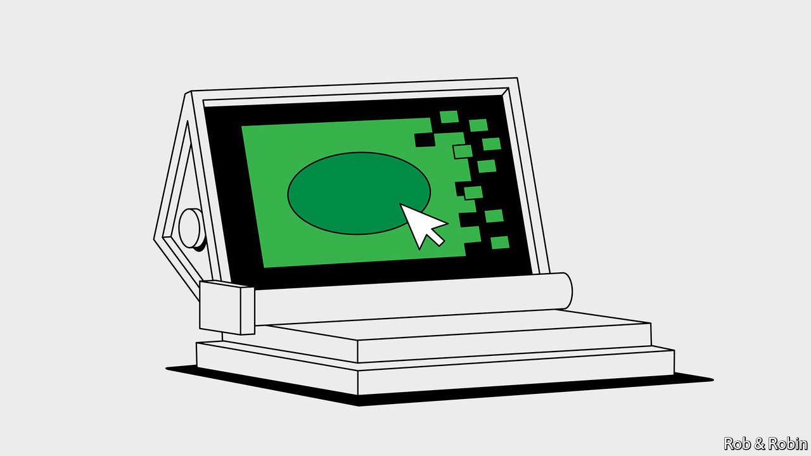
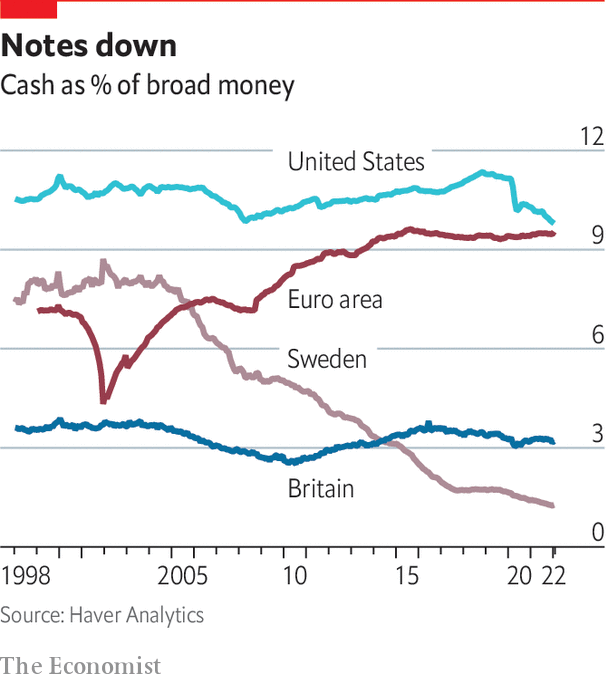

###### Going digital

# How central banks are moving into e-money 

##### Designing a digital currency that works—but not too well 

 

> Apr 20th 2022 

THE HISTORY of money is littered with swindles. In 17th-century England William Chaloner counterfeited coins, banknotes and lottery tickets before being sent to the gallows by Isaac Newton, master of the Royal Mint. During America’s free-banking era in the mid-1800s Andrew Dexter bought five banks in New England and began circulating banknotes with very little to back them. One bank was found to have issued $760,000 in notes, backed by only $86 in gold and silver.


Things became less lively after central banks gained legal monopolies over banknotes. Yet there were anxieties about this. At the turn of the 20th century, shortly before the Riksbank was given its banknote monopoly, Pontus Fahlbeck, a Swedish politician, wrote of “fears of severe disruptions in the business world”, and concerns that the central bank would become “much more powerful and influential than before for the country’s entire economy”.

Today physical cash has fallen out of favour. The bulk of money is digital and created by commercial banks, albeit regulated ones. A cast of digital-money wannabes are vying for customers’ e-wallets. And central banks want to stay in the money business by issuing digital currencies of their own, making the questions Fahlbeck raised more relevant than ever.

 


A banknote, as a claim on a central bank, is the safest form of money. But only commercial banks have access to a central bank’s reserves. A central-bank digital currency (CBDC) would extend that to everybody. The public could either hold accounts with the central bank, or hold central-bank money in privately issued wallets. According to the Atlantic Council, a think-tank in Washington, DC, 89 countries making up 90% of world GDP are exploring a CBDC. The Bahamian sand dollar, the East Caribbean DCash and Nigeria’s e-naira are already circulating. China’s trial of its digital currency, e-CNY, has expanded to more than 260m wallets.

The ECB is looking into the design and scope of a digital euro. “My preference is to see something in place by 2025,” says Christine Lagarde, its president. In Sweden a parliamentary inquiry will opine on the desirability of an e-krona soon. President Biden has issued an executive order asking the government and the Fed to explore the idea of a CBDC. In February researchers at the Boston Fed and the Massachusetts Institute of Technology announced that they had built a system to handle up to 1.7m transactions a second, far exceeding the throughput of Visa.


The consequences of CBDCs in their most radical form would be serious. They might make central banks responsible for how credit is intermediated. Because public money is safer than commercial-bank money, deposits could trickle out of banks towards the central bank. In bad times that could become a flood, made easier because money can be transferred between wallets at the mere click of a mouse. One study in Canada suggests that, depending on the features of a CBDC, households could hold between 4% and 55% of their liquid assets in one. Deposits are a source of cheap funding for banks. If they drained away, lenders would either have to raise money on pricier wholesale markets or scale back their lending. And central banks’ liabilities would expand, says Rickard Eriksson of the Swedish Bankers Association, raising the question of how they should be matched on the asset side. Direct lending to companies and households would be unlikely, but they might have to lend more to banks.

The danger, says Princeton’s Markus Brunnermeier, is that lenders’ dependence on central banks would alter the balance of relations by giving central banks power to determine who gets credit. Randal Quarles, the former Fed vice-chairman, points out that America’s Troubled Asset Relief Programme was meant to have no strings attached, but after it went through the political wringer, all sorts of conditions were added. Somebody would have to monitor payments data, if only because of anti-money-laundering rules. That would turn the central bank into a mighty credit machine and an all-seeing tool of the surveillance state. Eswar Prasad of Cornell University, author of a book on the future of money, reckons the biggest threat from a digital currency is ultimately to the independence of central banks.

Yet most central bankers are confident that a well-designed CBDC can minimise their intrusiveness, but still be attractive. Many are converging on a set of principles to avoid destabilising banks. None of the digital coins so far introduced or tested pay interest, so as not to compete with bank deposits. To avoid the risk of bank runs, most existing CBDCs limit the amount of virtual cash that customers can hold. A report by the BIS and seven big central banks suggests that a system of escalating fees could make CBDCs less attractive than commercial-bank accounts. The solution to the problem of privacy, they say, is to use a two-tier system without letting dodgy dealings off the hook. The users of the Bahamian sand dollar can hold up to $500 without providing any information to set up an account, but those wishing to hold up to $8,000 must pass identity checks. In an attempt to keep central banks at arm’s length from the public, most countries use private providers to offer CBDC wallets, so wallet providers do the anti-money-laundering checks.

These changes would, by design, make CBDCs an inferior form of money. Physical cash typically satisfies three functions of money: it is a unit of account, a means of exchange and a store of value. Caps on virtual cash would, however, mean that it would no longer be a store of value. The optimistic view is that this could open the door to innovation and competition. But the pessimistic view is that it might doom the attractiveness of a CBDC.

The result is something of a paradox. Central banks must ensure that the currencies are successful, but not too successful. In a report to the European Parliament Mr Brunnermeier and Jean-Pierre Landau of Sciences Po in Paris suggest that a central bank “will have to ensure that the CBDC is present everywhere but important nowhere”.

To some critics this makes CBDCs hardly worth the bother, especially in places where cash is not yet near extinction, and where existing payments systems are fast enough. The average amount in an e- CNY wallet is three yuan (47 cents), which does not suggest it has been a runaway success. In Britain, a House of Lords committee concluded that CBDCs were a “solution in search of a problem”. But the momentum for CBDCs is building. That makes the political process for agreeing on them important. ■

