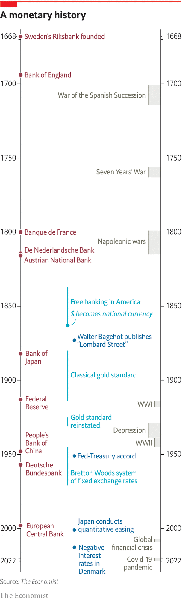

###### Central banks

# The danger of excessive distraction 

##### Central banks are under attack for failing to stop inflation. That partly reflects being given too many other jobs to do, argues Rachana Shanbhogue 

 

> Apr 20th 2022 

CENTRAL BANKS are the guardians of money, the lifeblood of capitalism. Their actions influence people’s wages and savings, whether they can borrow and at what price, and steer the broader direction of the economy. Whether you are a worker or a pensioner, a saver or a borrower, their decisions affect you.

Thirty years ago, after inflation in the rich world had spiked in the double digits, these powers were harnessed for a single goal: to keep prices stable. Most central banks were given strict mandates and made independent of meddlesome, vote-seeking politicians. For a time it seemed that this ingenious policy fix had banished the spectre of inflation altogether. Central banks’ targets moulded expectations of price rises everywhere. Inflation in America, Britain, Germany and Japan averaged 2.1% a year between 1990 and 2007, down from 8% in the 1970s. Before covid-19 hit the big worry was too-low, not too-high, inflation.

 


Today, however, the inflation-fighting regime faces its most spectacular failure yet. Inflation has come roaring back, spurred by surging energy prices, rising wages and supply-chain disruptions. In America and the euro area consumer prices rose at an annual rate exceeding 7% in March, the fastest pace in decades. Labour markets in many places have become uncomfortably tight as jobs chase too few workers. Even the Bank for International Settlements (BIS), the central bank for central banks, is warning that the world may be on the cusp of a new inflationary era. Monetary policymakers across the rich world are scrambling to react.


This special report notes that this threat to central banks’ credibility comes as they have extended themselves far beyond just fighting inflation. After the financial crisis of 2007-09 their regulatory authority was beefed up. During the pandemic they intervened in a wide range of asset markets, hoovering up government bonds and even lending directly to companies and governments. Lulled by quiescent inflation before the pandemic, they became all-purpose policymakers, venturing into fixing structural problems such as inequality and climate change. As inflation makes a comeback, the danger is that these new aims will hinder, or distract from, the central mission of taming it.

An expansive phase

The powers of central banks have waxed and waned over time, especially after crises. The Swedish Riksbank, the first central bank, was set up in 1668 “to maintain the domestic coinage at its fair and right value”. The Bank of England was established in 1694 to fund war against France. Other central banks followed, although the Federal Reserve was created only as late as 1913. A series of financial panics in the 19th century led to central banks becoming lenders of last resort, ready to support the banking system during a crisis. To ensure trust in money, most linked their currencies to gold.

In the depression of the 1930s the gold standard collapsed, central banks were disgraced and a period of subservience to governments ensued. During the second world war they kept public borrowing costs low. Many veered into industrial policy. In emerging markets they came to resemble national development banks. (An arm of Mexico’s central bank financed the construction of tourist resorts in Cancún.) But as inflation picked up in the 1960s and 1970s, the tide shifted in favour of giving them independence.

In America the Fed and the Treasury agreed that the central bank would no longer cap government-bond yields. The Fed forcefully displayed its independence in the early 1980s, when Paul Volcker provoked a recession to tame inflation. Central banks were given independence and inflation targets, first in the rich world and then in many emerging economies. Today most are independent (the People’s Bank of China, or PBoC, is an exception).

Why is the role of central banks ballooning again? One reason is the steady decline in interest rates as desired global saving rose, which made reviving inflation after the financial crisis harder. In 2000 the Fed’s benchmark rate was around 6%. Today it is 0.25-0.5%. Although the central bank has begun raising interest rates, investors expect them to peak only at 3.1% in two years’ time. As they tried to revive inflation central banks have reached for all manner of tools. Many in the rich world began buying government bonds to lower long-term interest rates. The European Central Bank (ECB) bought corporate paper and subsidised bank lending to households and businesses. The Bank of Japan went further, buying equity exchange-traded funds, and promising to keep ten-year government-bond yields at 0.25%.

Another reason for the growing role of central banks is the new attention paid to financial stability, after a period of neglect. Stricter regulation of banks has led to a rise in non-bank intermediaries in a range of credit markets. When the crisis came, central banks had to stabilise these markets. The extraordinary cash crunch brought on by the lockdowns of 2020 pushed central banks back to the sphere of credit allocation. Technological change has accelerated the decline of physical cash, which once embedded trust in central banks. That has led central banks to consider if the banknotes they supply to the public should go virtual.

Politics is another reason for central banks’ bigger footprints. One sign is that appointing Fed governors has become more fraught since the financial crisis. Confronted with big intractable problems such as climate change and inequality, ministers and activists also eye central banks’ huge balance-sheets, hoping to use them to achieve socially worthy or green goals. Central bankers talk about such issues a lot more. Rising global tensions have also forced some to go beyond technical risk management when managing their foreign-exchange reserves, into geopolitics.

Many emerging markets have adopted inflation targeting, casting off their development roles and enjoying lower, less-volatile inflation as a result. But they keep a firmer hand on markets, given their vulnerability to exchange-rate movements and capital outflows. Some vestiges of the old industrial policy remain, such as bank-lending quotas for farmers or rural borrowers in India. The PBoC chases several objectives, often at the behest of the government. Although it has liberalised interest rates a bit, it relies heavily on managing the quantity of credit, rather than its price, nudging banks to lend to certain preferred borrowers.

This special report considers five areas where central banks are being pressed to do more: intervening in financial markets; tackling inequality; combating climate change; introducing digital currencies; and reacting to geopolitics. Each represents an important shift in markets and the economy. But each also risks pulling central banks deeper into political terrain, the price of which would be a loss of focus. When inflation was low, a broader role may have seemed harmless. Now, however, it has slammed into the reality of high inflation. The danger is that, with too many objectives, central banks will fail in their most important mission. ■

