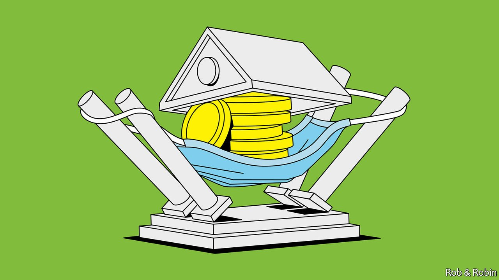
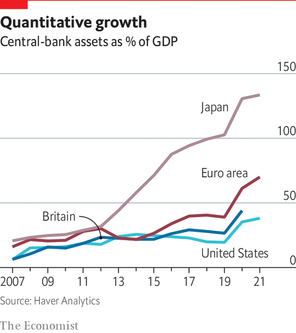

###### Emergency response

# The perils of expanded balance-sheets 

##### The power—and the limits—of central banks’ balance-sheets 

 

> Apr 20th 2022 

A CENTRAL BANK’S power stems from its ability to create reserves from thin air so as to buy assets or lend to borrowers. The use of the balance-sheet involves choices: which assets to buy, and how much. Central banks are guided by their legal mandates, using their clout to defuse risks to the financial system and meet their inflation targets. But their actions create winners and losers. After the financial crisis the Federal Reserve was castigated for bailing out Wall Street over Main Street. The ECB was attacked for being slow to act as a lender of last resort to the euro area’s heavily indebted southern members.

The power of central banks was on its fullest display during the pandemic. As countries began locking down in spring 2020, an enormous shock reverberated across the financial system. Desperate for cash, investors dumped even safe Treasuries. Corporate-credit markets dried up. Central banks reacted strongly. Between March and June 2020, writes Athanasios Orphanides of the Massachusetts Institute of Technology, the Fed created as many reserves as it had in its first 100 years.


As unparalleled as the scale of this intervention was its scope. The Fed introduced nine emergency-lending schemes, backstopping financial markets worth about $24trn and supporting bank lending to firms. It bought Treasuries, first to stabilise the bond market, then to lower borrowing costs (a policy known as quantitative easing, or QE). The assets of central banks in America, Britain, the euro area and Japan rose during the pandemic by more than $10trn. More than a dozen emerging markets, including India, Indonesia and South Africa, bought government bonds.

The mere announcement of these policies stemmed market chaos. “As of March 2020 there was a clear and rapid reaction that we could visibly point to,” said Christine Lagarde, president of the ECB, speaking in mid-February. Yet the take-up of some schemes remained modest: the Fed’s corporate-credit facilities lent only $14bn, a fraction of the $750bn available. A rapid economic bounceback led many lending schemes to wind down. And, as inflation surges, net purchases under QE are ending. Yet the consequences of these interventions will endure, not least by creating expectations that central banks will always come to the rescue if trouble hits. Vast stockpiles of government bonds have left monetary policy uncomfortably enmeshed with the public finances. Both considerations could make central banks less willing, or less able, to act forcefully to fight inflation.

The support for markets reflected the need to preserve financial stability. Following a doctrine laid out by Walter Bagehot, a former editor of The Economist, in the 19th century, central banks now act as lenders of last resort, standing ready to lend to sound financial institutions, against good collateral and at a penal rate, in order to prevent financial panics. Bagehot clearly had banks in mind. “The great wish on the part of the English people as to currency and banking is to be safe,” he wrote in 1844.

According to the Financial Stability Board, a group of regulators, non-banks conducted half of all financing activity worldwide in 2019. And it was these, not banks, that caused most panic in the pandemic. As mutual funds and money-market funds faced redemptions, they rushed to sell Treasuries and corporate bonds, disrupting credit markets and exposing weaknesses in government-bond markets. The Fed dusted off lending facilities for money-market funds set up during the financial crisis. Central banks also became buyers of last resort, both of government bonds and of commercial paper.

As Raghuram Rajan of the Chicago Booth School (and a former governor of the Reserve Bank of India) puts it, central banks became “corporate safety-nets”. The Fed bought commercial paper from companies, backed bank loans across the economy and even backstopped municipal debt. The ECB extended loans to banks. The Bank of England lent directly to firms. For some central bankers this was uncomfortable. The ECB, having run out of monetary firepower even before the pandemic, had already resorted to subsidised loans. And the PBoC is “a lending machine”, says Alicia Garcia Herrero of Natixis, an investment bank. In the middle of a trade war, it told banks how much to lend to the private sector. The Fed’s actions were its deepest involvement in the corporate-credit market since the 1930s. “We would always prefer not to be there,” says Andrew Bailey, governor of the Bank of England.

Independence days

These measures were justified by the extraordinary covid shock, says Randal Quarles, a former vice-chairman for supervision on the Fed’s Board of Governors. But his testimony to Congress in May 2020, after the Fed announced its schemes, serves as a reminder of how politically fraught they are. “Every question was along the lines of ‘where’s mine?’” he says. The Fed cannot buy private assets without permission from the Treasury secretary. Yet now that the “emergency glass has been broken”, he worries that credit support might be seen as just part of the regular toolkit. That makes norms around independence crucial.

The safety-net for investors may also feed the belief that central banks will always step in at the merest hint of trouble. Such moral hazard may just encourage investors to take greater risks. “The whole point of the Dodd-Frank Act in 2010 was to keep the Fed from intervening again,” says Mr Rajan. “But in 2020 it did everything and more. How do you get markets not to believe that you’ll do it again and again?”


One answer is to ensure non-banks do not need rescuing again. In December the Securities and Exchange Commission proposed rules to lessen the likelihood of money-market funds fire-selling assets when in trouble. A group of academics and former regulators suggests making the insurance the central bank offers non-banks explicit, by setting up a repo facility so they can borrow against Treasuries when they need cash, rather than sell them. This would be open to all market participants and charge unregulated non-banks a fee rather like an insurance premium. But the events of 2020 also make a case for more targeted ways of dealing with financial instability, says Mr Bailey. Last time it was fortuitous that a single tool of large-scale bond purchases served both to stabilise the financial system and to ease monetary conditions. If market dysfunction were to coincide with monetary tightening, central banks would face a tricky choice between stabilising markets and quelling inflation.

Large-scale bond purchases pose another set of headaches. Where programmes to provide liquidity can be quickly wound down, QE involves holding on to assets for some time. Central banks are now a huge presence in bond markets. The Bank of Japan owns 44% of Japanese government bonds. The ECB, which first began QE in 2015, holds more than 40% of Dutch, Finnish and German sovereign debt. The Fed and the Bank of England hold about 40% of Treasuries and 30% of gilts, respectively, much of it bought since 2020.

 


The pandemic required closer co-ordination between monetary and fiscal policies. In May 2020 the Bank of Japan and the finance ministry said they would do “whatever it takes” to stabilise the economy. The ECB played a key role in backstopping heavily indebted euro-area countries after Mario Draghi, its president, promised in 2012 to do “whatever it takes” to preserve the single currency. In the spring of 2020 it even began disproportionately buying bonds of the zone’s southern member states. Overall, its purchases more than exceeded governments’ net bond issuance in 2020 and 2021. A survey of big investors by the Financial Times found that the “overwhelming majority” thought the Bank of England’s bond-buying was meant to fund the government’s emergency spending, rather than support the economy. Mr Bailey rebuffs the charge: “To think that we knew precisely what Treasury issuance was going to be ahead of time is absurd,” he says.

The nightmare scenario is that central banks end up financing fiscal deficits, and governments press them to keep monetary policy loose, leading to spiralling inflation. But the pandemic seems to have been different. In Ghana, the Philippines and Indonesia, for example, central banks began buying bonds directly from debt-management offices, rather than secondary markets, with barely a backlash from investors—a sign of how much credibility they had built up. Markets have been unfazed as Indonesia extended its direct financing of the government into 2022. In a study in January, economists at the IMF found that large monetary expansions tend to lead to “considerable” price increases when fiscal deficits are wide and central-bank independence is weak. But during the pandemic, the researchers say, direct-financing programmes had little effect on inflation expectations.

The real test lies ahead. QE did not lower the government’s borrowing costs but rather changed when the bill falls due. In effect, central banks became managers of the public debt. With many starting to raise interest rates to tackle inflation, governments, weighed down by debt burdens swollen during the pandemic, will not be happy.

QE works by swapping long-term bonds for the shortest-duration liabilities possible: central-bank reserves. These reserves, which are remunerated at a floating rate, form part of consolidated government finances. The effect of central banks’ vast holdings of bonds has therefore been significantly to shorten the maturity structure of public debt. In Britain, the median maturity of gilts falls from 11 years to four years once the effects of the Bank of England’s QE are included, according to the Office for Budget Responsibility, an official fiscal watchdog. The OBR estimates that, should interest rates rise by an extra percentage point, the government would have to spend an extra £20.8bn ($27.1bn, or 0.8% of GDP) in interest in 2025-26.

Taken together, this looks like “a big debt-management mistake”, says Sir Paul Tucker, a former central banker now at the Harvard Kennedy School and author of the book “Unelected Power”. Rather than locking in very low long-term interest rates, governments have exposed the public finances to rising short-term rates as monetary policy normalises. The worry is that, particularly if their independence looks frail, central banks will be leant on to raise rates more slowly, or not at all.

Although interest rates are now rising, central banks may find them uncomfortably close to zero when recession next hits. Longer-term factors, such as population ageing, that have borne down on interest rates are unlikely to go away. In the face of such forces, it is the job of structural and fiscal policy to act, says Shirakawa Masaaki, a former governor of the Bank of Japan. Monetary policy aims to pull forward demand from tomorrow. But that is unlikely to do much if there isn’t the demand to bring forward, he says. The “hubris” of central bankers, says Mr Rajan, lies in thinking they can solve all problems.

That suggests a different co-ordination is needed: for fiscal policy to step in as monetary policy reaches its natural limits. But public spending faces “political transaction costs”, says Sir Paul. “A finance minister might agree that the best response to a deep recession is a mix of fiscal and monetary stimulus, but the difficulty of getting it past the party and parliament means that he leaves the central bank to do more alone.”

The close links between monetary policy, on the one hand, and financial stability and the public finances, on the other, could together make central banks think twice about how tough to be in response to rising inflation. So could their new-found emphasis on social responsibilities. ■

