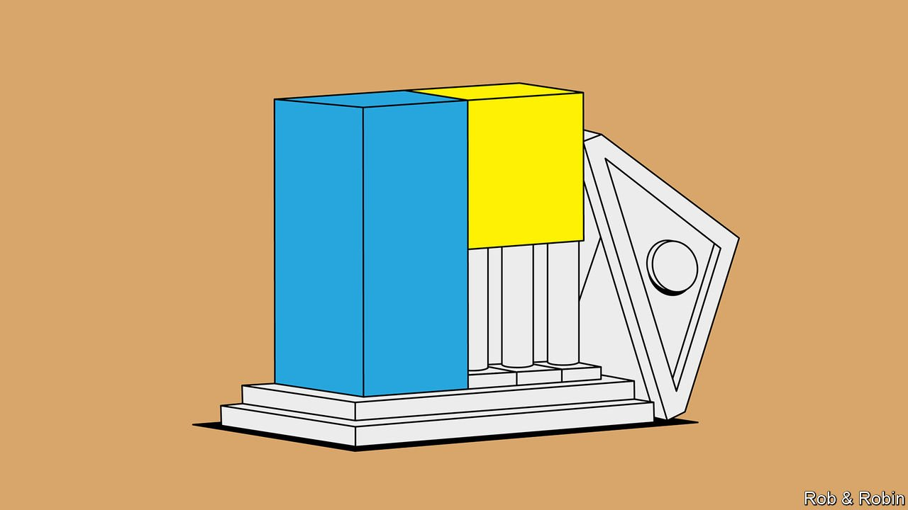
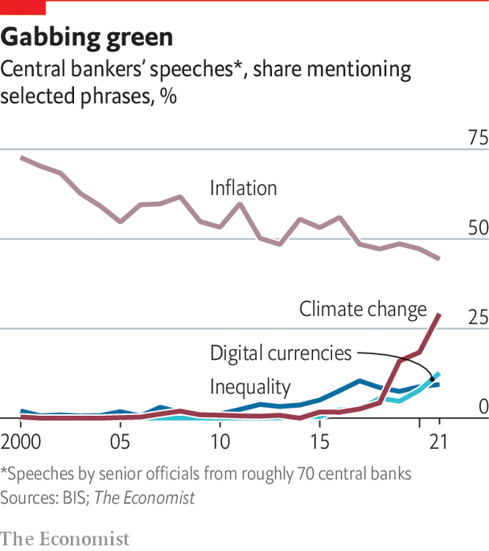

###### Social issues

# When central banks become one-stop policy shops 

##### Central banks are under pressure to cure social ills 

 

> Apr 20th 2022 

ALL AROUND the world politicians are exercised by the yawning gap between haves and have-nots. For every $1 the average white American household earned in 2019, the average black one made only 51 cents. For every $1 in wealth held by a white household, a black one owned just 15 cents. Joe Biden came into the presidency promising to tackle such disparities, vowing that “The dream of justice for all will be deferred no longer.” In New Zealand Jacinda Ardern, the prime minister, promised to “make homeownership possible again”. House prices went up by more than 25% in 2021, making property among the least affordable in the OECD club of mostly rich countries. “Anyone else want to leave New Zealand purely because of the housing crisis?” asked one buyer on an online forum. “This housing market sucks.” In China, the conspicuous gap between rich and poor and slowing social mobility spurred President Xi Jinping to launch a campaign of “common prosperity” last year, which took aim at everything from tech firms to celebrities.

Central banks seem almost as preoccupied with income distribution. According to a database maintained by the Bank for International Settlements (BIS), words relating to inequality cropped up in a tenth of speeches made by central bankers last year, compared with about 2% before the financial crisis. (By contrast, mentions of inflation drifted down.) In America about 15% of research papers published by the Federal Reserve studied inequality in 2021, up from about 5% in 2005, according to research by Carola Conces Binder of Haverford College and Christina Parajon Skinner of the Wharton School at the University of Pennsylvania.


This greater attention in part reflects a response to arguments that central banks have worsened inequality by keeping interest rates low and boosting asset prices. But they also face calls to do more to remedy inequality and other social ills directly. And they sometimes embrace a social role themselves. Recent experiences in America, China and New Zealand provide illustrations.

In America progressive Democrats have called on the Fed to tackle racial gaps in employment, income and wealth. In April 2021 the House financial services committee passed a bill proposing to amend its mandate, which requires it to aim for price stability and maximum employment, to add demands that it tries to eliminate racial gaps. “Systemic racism and inequality is not something that happens on its own—it is a result of specific policy choices and the Fed must take deliberate action to fix it,” said Elizabeth Warren, a senator for Massachusetts.

 


Research shows that black workers benefit most from long expansions. Black unemployment is not only always higher than white unemployment (the current gap is about three percentage points) but also tends to rise faster in bad times. As the labour market tightens, excluded workers are drawn in, and the gap starts to close. This suggests that if monetary policy stays loose for longer, it will enhance equality. As the Fed reviewed its strategy in 2020, when inflation looked low, it leapt on the idea, redefining its goal of maximum employment as “broad-based and inclusive”. “This change reflects our appreciation for the benefits of a strong labour market, particularly for many low- and moderate-income communities,” said Jerome Powell, the Fed’s chairman.

Betting the house

In 2021 the Reserve Bank of New Zealand became the first central bank to have house prices included in its remit, 31 years after it became the first to be given an inflation target. As in other rich countries, the central bank is seen as a big contributor to the housing boom. At the finance minister’s instruction, and subject to its primary inflation and employment goals, the RBNZ must now “have regard to house prices” and the government’s objective of making property affordable for first-time buyers.

By contrast, the PBoC has long had a multiplicity of goals. Chief among them is currency and economic stability. But the government has also asked it to improve the economic structure, implement reforms and enhance household welfare. Since 2014 the PBoC has conducted “structural monetary policy”, which targets credit to different sectors through subsidised lending facilities, to boost specific parts of the economy without worsening debt problems for overextended state-owned firms. As of June 2021, according to its Monetary Policy Report, it had lent nearly 1.5trn yuan ($234bn) to support rural development, small and midsize firms and poverty alleviation. The push to lend to small firms also supports the wider common-prosperity campaign, by lifting employment and therefore household income, says Helge Berger, the IMF’s mission chief for China.

Many economists doubt these attempts can succeed. One problem is that interest rates are a blunt tool. To have a big effect, the macro hammer must be used with great force, but that risks breaking other things. A study by Stephanie Aaronson of the Brookings Institution, a think-tank, and others suggests closing the gap between black and white men’s unemployment rate requires headline unemployment in America to fall to 1%. Another paper by economists at the New York Fed suggests that a percentage-point interest-rate cut reduces the gap in unemployment rates for black and white workers by less than 0.2 percentage points. Closing the wedge would require interest rates to fall by more than ten percentage points. Even if that were possible, it would overheat the economy and stoke serious inflation.

The economics linking monetary policy and inequality is “confused”, says Larry Summers of Harvard University (and a former Treasury secretary). He has spoken before of the danger that “woke” central bankers neglect rising inflation. Easy money buoys asset prices by design—and white people own an outsize share of those assets. The New York Fed researchers find that interest-rate cuts lead to large gains in white households’ wealth, far outweighing the impact of lower unemployment and higher incomes for black families. High inflation tends to affect the poorest in society most. Another study by Fed economists suggests that black households suffer more from inflation spikes, because they consume more goods with volatile prices. Both suggest that interest-rate increases, rather than decreases, would be a way to narrow disparities. The question of whether to raise or lower interest rates is a conundrum which the RBNZ would also face. It could raise interest rates to bring down house prices, but that would slow the economy, thereby denting the incomes of prospective homebuyers.

There is also debate over whether low rates cause inequality. Adrian Orr, the RBNZ’s governor, has pointed to the global savings glut, which holds down interest rates globally, and the low availability of housing, as reasons for the boom: the central bank plays only “a bit part”. Agustin Carstens, head of the BIS, says there is little central banks can do to counter the side-effects of low interest rates. Their best course, he counsels, is to ensure macroeconomic and financial stability. Just as inflation hurts the poorest most, so do recessions and crises.

The PBoC has more targeted tools at its disposal. Yet even in China many economists see structural monetary policy as a mistake. In an essay on the monetary-policy framework, Yiping Huang, Tingting Ge and Chu Wang, three academics, say there is no convincing evidence that it works. More credit is not always a solution, they say: if farmers do not receive enough, it may be because they are deemed too risky relative to the interest rates on loans. Stimulating competition among lenders, or liberalising interest rates, would be better. More broadly, argues Yu Yongding, a former member of the PBoC’s monetary-policy committee, the solution to social ills is not more lending, but a system of better-targeted taxes and subsidies, something only governments can do. This is an argument that applies as much to the case of racial inequality in America, and to housing disparities in New Zealand.

For central banks, meanwhile, the problem of tackling a structural problem with a cyclical tool is that it creates a tension between achieving its main mission and fixing social ills. When inflation was low, it was possible for the Fed to run the economy hot to bring disadvantaged workers into the labour force. But as inflation rises those good intentions could make the central bank slower to ensure its target is reached. According to Bloomberg News, even officials at New Zealand’s Treasury advised the finance minister against changing the RBNZ’s remit. The central bank, they concluded, would be unlikely to raise rates to reduce house prices, because their goals of maximum employment and inflation must always come first. ■

