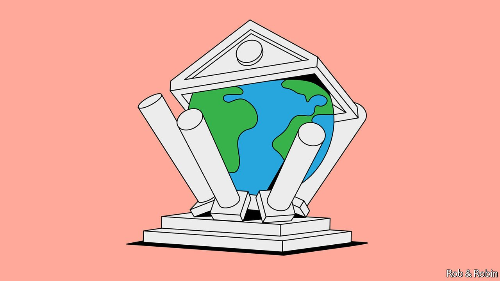

###### Geopolitics and war

# When central banks face sanctions 

##### Central banks must grapple with geopolitics, too 

 

> Apr 20th 2022 

THINK OF A central bank in dire straits, and Turkey’s might come to mind. Recep Tayyip Erdogan, the president, has sacked three of its bosses in three years in pursuit of his wacky economic ideas, one result of which is inflation of 60%. Or Lebanon, where the central bank orchestrated a scheme to funnel bank deposits to the government. Riad Salameh, its long-standing governor, faces charges of corruption and money-laundering, and is reportedly in hiding.

The latest to hit trouble is the Central Bank of Russia (CBR). When Russia faced economic sanctions from the West for invading Crimea in 2014, Elvira Nabiullina, its governor, let the rouble float and introduced an inflation target. But now Russia’s invasion of Ukraine has led to sanctions aimed directly at the central bank, blocking access to foreign-exchange reserves. Unable to use about half of the $630bn in its war-chest, the CBR had to raise interest rates briefly to 20% and impose capital controls.


Speculative attacks against other currencies have long been part of the arsenal of economic statecraft, says Harold James of Princeton University, in the belief that a financial crisis would force the enemy to spend less on its army. During the second world war America froze Japan’s foreign assets, and banned traders from buying gold from Japan. More recently, it took aim at Iran’s central-bank assets in 2011-12, as it tried to stop the Iranian nuclear-weapons programme. The American government estimates that Iran can still access only a tenth of its $100bn in reserves. After the Taliban seized control of Afghanistan, America also froze $7bn in assets held by the Afghan central bank at the Federal Reserve. In an executive order, President Biden said that the administration would eventually seek to spend some of the money on aid for Afghanistan.

The CBR has tried to reduce its reliance on American financial plumbing: the share of its reserves in dollars fell from nearly half in 2017 to less than a quarter in 2022. But it increased its holdings of euros, suggesting it may not have expected sanctions from Europe. It is now subject to sanctions from America, Britain, Canada, the EU, Japan and Switzerland. Most of the reserves that it can still access are in either gold or the yuan.

Geopolitics has always influenced foreign-exchange reserves, along with trade, convenience and safety. The obliteration of Russia’s financial war-chest will have been noted especially in countries like China, which has around $3.5trn in reserves, and India and Saudi Arabia, with $590bn and $472bn, respectively. The result may be a continued reduction in the dollar’s dominance. According to the IMF, it accounted for 60% of global reserve holdings in 2021, down from 70% in 2000.

Where to go instead? Gold could regain lustre. But although it is a good store of value, it must be sold to be useful, and financial sanctions will deter potential buyers. It is also a hassle to move. The CBR’s holdings amount to more than 180,000 bars, much of it kept in Russia, estimates Steve Cecchetti of Brandeis University. Safely transporting any of these to China or India, say, would be a costly affair.

What seems most likely is that “each reserve manager lives in their sphere of influence”, predicts Mr Cecchetti, buying currencies only of friendly countries. China’s yuan stands to gain: it makes up only about 3% of global currency reserves now. But the gains may be modest. Only a quarter of the diversification away from the dollar over the past 20 years has been to the yuan, according to Barry Eichengreen of the University of California, Berkeley. China’s closed financial system makes buying many yuan-denominated bonds and securities far from easy. And if America can freeze a central bank’s foreign assets, it is not hard to imagine China one day doing the same.

