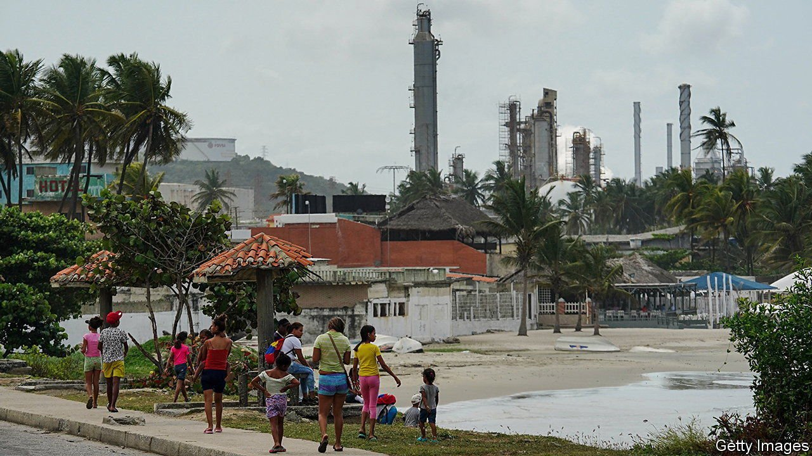
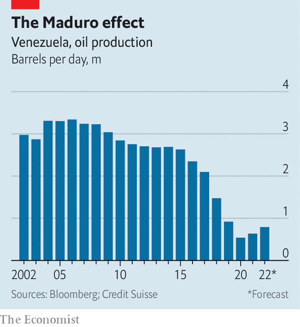

###### Enemies with benefits

# Can Venezuela help the West wean itself off Russian oil? 

##### Nicolás Maduro, the country’s autocratic president, may make that difficult 

 

> Apr 23rd 2022 

ON APRIL 22ND a ban on Russian oil imports will come into effect in the United States. One of the countries that could benefit is Venezuela. According to Credit Suisse, a bank, its economy is expected to grow in real terms by 20% this year, albeit from a very low base. This will be driven wholly by the oil industry. The bank expects petroleum output to increase by more than a fifth.

Even before Russia’s war in Ukraine, Venezuela had been producing more oil. Over the past year, it doubled its output to around 800,000 barrels a day. Although that is a fraction of the 3m it produced in the 1990s, it is enough to replace the 199,000 barrels a day the United States imported from Russia in 2021. Several American refineries were built to process viscous Venezuelan crude specifically. They struggle with runnier Saudi stuff or domestically produced shale oil.


At the moment, however, the United States bans the import of Venezuelan oil, one of a series of sanctions designed to make life difficult for the regime of Nicolás Maduro, the dictatorial president. It has charged Mr Maduro himself with “narco-terrorism” and is offering a $15m bounty to anyone who helps bring him to justice. It has declared that an opposition politician, Juan Guaidó, is the legitimate president.

 


Yet last month in Caracas, Venezuela’s capital, three American officials met Mr Maduro, in an encounter he described as “respectful”. Three days after the delegation arrived, President Joe Biden announced the ban on Russian oil imports. “The timing [of the meeting] suggests the administration’s real effort is to get more oil,” says Elliott Abrams, who served as special representative for Venezuela under Donald Trump, Mr Biden’s predecessor.

If Mr Biden is considering a detente with Venezuela, it would not just be for economic reasons. He may hope to exploit the war in Ukraine to drive a wedge between Venezuela and Russia, one of its closest allies. Vladimir Putin, Russia’s president, became interested in the South American country after the United States suggested in 2008 that Ukraine and Georgia could eventually become members of NATO. Mr Putin seems to have decided to meddle in the backyard of the United States in retaliation—and found, in Hugo Chávez, Mr Maduro’s predecessor, a willing partner. Between 2009 and 2019 Russia sold nearly $9bn worth of arms to Venezuela. When Mr Trump flirted with the idea of invading Venezuela in 2017, the Russian government sent long-range bombers capable of firing nuclear weapons to Caracas. In 2019, when the United States and other governments recognised Mr Guaidó as president, Mr Putin sent soldiers and mercenaries to defend Mr Maduro.

Since 2019 Russia’s government has also created a sanctions-busting network for Venezuela, helping it sell gold and oil, albeit at a deep discount. That year Petróleos de Venezuela, the state oil company, moved its European offices from Lisbon to Moscow. Plane-loads of cash arrived in Caracas from Moscow, giving the regime enough hard currency to stave off collapse. Mr Maduro’s cronies are also assumed to be stashing their money in Russian banks.

The Kremlin has claimed that, on a phone call with Mr Putin, Mr Maduro backed Russia’s bloodthirsty invasion of Ukraine. But the conflict is damaging relations. Western sanctions on Russian banks will make it difficult for Mr Maduro and his lieutenants to get their money out of Russia, suggests Francisco Monaldi at Rice University in Texas. At the meeting in March Mr Maduro is said to have asked the American delegation to lift sanctions on Russian banks temporarily, in order to allow the regime to withdraw its funds. They reportedly refused.

Mr Maduro may also be concerned that, now Russia is a pariah, too, it will become a competitor in selling cut-price oil. Since 2020 China has been the main buyer of Venezuelan crude. But importing oil from halfway around the world makes little sense if Russian oil is going begging on China’s doorstep.

Chevron, the last American oil company operating in Venezuela, is poised to take advantage of any change in the sanctions regime. The American authorities currently allow it to maintain its infrastructure, but not pump any oil. Even that permission expires in June. Chevron has been lobbying for an expanded licence which would allow it to trade Venezuelan oil. According to Reuters, it has started to assemble a trading team to market oil from Venezuela. It has also begun preparations for employees to get Venezuelan visas in Aruba, just in case.

According to Caracas Chronicles, a blog, Delcy Rodríguez, the vice president, and Felix Plasencia, the foreign minister, plan to meet American officials in Trinidad &amp; Tobago soon. On April 14th a group of 25 Venezuelan economists and civic leaders, most of whom are opposed to Mr Maduro’s regime, sent a letter to Mr Biden arguing that sanctions should be eased and that Western oil companies should be allowed to operate in the country once more.

The Biden administration insists that it is not about to embrace Mr Maduro and that it remains concerned about human rights. After the meeting in March, Mr Maduro released two American prisoners who had been held hostage in Caracas. He also pledged to return to talks with the Venezuelan opposition in Mexico.

Black gold

But many observers are sceptical that the United States can both buy oil and make Mr Maduro change his dictatorial ways. “If you’re going to go for oil and try to pry Maduro away from Russia, then you have made a decision to deal with his regime the way it is,” says Brian Winter of the Americas Society, a regional forum. Several analysts also doubt that, even if sanctions were lifted immediately, Venezuela would be able to ramp up production after years of mismanagement and corruption. “To me, this looks like Obama’s Cuba policy,” says Mr Abrams. “That is, you give and you give and you get nothing.”

Mr Maduro’s position has clearly grown stronger in recent years. His approval ratings, at 19%, are higher than those of Mr Guaidó, at 12%. Since 2019 Mr Maduro has quietly instituted a range of economic reforms, including lifting price controls and some restrictions on foreign exchange. He has courted private investment. The dollar has become, in effect, the national currency, which may have helped bring down inflation from almost 3,000% in 2020 to 686% in 2021. “Maduro has never been in such a position of strength,” says Temir Porras, his former chief of staff. “He is the boss.” If there is a deal to be done, it will not be entirely on Mr Biden’s terms. ■

Read more of our recent coverage of the 

