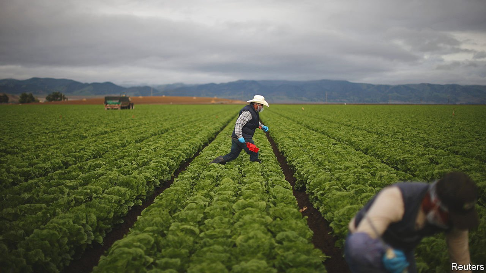

###### The United States of Mexico

# Mexican migration has changed America for the better 

##### Remittances sent home have helped Mexico, too 

 

> Apr 23rd 2022 

PEDRO MORALES, a 73-year-old retired farmer, sits at the table of his sparsely furnished house in Santa Rosa and flicks through faded pictures of José, one of his sons. In 1990 José, then just 19, left this small village two hours outside of Guadalajara, in the central Mexican state of Jalisco, where chickens still roam the streets. He crossed the border to the United States illegally, and has lived there ever since.

Some 3,000km (1,800 miles) away, José explains over breakfast in Los Angeles that he migrated north for “a better life and to help my parents”. It has been hard work, but he achieved both aims. With the money he earned through a series of construction jobs, he bought a house in California. He married Claudia, also an undocumented Mexican. Their 26-year-old daughter, Evelyn, is an American citizen.


José was not the only person from his family to make the journey. His brother Roberto lived in the United States for nine years until he was deported. One of Pedro’s grandsons, named after him, worked for four years legally in America before returning to Mexico at the start of the pandemic. Juan Carlos, another grandson, migrated north last year for six months on a visa for agricultural labourers.

One family, two countries—and a tangled web of legal statuses and experiences. The Morales family illustrates the vast and varied panorama of migration from Mexico to the United States, one of the largest movements of people from one country to another in the past 50 years. Since 1965 over 16m people have left Mexico to go north of the border.

 


Partly because so many Mexicans (and Central Americans) have moved illegally to the United States, immigration is an issue that haunts every American administration. President Joe Biden, for example, is under pressure to extend a policy known as Title 42, introduced under his predecessor Donald Trump. This policy, ostensibly adopted because of the pandemic, allows officials to turn away migrants at the border, including asylum-seekers, and is due to expire in May. But such squabbles over Mexican migration fail to capture its nuances. And they ignore how these migrants are shaping both their countries, mostly for the better.

The border between the two countries has always been porous. But the period of mass movement north dates to 1964, when the closure of the bracero seasonal work programme in the United States spurred many Mexicans to make the journey illegally. The number of migrants gathered pace in the 1980s and rocketed in the 1990s and early 2000s (see chart).

Las fronteras

Mexican migration is primarily driven by a demand for manual labour in the United States, says Jorge Durand of the University of Guadalajara. By one estimate 68% of California’s agricultural workers are Mexicans. “I knew there was work in the United States,” says José.

The first wave of migrants fitted squarely into this pattern. They were single young men from rural areas, according to Filiz Garip of Princeton University. They did not have documents and worked in agriculture. Later, however, they were joined by migrants from cities, who were richer and better educated than the average Mexican. Women started to make the journey. Migrants fanned out from California, Texas and Illinois to other parts of America. They stayed for longer, too.

The patterns of Mexican migration shifted again over the time that José was beginning to settle down in the United States. For a start, after a peak in 2007, fewer Mexicans have been making it over the border each year, not least as border security has been tightened by successive administrations. In the 2000s there were several years of negative net migration, because of a large number of deportations and a less buoyant jobs market caused by the Great Recession. The second trend is that since around 2017, there have been more legal than illegal Mexicans in the United States, estimates suggest.

The overall fall in the number of migrants also correlates with Mexico’s shifting demography. An average Mexican woman had 6.6 children in her lifetime in 1970 but only 2.1 in 2020; the country’s median age rose from 15 to 28 over the same period. Mexican migrants, in turn, have changed the United States. The country is home to around 11m migrants born in Mexico. They constitute around a quarter of the foreign-born population, and are increasingly a political and an economic force. Hispanic migrants are younger and, until recently, tended to have more children. According to the Pew Research Centre, some 17% of American women who gave birth in 2018 were of Hispanic origin, up from 10% in 2000. But Mexican migrants to the United States are having far fewer children than they used to: in 2000 they accounted for 42% of all births to women born abroad. By 2018 their share was half that.

Hope accompanies them

The newcomers changed where they lived, too. Almost half of the population of Los Angeles is Hispanic. Most are of Mexican heritage. In the neighbourhood where the Morales live, there are “lavanderias” (laundries), “tiendas” (shops) and “taquerias” (taco shops), not unlike back in Mexico. Claudia says when Evelyn was small she would panic about not being able to speak English in a medical emergency. Now Spanish-speaking doctors are plentiful. Mexican-Americans are creating new traditions, too. “On the one hand I have a sense of lost identity, but on the other we are creating our own culture,” says Evelyn.

The presence of Mexican labourers willing to work for less pay than Americans can push down wages. Research by economists such as Gordon Hanson of Harvard University and Giovanni Peri of the University of California suggests this affects only a small proportion of Americans. Mexican migrants boost the purchasing power of far more people by providing cheap childcare and the like. “Anyone who has bought a house or eats fruit and vegetables” has benefited, says Mr Hanson. However, other economists, such as George Borjas at Harvard University, think the number of poorly paid American workers affected may be higher.

Either way, most economists agree that immigration is good for the receiving economy over the long run. A model built by Mr Hanson and colleagues found that reducing immigration from Latin America by half led to a small decline in average real income. The decline was larger in places with many Hispanic immigrants, such as Los Angeles.

Moving north also improves the lives of Mexican migrants. Mr Hanson calculates that the income of those who move goes up between two-and-a-half and five times, even after adjusting for the higher cost of living in America. Pepe Zárate, a 41-year-old undocumented Mexican, could have earned a decent living at home as a doctor but still left for the United States two decades ago. He now makes around $4,000 a month as a construction worker. In Mexico he would struggle to earn an equivalent wage even as a doctor.

 


Evaluating migration’s impact the other way, on Mexico’s economy, is trickier. Economists reckon remittances have helped keep the economy relatively stable. They boost spending and are a big source of foreign exchange. Pedro’s house in Santa Rosa is modest compared to his son’s in Los Angeles, but far more luxurious than others in the area. With the money José sent him, he installed a toilet which flushes, for instance.

During the pandemic remittances have been particularly important. They rose by 27% between 2020 and 2021, reaching a high of $52bn, equivalent to 4% of Mexico’s GDP. In contrast, the government under Andrés Manuel López Obrador, the fiscally conservative president, has spent only 0.7% of GDP on direct aid.

But Mexico has failed to make the most of its migrants, says Tonatiuh Guillén, a former head of Mexico’s National Institute for Migration. Those with fluent English could work in call centres, so boosting the country’s nascent service industry. Migrants could also be tapped for investment. Mr López Obrador ended a programme in which municipal, state and federal governments could match gifts or contributions from hometown clubs of migrants in the United States to pay for roads and the like.

Today is all they have

Lately the number of Mexicans making the journey north has been climbing again. Last year US border patrol agents caught 655,594 Mexicans trying to enter America illegally. Numbers this year are already up by 44%. That includes some double-counting, but it still seems likely that the number of people crossing is rising sharply.

Mexico’s economy is 3.8% smaller than in 2019, and is not expected to reach its former size again until next year. Gang violence has not previously spurred migration, but that appears to be changing, too, reckons Stephanie Leutert of the University of Texas at Austin.

The political backlash to this will make the lives of those Mexicans who are already settled in the United States harder. According to Doug Massey at Princeton University, most studies suggest that Mexican migrants are becoming more like Americans, both financially and socially. But as so many are undocumented, they do not have access to services that could help them integrate further. Many live in fear of being booted out; few dare leave as a result. American immigration policy “has never really recognised that historically Mexicans didn’t want to settle [in the United States],” argues Mr Massey, but to “circulate and keep their home in Mexico”.

José, for example, has only visited his father once in the two decades since moving away. He and Claudia would return to Mexico permanently if they knew they could go back to see Evelyn in the United States. “This country has given us so many opportunities,” he says. “But I would like to be able to hug my brother on his birthday or share a family meal.” ■

