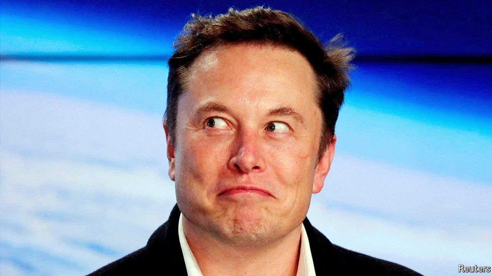
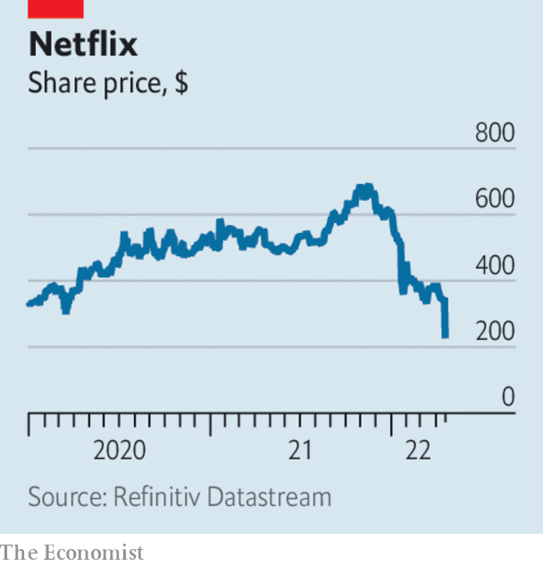

###### 

# Business 

#####  

 

> Apr 21st 2022 

Having built a stake in Twitter, then being offered and rejecting a seat on its board, Elon Musk proposed taking the company private with a $43bn bid. In response Twitter adopted a poison pill that in effect discourages anyone from accumulating more than 15% of its shares (Mr Musk holds 9.2%). Many wonder if all this is just more mischief-making by Mr Musk, who has clashed with Twitter over free speech, though he is trying to get other backers on board.


Meanwhile, Tesla reported a record quarterly net profit of $3.3bn as sales soared. The electric-car maker has largely weathered the supply-chain crunch that has hampered production in the industry, despite the shutdown of its factory in Shanghai amid a covid outbreak. Mr Musk, Tesla’s boss, said he would make 1.5m vehicles this year, up by 60% from last year, despite the bottlenecks.

A regulatory filing revealed that Amazon will conduct a racial audit of its employees’ pay and conditions. It will be led by Loretta Lynch, a former attorney-general under Barack Obama. It follows demands from activist shareholders that big firms do more to avoid policies that have disparate effects on different groups.

Game over

With China’s regulators cracking down on the tech industry, Tencent decided to block access on its platforms to foreign video games that have not been approved by the government, such as “Grand Theft Auto”. A regulator reminded game providers that they are “strictly prohibited” from live-streaming content that displeases the censors.

Japan’s finance minister said that the yen’s dramatic weakening against the dollar was “undesirable”, and making imports more expensive. The Japanese currency has fallen by 10% against the greenback this year to a 20-year low. Pressure on the yen is being caused by the increasing contrast between the monetary policies of Japan and the rest of the rich world. While the Federal Reserve and other central banks have raised interest rates, the Bank of Japan has remained committed to keeping them low, and to buying an unlimited quantity of government debt.

The war in Ukraine will contribute to a slowdown in global growth, according to the IMF, which now expects the world economy to expand by 3.6% this year, almost a percentage point below its previous forecast in January. GDP growth in the euro area was revised down to 2.8% (from 3.9%) because of its reliance on now partially embargoed Russian oil and supply-chain disruptions.

China’s GDP was 4.8% larger in the first quarter of 2022 than a year earlier. The figure was better than expected, but didn’t capture the full effect of recent lockdowns in Shanghai and other cities, which were imposed in mid-March. Other data point to a slowing economy. Retail sales in March were down by 3.5% and the unemployment rate climbed to 5.8%, the highest it has been since the pandemic began.

 


Netflix shook investors by reporting its first drop in subscribers for more than a decade. The media-streaming service lost 200,000 users over the first three months of the year, and expects another 2m will leave in the current quarter, almost 1% of its customer base. It blamed some of that on the 100m households that share their passwords with freeloaders, but competition from Disney+ and a rise in living costs also play a part. In Britain a record number of households are cancelling streaming services, a survey found. Netflix’s share price tumbled. Bill Ackman, a big investor, cashed out at a loss.

Food delivery is another industry showing signs of a post-pandemic slowdown. Just Eat Takeaway, which operates in 23 countries, said that growth remained “challenging”, and signalled that it has lost its appetite for Grubhub, a smaller American rival that it took over less than a year ago. It is exploring options for the subsidiary, including a possible sale.

It was a busy week for Blackstone. The investment firm joined with the Benetton family of Italy to offer €58bn ($63bn) to take Atlantia private. Atlantia operates Rome’s two main airports and three on the French Riviera, as well as 9,400km of toll roads. The Benettons already own a third of the company. Blackstone also agreed to buy out American Campus Communities, a provider of student housing across the United States, in a deal worth $12.8bn.

Financial instruments

The hedge-fund billionaire who owns Steinway filed documents to return it to public markets in an IPO. John Paulson’s firm bought the piano-maker in 2013, topping a crescendo of offers with a $512m bid. Founded by a German immigrant to New York in 1853, Steinway’s forte today is as a luxury brand, notably in China. There are around 40m practising Chinese pianists compared with 6m Americans who like to tickle the ivories.

