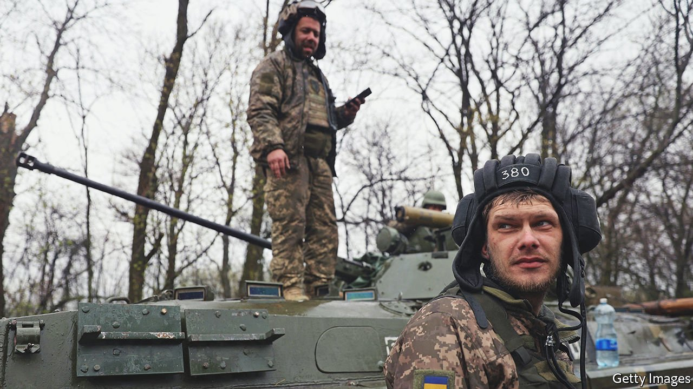
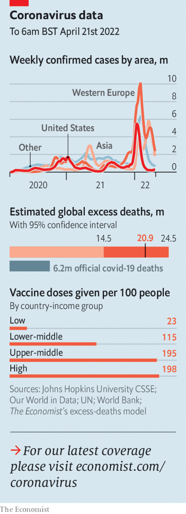

###### 

# Politics 

#####  

 

> Apr 21st 2022 

Ukraine’s president, Volodymyr Zelensky, said that a Russian assault had begun along a 400km front line in the east of the country. The attack had long been expected after Russia withdrew its troops from the north in order to concentrate on securing its objectives in the south and east. These are thought to include seizing all of the Donbas region and full control of a “land bridge” connecting Russia with the Crimean peninsula, which it annexed in 2014. Ukraine said it had repelled a number of Russian advances, but expected more. There were also a number of missile strikes on Kyiv and on Lviv, a city in the far west of Ukraine. The number of refugees passed 5m.


Russia’s defence ministry released a video of a test of its Sarmat intercontinental ballistic missile, which can be fitted with nuclear warheads. Vladimir Putin, Russia’s president, said the test would give “food for thought for those who…try to threaten our country”.

Ukraine claimed to have hit the , the flagship of Russia’s Black Sea fleet, with two missiles. Russia later admitted that it had sunk, although it blamed the loss on a fire. The sailors’ families were given little information about survivors.

NATO countries began to deliver heavier weapons to Ukraine to help repel the Russian offensive. America, Britain and Canada all promised to supply heavy artillery. Russia stepped up its warnings of negative consequences if Finland and Sweden join NATO. The Finnish parliament held a debate on membership this week.

In Sweden dozens of people were injured, most of them police, when riots broke out in several cities over plans by the leader of a far-right Danish group to burn a copy of the Koran. He was conducting a “tour” of areas that have big Muslim populations.

Emmanuel Macron clashed with Marine Le Pen in their only televised debate ahead of the French presidential  election on April 24th. Ms Le Pen was put on the spot about her previous links to Russia. She attacked Mr Macron over the high cost of living.

What to believe

The authorities in Shanghai eased a weeks-long lockdown for some of the city’s 25m residents. A health official said the virus was “under effective control” in parts of the city. But the government also reported that 17 people had died after contracting covid-19, the first such deaths acknowledged by the state since 2020. Reports suggest the actual death toll in Shanghai is higher.

Protests continued in Sri Lanka over an economic crisis, which has seen food and fuel prices rocket. Police fired live rounds into a crowd of demonstrators, killing at least one. The government has suspended debt payments and is negotiating with the IMF.

Pakistan carried out air strikes in Afghanistan, killing almost 50 people, in response to an increase in attacks in Pakistan by jihadists that Pakistan says are based in Afghanistan.

José Ramos-Horta won East Timor’s presidential election. A winner of the Nobel peace prize, Mr Ramos-Horta was president between 2007 and 2012. He says he ran for office again to bring stability to the young country.

More than 100 Palestinians were said to have been injured in the compound of Jerusalem’s al-Aqsa mosque in clashes with Israeli riot police, who accused the Palestinians of throwing stones and fire crackers at Jews praying at the Wailing Wall below. Several hundred were arrested, most of whom were later released. Israel carried out an air strike in Gaza after it said a rocket was fired from there, the first such attack in months. No one was hurt.

 


The worst drought in the Horn of Africa since 1981, together with conflict in Ethiopia, may lead to as many as 20m people going hungry this year, the UN warned. It says that about 6m people in Somalia are on the brink of famine. Millions more are starving in Ethiopia’s rebel-held Tigray region.

At least 443 people were killed, and dozens more are missing, after floods swept away nearly 4,000 homes around the South African city of Durban. Many of those who died lived in shanty-towns.

The British government’s latest scheme to tackle illegal immigration was widely denounced. It involves deporting asylum-seekers who cross the English Channel without permission to Rwanda, 6,500km from Britain. Their claims will be reviewed in the African country, where they will be given asylum if successful. Even some government MPs criticised the plan.

Boris Johnson apologised to Parliament for breaking covid restrictions in 2020, for which the police have fined him. MPs from his party, the Conservatives, rallied round the prime minister. The opposition claims he lied to Parliament.

Power play

In a blow to President Andrés Manuel López Obrador,  Mexico’s congress voted down a constitutional reform to hand back control of the power industry to the state-owned electricity company. However, the president may be able to preserve some parts of his signature policy after the Supreme Court ruled that elements of the reforms could be adopted as normal legislation. Mr López Obrador did manage to push a law through congress that nationalises lithium reserves. “The lithium is ours,” he boasted.

America’s border force had 221,000 “encounters” with migrants crossing the Mexican border in March, the highest number in two decades (some in that count crossed several times). Nearly 110,000 were expelled under Title 42, a pandemic health measure. It expires next month, prompting fears of even more crossings.

The Biden administration appealed against a court ruling that rescinded a requirement for masks to be worn on public transport. In the meantime airlines have made it optional for passengers and crew to wear a mask. The mandate had caused angry scenes on planes when travellers refused to mask up and had become a political lightning-rod.

