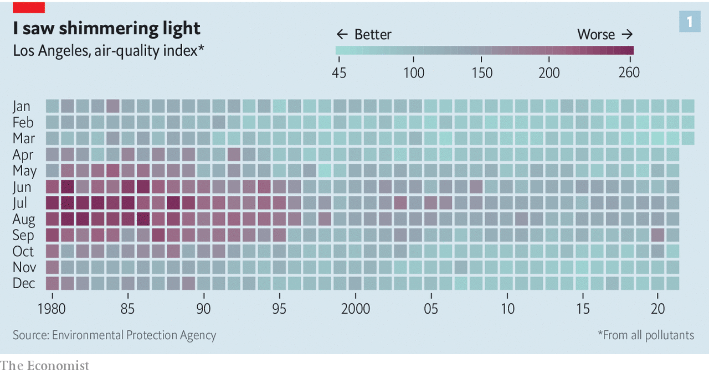

###### Greener than thou

# California wants to lead the world on climate policy 

##### The energy crunch offers the state a chance to live up to its green reputation 

 

> Apr 23rd 2022 

THE GLOBAL energy crunch brought about by Russia’s invasion of Ukraine has given Joe Biden’s presidency a slogan usually associated with Republicans crowing about energy independence: “drill, baby, drill”. In addition to releasing 1m barrels of oil a day from America’s Strategic Petroleum Reserve, the Interior Department will resume new lease sales for oil and gas drilling on public lands, reneging on Mr Biden’s campaign promise to end the practice. Sounding less like a Republican, the president has also suggested that long-term energy independence would come only from weaning America off fossil fuels.

The pain at the pump is most agonising in California. On April 20th the average price of a gallon of petrol in America was $4.11; in highway-laden Los Angeles it was $5.79. Yet for all its gas-guzzling, California also claims to be America’s greenest state. In a recent speech Gavin Newsom, its Democratic governor, proclaimed that “California has no peers” on climate policy. His proposed annual budget includes a $22.5bn climate wish-list that would invest in electrifying transport, shoring up public-transit infrastructure and protecting people from droughts and fires. This follows decades of ambitious environmental policy that has influenced officials in other states, in the federal government and abroad. How will the Golden State’s green reputation hold up at a time of deepening energy worries?


Two policies stand out for their impact within the state and beyond. First is California’s unique ability among America’s states to set its own standards for vehicle emissions. In the 20th century, Los Angeles’s booming population, topography and sprawling port contaminated its air. The sky was so filthy one summer day in 1943 that Angelenos worried they were victims of a gas attack related to the war. Officials enacted exhaust-emissions limits in 1966 to try to tame the city’s noxious smog.

Because California’s rules predated the Air Quality Act of 1967 and the Clean Air Act of 1970, when federal officials first set national standards for air quality, the feds granted the state waivers which allowed it to set its own, stricter pollution rules. California has applied for more than 100 waivers since 1967. Today, states can choose to adopt the Environmental Protection Agency’s (EPA) rules for vehicle emissions, or California’s. By 2022, 16 states followed California’s standards. The state’s laser focus on car exhaust stems from twin concerns: local air pollution and the global climate crisis. Transport accounts for 29% of greenhouse-gas emissions in America and fully 41% in California.

Los Angeles’s air quality is still often foul, but it has improved a lot over the past 40 years (see chart 1). Yet the Trump administration revoked California’s waiver in 2019, arguing that it should not set standards for other states. The decision was the most serious manifestation of President Donald Trump’s resentment of California’s environmental leadership, says Richard Revesz of New York University. The EPA restored the waiver last month around the time it announced new federal pollution limits for buses, vans and lorries—based on similar rules in California.

 


The second landmark policy dates back to 2006, when California passed a law requiring it to cut greenhouse-gas emissions to 1990 levels by 2020. Britain was the first country to set a legally binding emissions target, but not until 2008. Six months after the bill’s passage Arnold Schwarzenegger, the governor at the time, was on the cover of Newsweek balancing a globe on one finger. Mary Nichols, a former boss of the California Air Resources Board (CARB), the state’s air-pollution regulator, recalls giving a lecture in Switzerland to crowds of people “wanting to hear what California under Arnold Schwarzenegger was going to be doing about climate change”.

The target was achieved early, in 2016. Lawmakers then required the state to cut emissions to 40% below 1990 levels by 2030. Today California still has the second-highest total emissions (after Texas) among the 50 states. Yet as of 2016 only New York had lower emissions per person.

California was early on emissions-cutting for several reasons. First, it enjoys rare bipartisan support for bold climate action. CARB was created during Ronald Reagan’s governorship in the 1960s. “Arnold Schwarzenegger was pretty lonely among Republican governors who believe deeply in the need to address climate change,” says Bill Ritter, a former governor of Colorado who runs the Centre for the New Energy Economy at Colorado State University. States without Democratic supermajorities or climate-conscious conservatives cannot hope to move as fast. Voters are also on board. In a recent poll 68% of Californians said the effects of climate change are already being felt, and nearly three-quarters said they support the 2030 target.

Second, California has the cash and manpower to invest in climate mitigation and adaptation. The Golden State is the world’s fifth-largest economy. Thanks to a colossal budget surplus, Mr Newsom’s $22.5bn climate blueprint is almost twice the size of President Joe Biden’s 2023 budget request for the EPA (although the EPA is just one of many federal agencies that formulate climate policy). More than 1,700 people work for CARB.

Lastly, Californians have been suffering the effects of climate change for years. Wildfires have incinerated towns and their smoke has dirtied the air. Drought has dried up water supplies. Extreme heat has baked cities and farms. And rising seas threaten coastal towns.

This could be heaven or it could be hell

Few dispute California’s past successes. But recently some have argued that its big achievements—such as implementing a cap-and-trade system in 2013—are long past. The state’s politicians are used to being badmouthed by their counterparts in Texas and Florida, but on climate the toughest criticisms often come from within. “It’s one thing to set goals, which we’ve done a great job of,” says Anthony Rendon, the Speaker of California’s state assembly. “It’s another thing to actually attain those.”

Scepticism about the state’s ability to reach its climate targets may be warranted. Last year a report from the state auditor said CARB has failed to measure accurately the success of its incentive programmes for electric vehicles, leading it to overstate emissions reductions. Data collection is just one problem. Some hurdles, such as the need to build transmission lines to import wind and solar power from states farther inland, are to be expected. But many obstacles are of California’s own making.

Consider Diablo Canyon, the state’s lone nuclear plant, which is due to be shut down by 2025 despite being a source of clean, reliable energy. Diablo supplies California with about 9% of its electricity generation and accounts for 15% of its clean-electricity production. California plans to replace the plant with other low-carbon sources, but it cannot afford to forgo baseload power when it is trying to electrify everything from cars to stoves.

The Golden State’s tireless NIMBYs are also hampering the fight against climate change. Anti-growth activists have used the  to block public-transit projects and new housing, which is often denser and more energy-efficient than are old buildings and single-family homes. Estimates suggest that California could produce 112 gigawatts of offshore wind power, yet NIMBYs fret that floating turbines will spoil the view.

Making things trickier is the need to tackle short-term troubles—such as high petrol prices—while aiming to hasten decarbonisation. Squabbling in Sacramento over what to do about California’s highest-in-the-country fuel prices epitomises the state’s contradictions on climate. Mr Newsom’s proposal to send $400 to all car-owners has baffled some Democrats, who argue that helping only drivers leaves out poorer Californians who happen not to drive but are also squeezed by inflation. Subsidising petrol also seems a curious way to encourage drivers to buy an electric car or take the bus. The $750m that Mr Newsom would spend to subsidise public transport pales in comparison with the $9bn he would splash out on fuel rebates.

 


Californians in oil-rich Kern County are, like Mr Biden, clamouring to drill. Most new fracking permits have been denied as California has tried to phase out oil production. As fuel and electricity prices rise, lawmakers must reckon with how to decarbonise without hurting more residents and losing firms to cheaper states.

Republicans fret that the state’s web of regulations, steep energy costs and high taxes levied in the name of greenery are harming California’s competitiveness. A report last year from Stanford University’s Hoover Institution, a conservative think-tank, found that businesses cited all three as reasons they decided to flee the state—usually for Texas. In 2021 the cost of electricity in California was the third-highest among the states, after Hawaii and Alaska. In part that is because consumers foot the bill for utilities to upgrade their equipment, so as to spark fewer wildfires. Rates are projected to keep climbing (see chart 2).

Years of climate denial under Mr Trump and the current dysfunction in Congress mean that states are driving the country’s fight against climate change. California is one of four American states that helped found the Under2 Coalition, a group of subnational governments committed to the Paris Agreement of 2015.

But even if California and other green states can hit their targets, a coalition of the willing can only do so much. The Rhodium Group, a consultancy, reckons that 60% of emissions stem from states without climate goals. To force high emitters such as Texas to act, “Joint action with the federal government is absolutely required,” says Mr Ritter. Last year Joe Manchin, the Democratic senator for West Virginia, demolished his party’s hopes of passing $555bn in climate provisions that were part of the huge Build Back Better bill (he has recently restarted talks with other Democrats about an energy package).

While Congress sits on its hands, CARB has proposed banning the sale of new gasoline-powered cars by 2035. Mr Biden’s more modest national goal is for half of all cars sold in 2030 to be electric. Regulators are also investigating what it would take to decarbonise California by 2035, moving the state’s goalposts forward by a decade. “I think sometimes there is an aversion to following the California example because other parts of the country may have a strong reaction to the idea of being like California,” says Aimee Barnes, a climate adviser to Jerry Brown, a former governor of the state. “And I think that’s a mistake.” ■

For more coverage of climate change, register for , our fortnightly newsletter, or visit our 

