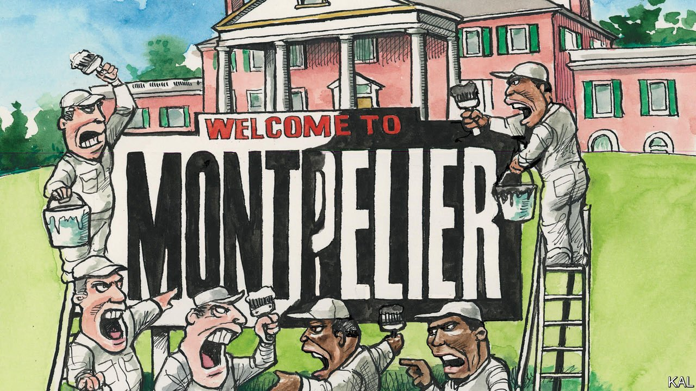

###### Lexington

# James Madison and his slaves 

##### A row over the management of Montpelier illustrates the racial politics of cultural preservation 

 

> Apr 21st 2022 

LAST JUNE the foundation that runs Montpelier, the former Virginian slave plantation of James Madison, made a dramatic announcement. It had resolved, by a two-thirds vote of its board, to share management of the property with a group representing the descendants of slaves. The Montpelier Descendants Committee (MDC), a local charity, would be “co-equals in sharing governing power and responsibility for the very site that enslaved their ancestors”, said the foundation’s chairman, Gene Hickok.

The decision brought acclaim to Montpelier, one of the least visited yet perhaps the loveliest of Virginia’s Founding Father abodes. Set in rolling horse-country north of Charlottesville, the historic site had already come a long way towards confronting the slaver past of America’s fourth president. Its domestic slave cabins had been located and reconstructed—within shouting distance of the room where Madison drafted the American constitution. Yet the Montpelier Foundation’s promise of “structural parity” for the slave descendants implied a far greater commitment.


Sadly, the foundation has broken its word. Even as slave-descendant groups trumpeted the arrangement as a new template for historic places, its board, dominated by local worthies, began questioning the MDC’s right to represent Montpelier’s slave descendants. It removed MDC representatives from its governance committee and promoted members of a rival descendant group—which claims kinship with Montpelier’s best-known slave, Paul Jennings, author of a memoir of enslavement in the White House. Last month the board voted to reduce the MDC’S role in nominating descendant board members, a move slammed by the trust that owns Montpelier and by most of its senior staff. As a result, the site’s chief curator and chief archaeologist—veterans of three decades at Montpelier between them—were sacked this week.

Their opposition to the board’s move was understandable. Advances in genealogy have seen a proliferation of slave-descent groups in recent years, and many have contributed to America’s ongoing reckoning with slavery. The Monroes of Monroetown, a settlement formed by former slaves of James Monroe, are as revealing of the fifth president’s legacy as his rebuilt house, Highland, a short drive from Montpelier. It helps that America has a long tradition of lineage societies—some of which, in a compelling irony, long pushed a lily-white version of American history. The Madison family cemetery at Montpelier was renovated by Daughters of the American Revolution, an educational society that openly refused to accept black members until the 1980s. This makes it especially logical that the MDC claims an oversight role at Montpelier’s slave burial ground. Similarly, in Monticello, the nearby residence of Thomas Jefferson, the long-standing role of his descendants in pushing a sanitised version of his biography provided an opening for descendants of the third president and his slave-concubine, Sally Hemings, to offer an accurate version.

Such interventions can be especially powerful because of how thin the record of individual slaves is—especially set against the magnificent details of the slaver presidents. The names of slaves were noted patchily, if at all, in estate accounts. Amid the clutter of Jefferson’s inventions, books and collections at Monticello, there is no image of Hemings, with whom he had six children. Most of what is known of her comes from her descendants’ family histories. Jennings, who was sold by Madison’s widow but later bought his freedom, is the only one of Madison’s 100 or so slaves of whom an image and much biography remain. To hear James French, a banker who chairs the MDC, recount his family tree is therefore to be guided back to a time and place from which little evidence of human life or interaction survives. His ancestors were enslaved offspring of two of Madison’s white neighbours, including James Barbour, a governor of Virginia.

Yet, impressive as its achievements are, slave-descendant activism may not be as straightforwardly positive as some claim. The MDC argues for a lead role at Montpelier not on the basis of its impressive academic and business capacity, but solely by moral right. Its blueprint for slave-descendant activism, known as “the rubric”, suggests any institution that omits slave descendants is by definition “perpetuat[ing] the exploitative practices of the past by privileging the perspectives of slave owners”. Slave descendants are not merely defending the interests of dead slaves, in other words; they consider themselves almost synonymous with them. This may help explain why the slavery exhibits at Montpelier use photographs of slave descendants to represent slaves. For Lexington, at least, these portraits of middle-class Americans with sombre expressions do not bring history alive; they push it away.

By extension, Monticello, whose excellent slavery exhibits your columnist also visited last week, is nonetheless failing as far the rubric is concerned because it does not reserve seats on its board for slave descendants. Or rather, according to the blueprint’s loose definition of descendance, because it does not reserve seats for people who consider themselves as slave descendants, “whether or not they know of a genealogical connection”. It can be hard to prove slave lineage; yet that seems like a contestable basis on which to claim a right to manage Monticello or Montpelier.

The meaning of Madison

“Ambition must be made to counteract ambition. The interest of the man must be connected with the constitutional rights of the place,” wrote Madison of the constitutional system he designed. The same seems to be true of the management of his former house. The Montpelier Foundation has behaved shamefully in abrogating its agreement with Mr French’s organisation. But you do not need to be racist to suspect that the overreaching descendant movement could be a difficult partner. Both parties will have to compromise to co-exist. That, despite his terrible moral flaw, remains Madison’s great insight. ■

Read more from Lexington, our columnist on American politics: (Apr 16th)

 (Apr 9th) (Apr 2nd)

For exclusive insight and reading recommendations from our correspondents in America, , our weekly newsletter.

