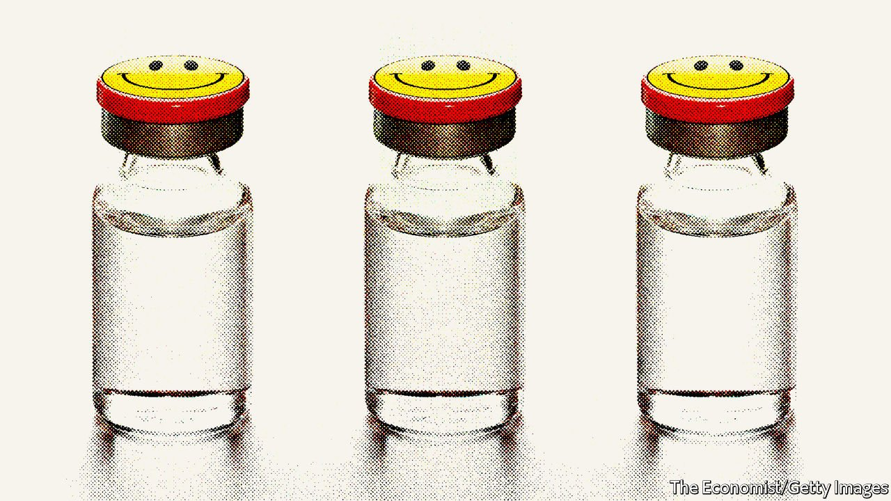

###### Ketamine clinics

# More American clinics are offering ketamine to treat depression 

##### Is this a good thing? 

 

> Apr 23rd 2022 

SAT NEXT to a nursery on an industrial estate in Naperville, a suburban city on the outskirts of Chicago, the Ketamine Wellness Centres (KWC) clinic does not look like anything revolutionary. Inside, a television plays videos of landscapes with calming music; tubs of sweets sit on a coffee table. The clinic is one of several in the region, and of over 100 across America, where patients are injected with ketamine to treat persistent pain or depression.

Interest is rising in the idea that ketamine, typically used as an anaesthetic (or as an illegal party drug), can help provide a lasting cure where traditional treatments, such as antidepressant drugs, have failed. PSYCH Global, a provider of information on psychedelic health care, estimates that the revenue for American clinics could be over $3bn between 2023 and 2029. Critics, though, worry that the drug can lead to dependency and that not enough is known about its long-term safety.


It is more than 20 years since studies first suggested that ketamine was an effective, rapidly acting antidepressant—albeit one whose impact lasts for only days and weeks. Its take-up has been limited because it has not been approved for use specifically as an antidepressant. That deters doctors, patients and those who pay for medicines. It is also unlikely to gain such regulatory approval, which would require a pharmaceutical firm to invest in a drug that is now a cheap generic that anyone can make. Still, off-label prescriptions are possible—and they are on the rise.

In KWC’s treatment rooms, people spend between two and four hours experiencing what Kevin Nicholson, the founder and chief executive of the firm, calls a mildly “floaty” and “dreamlike” high, under the close watch of a nurse or paramedic. Although there may be less clinical evidence for ketamine than for traditional antidepressants, its ability to act quickly to relieve depression is an enormous advantage. It stands in stark contrast to antidepressants that can take weeks or months to have an effect—if they work at all. For patients who have failed to respond to antidepressants, and for those who may be suicidal, ketamine is an attractive option.

Quicker but potentially quackier

Some of KWC’s patients struggled for a decade, though a growing number are coming a year or two after their first diagnosis. At the Naperville clinic, to get treatment for depression patients must first go through a psychological evaluation, usually over a video call. They must also have been experiencing symptoms that have not lifted after the use of antidepressant medications and lifestyle changes.

Once accepted, patients have four to six injections over two weeks, then more as needed with widening spaces between. Each one costs $449. Most medical insurance does not cover the actual injections yet, says Mr Nicholson, though it may cover the related assessment and therapy. And a few insurers, including the federal VA, which provides health insurance to former soldiers, now pay for the injections too.

In addition to depression, there is growing evidence that ketamine may be effective in treating several other mental-health conditions, such as post-traumatic stress disorder, chronic pain and alcoholism. But it can also cause adverse reactions, ranging from dizziness, nausea and poor co-ordination to hallucinations and paranoia. Delivery of the drug, therefore, needs to be supervised in a safe environment such as that provided by KWC. There is also the thorny, unanswered question of whether it has a long-term downside.

Providing ketamine to those who may have previously struggled with addiction to opioids, alcohol or other drugs may seem risky. But the treatment does not seem likely to appeal to people who just want to get high. The dose given is much lower than recreational users of ketamine typically take, and far costlier. (A gram of street ketamine costs around $100 in the United States; the dose used by KWC is rarely more than 100th of that.) A suburban office in which users are hooked up to cardiac and blood-pressure monitors is also not exactly a party space. After the session is over, patients have to be driven home by a friend or relative.

Plenty of other firms use the drug as an adjunct to psychiatry. While the exact mechanism by which ketamine works is not entirely clear, it is known to increase neuroplasticity and stimulate the growth of new synapses. By combining the ketamine experience with psychiatric support, the idea is it helps the patient learn new ways of thinking during a window of neuroplasticity opened by the drug.

Many of these new clinics also have a weather eye to rapid shifts in the science, and cultural acceptability, of using psilocybin and MDMA, two psychedelic drugs, for many of the same mental-health conditions. The path to such treatments is trickier: both these drugs are illegal in most of the country. But ketamine clinics provide the ideal setting for delivering future substances, if and when their time arrives.

Without approval from a regulator, however, ketamine will remain in a medical no-man’s-land. In 2016 the Louisiana State Board of Medical Examiners advised doctors against its use in mental-health conditions, warning that doing so might be deemed “unprofessional conduct”. Many doctors who deal with addiction are still reluctant to recommend it, admits Mr Nicholson: “It’s new and different, so it scares them.”

Others are too keen. As interest grows, without better oversight of new clinics there is a risk that vulnerable people may be exploited by unscrupulous actors. And a boom in at-home use through telemedicine, spurred by the pandemic, is taking ketamine into uncharted territory. ■

For exclusive insight and reading recommendations from our correspondents in America, , our weekly newsletter.

