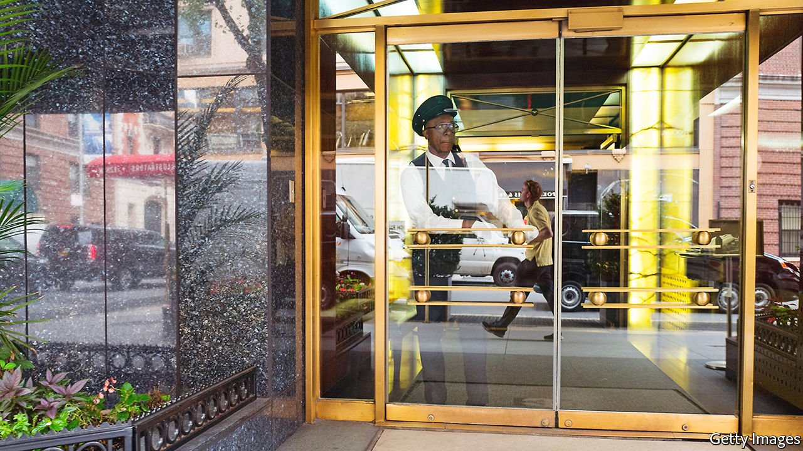

###### Dust-up with doormen

# New York’s well-to-do avoid having to open their own doors 

##### The white gloves almost come off 

 

> Apr 23rd 2022 

FEW THINGS are as quintessentially New York as its doormen. Yes, other places have concierges. But that is like saying you can get a bagel anywhere. New York doormen are special. Residents often say their doormen are like family. They’re trusted, discreet and act as gatekeepers. They watch out for the kids and the safety of residents. “We’re all part of the same team,” says one doorman.

That team was divided during recent contract negotiations. The doormen’s union, Service Employees International’s Local 32BJ, which represents some 30,000 doormen and other building staff, voted on April 13th to strike. But on April 19th, a day before the contract expired, the two sides—the union and about 3,000 residential-building owners represented by the Realty Advisory Board on Labour Relations—reached an agreement. The union got the pay increase it wanted, and it keeps fully employer-paid health care.


Kyle Bragg, head of the union, says his members have had a tough two years. Doormen (and women) went to work when residents stayed at home or fled the city. About 40 New York doormen died from covid-19. Covid protocols meant even more cleaning. When residents fell ill doormen were sometimes the only people making sure they got fed. Deliveries increased as more people relied on online shopping and food delivery. “We make sure everything that they need is available for them,” says Crystalann Johnson, who works in a 60-storey building in midtown.

The pandemic affected management, too. Many ground-floor tenants, such as retailers and restaurants, closed and did not reopen, meaning loss of revenue. The union was sceptical: Manhattan rent is at a record high, and residential-property sales had their strongest-ever first quarter, with purchases of $7.3bn. A doorman adds 10-15% to an apartment’s value, says Jonathan Miller of Miller Samuel, an appraisal firm.

In a way, doormen always had the support of management—in the form of the residents. Some doormen even helped them prepare for a possible walkout, showing them where rubbish gets recycled and how to work the lifts. It is unusual, says Peter Bearman of Columbia University, author of “Doormen”, which examines that curious relationship. “There is no other situation in which you will see that kind of dynamics. The tenants become the scabs, essentially, replacing the labour of the doorman. But it’s done with such grace and mutual support.”

Happily for the scabs and the doormen, the strike was averted. The last one was in 1991 and lasted for 12 days. A strike in 2022 would have had a bigger impact because deliveries have changed from a luxury to a necessity for many households: food-delivery workers and couriers might not have wanted to cross picket lines. And perish the thought that residents would have to open their own doors and hail their own cabs. 

For exclusive insight and reading recommendations from our correspondents in America, , our weekly newsletter.

