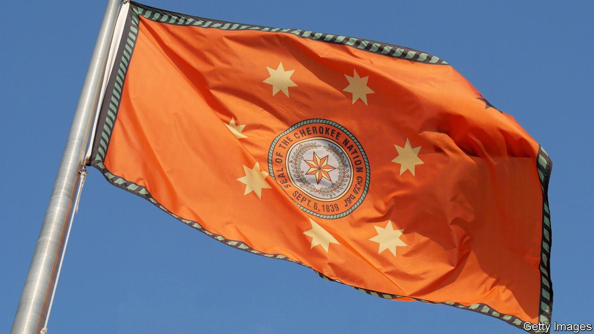

###### A fight over jurisdiction

# Oklahoma takes a tussle with Indian tribes to the Supreme Court 

##### Challenging the long arm of tribal law 

 

> Apr 21st 2022 

WITH AN AIR of efficiency Judge Amy Page moves through the day’s docket. Defendants stand sheepishly before her to face their charges: assault and battery, stalking, larceny, drunk driving. Most take a plea deal and a scolding, and exhale with relief when dismissed. The proceedings resemble those of any county courtroom in the country—but for the fact that every defendant is Native American. The seal of the Cherokee nation adorns the wall.

The Cherokee court in Tahlequah, Oklahoma, used to see at most 70 criminal cases a year. Now it handles 4,000. The shift stems from the Supreme Court’s 5-4 decision in McGirt v Oklahoma, which in 2020 held that the reservation of the Muscogee (Creek) nation, an Indian tribe, had not been legally dissolved by Congress. That gave the tribe jurisdiction over members who commit crimes there. The ruling has since been extended to the Cherokee, Chickasaw, Choctaw and Seminole. Their land covers 43% of the state, home to 1.8m people. It includes Tulsa, a city that sits within Cherokee and Muscogee territory.


McGirt meant the state lost jurisdiction over some 18,000 cases a year. The caseload of the Tulsa district-attorney’s office shrank by 15%. Most of these—misdemeanours and petty felonies committed by Indians—now go to tribal prosecutors. Federal courts handle the rest: crimes with non-Indian defendants and Indian victims, and serious ones by Indians. Federal prosecutors in the northern district of Oklahoma, which covers Tulsa, file 600 indictments a year, up from 200 pre- McGirt. Its staff of attorneys has nearly doubled, to 50.

The Supreme Court’s ruling was a victory for Oklahoma’s tribes—a recognition of sovereignty, in their eyes. But it inflamed tensions with the state. Kevin Stitt, the governor, who is Cherokee, has said the decision “robbed” him of the authority to pursue criminals and created a “public-safety nightmare”. He calls McGirt the state’s “most pressing issue” and has petitioned the court to revisit its ruling.

On April 27th the justices will hear oral arguments in Oklahoma v Castro-Huerta, which could reduce McGirt’s scope by returning some prosecutorial authority to the state. Oklahoma wants concurrent power to prosecute crimes by non-Indians against Indians on reservations (only the federal government has that jurisdiction). These represent a fifth of the cases that McGirt diverted from state courts. The state contends that overwhelmed federal prosecutors are letting suspects go unpunished. Clint Johnson, the US attorney in the northern district, concedes that some minor felonies are not charged immediately. He prioritises “murders, rapes and strangulations more than the John Deere mower stolen out of someone’s barn”. Those low-level cases will be prosecuted, he insists. “It’s just a matter of timing.”

Sara Hill, attorney-general of the Cherokee nation, calls Mr Stitt’s worries “crocodile tears”. She thinks he is motivated by anxiety over McGirt’s civil implications. The state’s opposition is “fundamentally based on money”, says Jeff Fife, chief of staff to the head of the Muscogee nation.

McGirt dealt with criminal law. But by determining that the reservations are “Indian country”, it opened the door for tribes and the federal government to assert tax and regulatory powers there. States cannot tax Native Americans on income earned on reservations. In February a Choctaw couple sued the Oklahoma Tax Commission, challenging its authority to tax them. Such exemptions would cost the state $73m a year, estimates the commission.

After McGirt the federal government tried to stop the state from regulating coal-mining on Cherokee, Choctaw and Muscogee land. The dispute has gone to federal court. Tribes might try to tax oil and gas firms operating in Indian country on land owned by non-Indians. This is a legal grey area. But the mere possibility enhances their leverage. Oklahoma and the tribes were already bargaining over issues related to gambling and hunting. “Tribes asserting their full authority under McGirt strengthens their position in other negotiations too,” says Seth Davis of Berkeley Law.

Oklahoma is pinning its hopes for Castro-Huerta on a shift in the Supreme Court’s composition since McGirt. (Ruth Bader Ginsburg has been replaced by Amy Coney Barrett.) But any win would be narrow and technical. The big question, of whether the tribes’ land is Indian country, is settled. The court denied Oklahoma’s request to consider overturning McGirt.  ■

For exclusive insight and reading recommendations from our correspondents in America, , our weekly newsletter.

