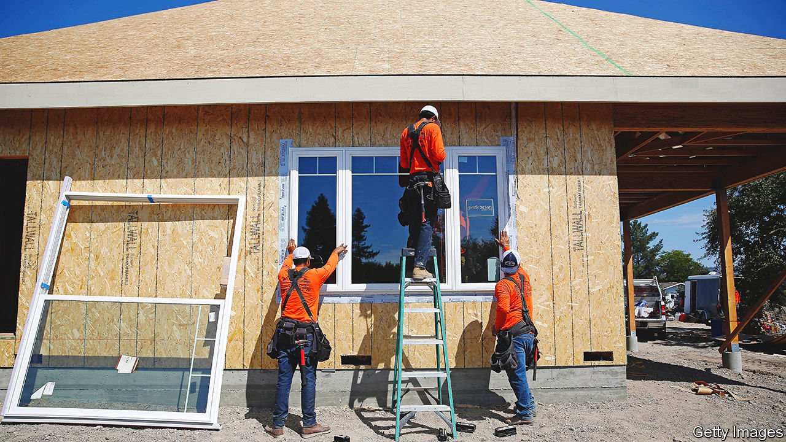

###### Cottage industry

# The case for granny flats 

##### Adding density would boost housing supply and lower emissions 

 

> Apr 23rd 2022 

“A NIGHTMARE,” is how Sam Schneider, a co-founder of Homestead, a startup that finances and builds granny flats, describes the permit process in California. Yet, sitting on the rooftop deck of his office in Los Angeles, he concedes that the paperwork is getting easier. Granny flats—or Accessory Dwelling Units (ADUs), as Americans call them—have taken off in California and cities around the American West as house prices have soared.

An ADU is a cottage or flat built on the same lot as a single-family home. Owners rent them for cash, or house family in them. About 180 municipalities in California passed ADU laws between 2017 and 2020. Los Angeles issued permits for nearly 6,700 units in 2019, up from about 4,100 in 2018. Seattle approved some 500 in 2020 and 800 in 2021. Tobias Peter of the American Enterprise Institute (AEI), a think-tank in Washington, DC, views ADUs as one example of “light-touch density”, which also includes splitting single-family homes into several units. Such conversions may become more common in California thanks to a law passed last year which eliminated single-family zoning.


Things are moving more slowly in cities with strict zoning codes. Denver approved just two granny flats in 2010 and 71 in 2019. Many single-family homeowners in Colorado’s capital who want to build an ADU must petition the city to have their plot rezoned, which can take months. Permits and construction can also be costly and confusing. That is where startups like Homestead come in. As interest in ADUs grows, so does the number of firms wanting to build them.

It is no mystery why local officials are keen on granny flats. They are “low-hanging fruit”, says Mr Peter. The infrastructure costs of adding a new unit on undeveloped land are $50,000 more than for an “infill” unit, according to AEI.

High-density developments are also greener than single-family ones thanks to reduced heating and cooling costs, and shorter commutes. Adding units to urban areas allows more people to live close to public transport and the places where they would work or socialise, curbing transport emissions. Encouraging density rather than sprawl would avoid “letting the affordability and housing crisis further our climate woes”, says Lauren Sanchez, a climate adviser to California’s governor.

Granny flats alone will not solve California’s housing crunch, but their popularity is a good sign. “If you create enough housing stock,” says Mr Schneider, Los Angeles and San Francisco “become places where people can actually live, and not places where people can only leave.”

For exclusive insight and reading recommendations from our correspondents in America, , our weekly newsletter.

