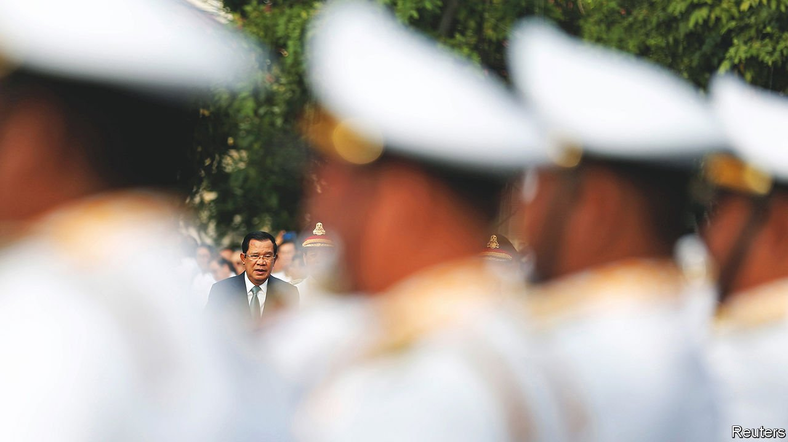

###### Autumn of the patriarch

# Cambodia’s strongman, Hun Sen, plans his succession 

##### But can he control the script? 

 

> Apr 28th 2022 

HIS HOURS-LONG speeches lack the pizzazz of yesteryear. He is said to tire more easily on his early-morning treadmill. Though still a stripling of an autocrat at 69 years of age, the shadows are lengthening on the rule of Hun Sen, Cambodia’s prime minister. He has run the country, in one form or another and increasingly ruthlessly, since 1985. That is longer than most Cambodians have been alive. Now Mr Hun Sen is starting to think of his legacy—and how to reshape it. He would love to acquire the respect that accrues to elder statesmen.

The dictator is aware of his dim standing in the world. Mr Hun Sen’s repression of the political opposition and other civic groups has earned Cambodia pariah status in much of the West. China’s outsized economic, military and political influence has made Cambodia resemble a vassal state. This year neighbours in South-East Asia were appalled when Mr Hun Sen became the first foreign leader to visit General Min Aung Hlaing, the leader of Myanmar’s outrageous coup. It made the prime minister look like a fan of the general.


Even Mr Hun Sen has admitted to foreign diplomats that his trip to Myanmar went badly. Not only was he (predictably) prevented from meeting Aung San Suu Kyi or any other ousted civilian leader. He also claimed he had secured the release of an Australian adviser to Ms Suu Kyi, whom the general has in fact kept locked up. Mr Hun Sen grumbles that his trip was not an endorsement of the junta. He says he would have been damned if he did not attempt to mediate, and damned if he did. He decided to try.

Yet in other regards Mr Hun Sen has not behaved as an autocrat in hock to China might. The red carpet rolled out in March for Kishida Fumio, making a rare visit for a Japanese prime minister to Phnom Penh, suggested that Mr Hun Sen wants other Asian powers to balance China’s presence. Japanese vessels even called by a naval base on which China has designs.

More striking, the autocrat has heeded the urgings of Japan and others to condemn Vladimir Putin’s invasion of Ukraine. He even insisted that Cambodia co-sponsor a UN resolution calling on Russia to withdraw. That move stunned observers—including, presumably, China, which has forged close ties with Russia. Cambodia’s own relationship with Russia and the former Soviet Union goes back to the Indochina wars of the second half of the 20th century. Yet conscious, perhaps, that international law protects the smallest states above all, Mr Hun Sen has told foreign visitors that gross violations need to be called out. The wannabe elder statesman was writing himself into the history books.

Matters of legacy loom large at home, too. In December Mr Hun Sen named a successor: his eldest son, Hun Manet. Not that Mr Hun Sen intends an imminent exit; he has mentioned some time around 2028, when the next (rigged) election but one is due, as a good time to step aside—not down. Singapore’s late leader, Lee Kuan Yew, wielded influence for two decades after retiring as prime minister, including serving as “minister mentor”. He is often cited by Mr Hun Sen’s people as a model.

The irony hardly needs stressing. If Lee ruled with an iron hand, he also fostered institutions, competence, probity and widespread prosperity. Mr Hun Sen, to his credit, helped bring peace to a country racked by three decades of violence that included civil war, American carpet bombing and the grotesque bloodletting of the Khmers Rouges. Yet he has centralised power not by building institutions but by personalising them.

In Mr Hun Sen’s Cambodia, government positions are handed out as sinecures to the offspring of ageing comrades in the ruling Cambodian People’s Party (CPP). Favoured tycoons get the right to import and distribute tobacco, booze and more. They chop down forests or grab land from subsistence farmers. Alliances among the elite are cemented with spectacular weddings. The economy has grown fairly briskly. But Hunsenomics has brought environmental destruction, money-laundering, capital flight and gross inequality. Cambodia comes 157th out of 180 countries ranked by Transparency International for perceived corruption.

Even as the old fox demands almost unquestioned obedience within the CPP, he has attempted to demolish the opposition. The Cambodia National Rescue Party came close to winning a general election in 2013. In late 2017 the courts agreed that the party was part of a foreign plot to overthrow the CPP and ordered it disbanded. Of its two former leaders, one, Kem Sokha, faces a drawn-out trial for treason while the other, Sam Rainsy, leads an upholstered life in exile in Paris.

Given Mr Hun Sen’s tight grip on power, the endorsement of Mr Hun Manet is as good as a coronation for the 44-year-old. A top-scoring graduate of America’s West Point military academy with a doctorate in economics from a British university, Mr Hun Manet has risen fast through Cambodia’s security services. He currently serves as army chief, head of counterterrorism and number two in his father’s all-important presidential guard. Modest and personable, he does not appear to have very many enemies.

Yet if his elevation is almost guaranteed, a smooth transition is not. The secretive CPP is more factionalised and diverse than it appears from the outside. Differences might only grow under Mr Hun Manet, especially between the party’s modernisers and those who think of the CPP as a vehicle for patronage and personal networks of power. A related challenge for the next ruler is the generational change his elevation implies. For Mr Hun Sen has made it clear that when he steps back so must the other old-timers.

This breeds two potential problems. One is that some of the old guard will resent the whippersnapper’s unearned promotion, which has dashed their own dreams of higher power. A bigger problem is the sense of entitlement among their progeny. Mr Hun Manet has been meeting some of his contemporaries for tea at the capital’s Hyatt Regency hotel, presumably to thrash out quite how power will be doled out in future. But with so much honour and profit at stake there are surely not enough plum posts to go around. Genteel machinations at afternoon tea could yet descend into nastier struggles.

A last challenge to Mr Hun Sen’s notions of a smooth transition might come from outside the ruling party. For all his political repression, and his cosying up to authoritarian China, the prime minister seems to care too much about what the West thinks of him to snuff out all opposition for good. NGOs and other action groups cling on, and occasionally bounce back—a sharp contrast to neighbouring Vietnam or Laos.

A new party, the Candlelight Party, has grown out of Mr Sam Rainsy’s movement. To the dismay of the CPP, it has managed to field candidates for nearly all of the seats on the councils of the country’s 1,652 local communes that are being contested in early June. The ruling party still has the money, the organisation, the thuggery and, in some places, the popularity to prevail. But plenty of ordinary Cambodians feel they should have a say in writing Mr Hun Sen’s succession script. ■

