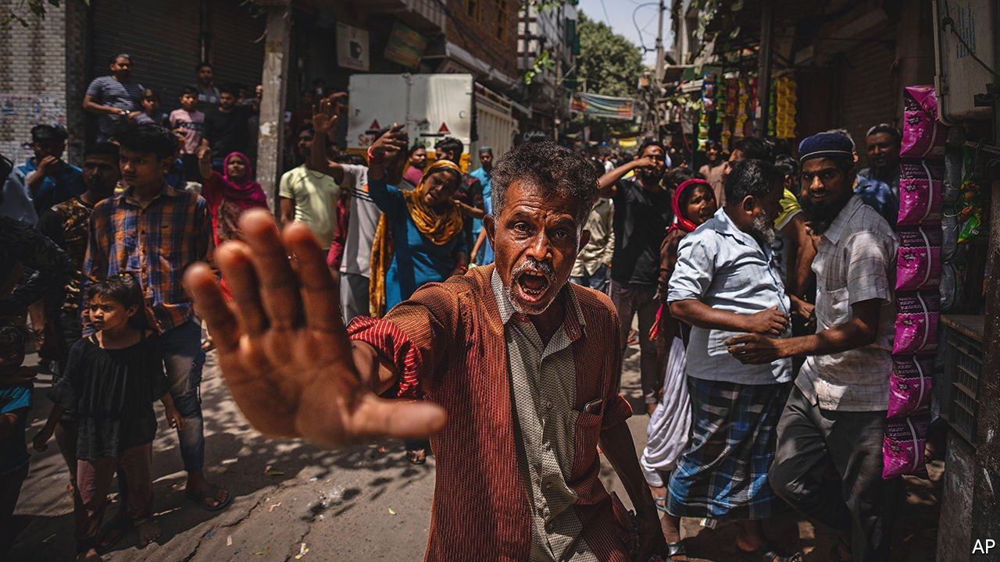

###### Policing, fast and slow

# Justice in India is growing ever more partisan 

##### The ruling party’s opponents are punished with remarkable speed 

 

> Apr 28th 2022 

WHEN INDIANS think of how the law works, speed is not what comes to mind. An average case in the lower courts takes five years to settle. Three-quarters of prison inmates are not sentenced offenders, but awaiting trial. Yet repeatedly in recent weeks Indian justice has moved with remarkable swiftness.

Ask Jignesh Mevani, a member of the Gujarat state assembly. On April 18th Mr Mevani posted a tweet hinting that Narendra Modi, the prime minister, approves of Hindu-nationalist violence. This annoyed a reader in Assam, a state as far from Gujarat as Ukraine is from England, so much that he complained at his local police station. Within 48 hours a team from Assam’s police had flown to Gujarat, nabbed Mr Mevani and hustled him across India. When a judge then granted the prisoner bail, the Assam police instantly rearrested Mr Mevani for allegedly assaulting one of the officers who had helped transport him across the country.


Or ask residents of Jahangirpuri, a working-class part of Delhi, India’s capital. In mid-April a riot broke out in its narrow lanes after Hindu youths carrying swords, guns and clubs on what they called a religious procession stopped outside a mosque to insult the fasting worshippers inside. No one was badly hurt in the ensuing stone-throwing, but three days later authorities, citing building violations, sent in diggers to smash property belonging to suspected troublemakers (affected residents are pictured).

Such “bulldozer justice” is becoming increasingly common. In recent months religious processions strikingly similar to the one in Jahangirpuri have sparked mini-riots in towns and villages across eight north Indian states. All too often, instant punishment has fallen in the form of property demolitions. In numerous instances owners say they had no time to gather possessions, or to present perfectly valid legal documents, or to explain that their house stood miles from where the riot happened.

There is a subtext to this legal impatience. The governments of Gujarat and Assam, as well as local authorities opting for summary demolitions, are all controlled by the ruling Bharatiya Janata party (BJP). Its hard-core fans, many of whom belong to Hindu-supremacist groups, chorus outrage against critics of Mr Modi. They loudly decry any infringement of what they see as the right of majority Hindus to practise their faith. It is just this mix of Modi-mania and pumped-up Hindu pride that has won the BJP election after election.

Exalting one thing seems to entail demonising its opposite. Mr Mevani does not just represent an opposition party in a state that is Mr Modi’s own home turf and which is headed for elections in December. He is also a Dalit. By drawing attention to the continued repression of these former “untouchables”, Mr Mevani challenges the BJP’s narrative of Hindu unity.

As for those at the wrong end of government bulldozers, the stark fact is that nearly all are Muslims. Although India’s 15% Muslim minority suffers most from communal violence, it is Muslims who are targeted for collective punishment. On April 10th rioters in the town of Khargone in the state of Madhya Pradesh vandalised Muslim-owned property and burned down houses. Yet a day later government bulldozers wrecked 29 Muslim-owned houses and 16 shops. Narottam Mishra, the state’s home minister, made the objective clear: “The house from whence stones came we will make into a pile of stones.”

The intent behind the sudden acceleration of justice for some cases is exposed by the plodding slowness of others. Hindu agitators, including one who recently called over a loudspeaker for the rape of Muslim women, are getting soft treatment. But numerous Muslims remain in jail, often charged under anti-terror statutes, for far milder statements. Indian justice is not always so partial. Granting bail to three Muslim students who had been jailed for sedition, a judge declared, “The unity of India is not made of bamboo reeds which will bend to passing winds.” But he made no mention of what had cost the youths five months of freedom: tweeting cheers to Pakistan for winning a cricket match. ■

