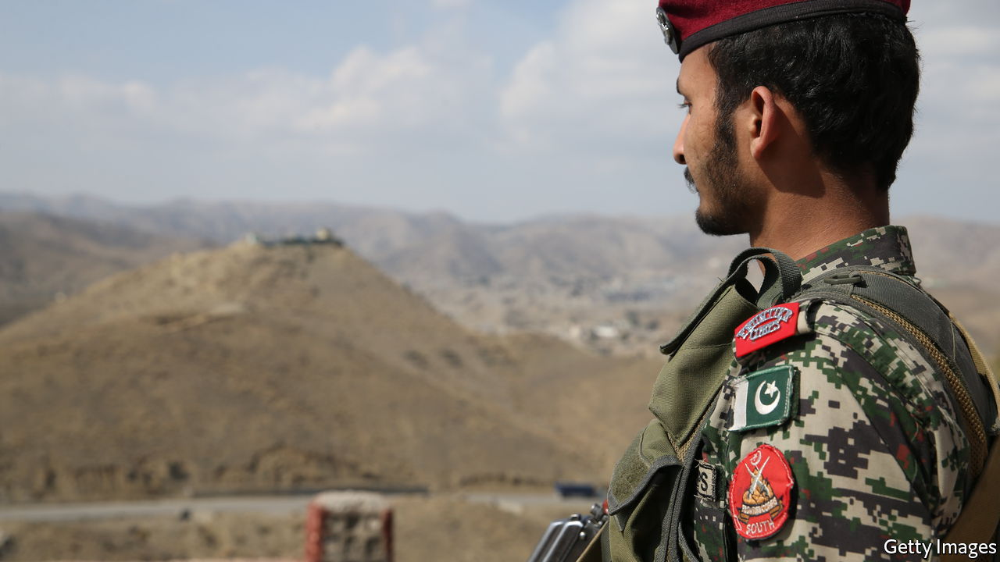

###### Bad neighbours

# Pakistan is losing patience with the Taliban 

##### Insurgents continue to attack it from Afghanistan 

 

> Apr 30th 2022 

PAKISTAN’S DAPPER spy chief was all smiles when he swanned into Kabul, the Afghan capital, three weeks after the Taliban regained power. During his visit in September Faiz Hameed (who has since stepped down) tried to reassure a nervous world that Afghanistan’s future would be rosy. America and its allies had departed in ignoble fashion, handing the government to an Islamist militia. But Lieutenant-General Hameed was upbeat. “Everything will be okay,” he said.

At the time many in Pakistan’s army and security services shared this optimism. The Afghan government that was toppled by the Taliban was frequently at odds with its neighbour, and sympathetic towards India to boot. The new regime, in contrast, was old friends with Pakistan’s serpentine security services. Pakistan had helped the militants since their early years. Taliban leaders had lived in Pakistan throughout their long insurgency.


How things have changed. In the middle of April 45 people died in their beds as a result of air strikes launched on villages in the Afghan border provinces of Kunar and Khost. The Taliban said Pakistani helicopters were responsible. They summoned Pakistan’s ambassador for an ear-bashing.

Pakistan has not admitted carrying out the strikes. But it is plainly fuming at the Taliban’s tolerance of Pakistani insurgents who have been attacking Pakistan’s borderlands from havens inside Afghanistan. These militants, the Tehrik-i-Taliban Pakistan (TTP), want to oust the Pakistani government and impose sharia (Islamic law). They share many ties with the Afghan Taliban and swear allegiance to the Taliban’s supreme leader, Haibatullah Akhunzada.

Over the past decade the Pakistani army had gradually driven them out of Pakistan’s territory and across the border. But the Taliban’s victory in Afghanistan seems to have buoyed the gunmen, not least by giving them hope that they can repeat a similar feat in Pakistan. The hard-won peace in Pakistan’s border districts is starting to look fragile as a result. Two Pakistani soldiers were shot dead in South Waziristan on April 26th; three died a few days before. The Afghan villages that were recently destroyed by air strikes were said to have housed families of fighters who had previously killed Pakistani soldiers and policemen in ambushes.

Talks between Pakistan and the TTP, which the Taliban had brokered, seem to have gone nowhere. The Taliban’s indulgence of the TTP is not the only way in which it is disappointing Pakistan. The Taliban’s leadership has followed the example of Afghanistan’s previous government in refusing to recognise the international border. Fencing along bits of the frontier has been torn down.

A lot of this will seem wearily familiar to Pakistan’s most grizzled spooks. The first time the Taliban held power in Afghanistan, in the late 1990s, they were much more reliant than they are now on keeping up good relations with their neighbour. Even then, they often fell out. In one incident they shaved the heads of a visiting Pakistani football team as punishment for wearing shorts. Senior leaders in Kabul generally want to get on well with Pakistan. But powerful local commanders who have lived and fought alongside the TTP are reluctant to turn on them.

Blowing up villages in Afghanistan may prompt some TTP militants to pack up their camps and reinstall them somewhere out of reach. But it is unlikely to change many minds among the Taliban, and may only harden opinions. “Next time we might not tolerate it,” warned Mullah Mohammad Yaqoob, the acting Afghan defence minister.

Pakistan may yet try other ways to bring the Taliban into line. Afghanistan’s government craves international recognition. Pakistan is unlikely to support this while the two are at odds. And during some past disputes Pakistan has held trade hostage by abruptly shutting border crossings. Such arm-twisting might now have an effect. Or it may only bring into sharper focus the limits of Pakistan’s power. ■

