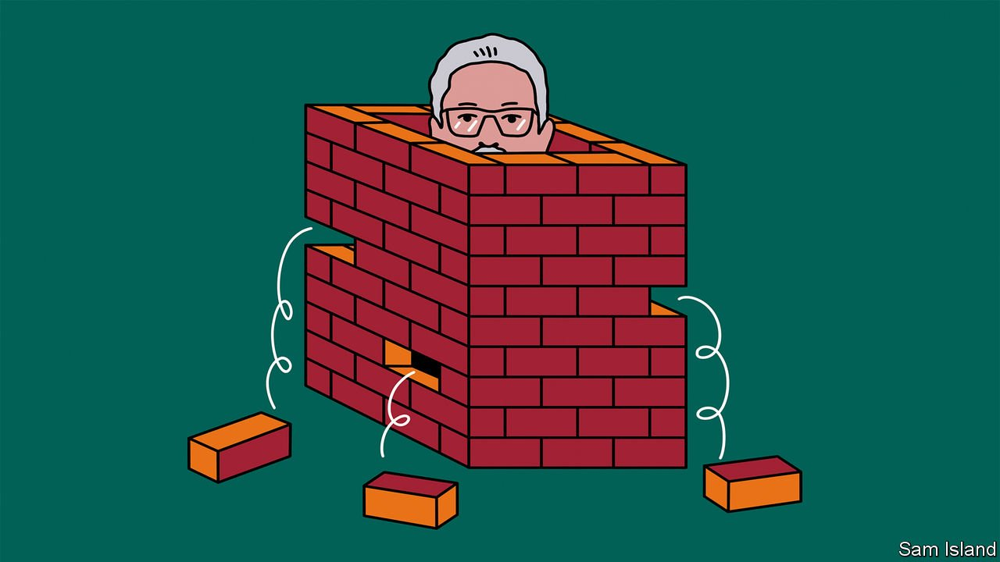

###### Banyan

# Sri Lanka’s ruling family is running out of road 

##### The Rajapaksas hang together. Now they are falling apart 

 

> Apr 30th 2022 

 On May 9th Mahinda Rajapaksa, Sri Lanka’s prime minister,  between anti-government protesters and his supporters. The president, Gotabaya Rajapaksa—Mahinda’s brother—, and imposed a curfew. The homes of several politicians were set on fire. A lawmaker from the ruling party was among those who have died.

AS THE SUN goes down the numbers swell on Galle Face Green, a promenade facing the Indian Ocean in downtown Colombo where families and lovers typically come to stroll and fly kites. These days it hosts a more purposeful crowd. Families are there, but so are farmers, students and their professors, Buddhist monks, Catholic nuns, Muslims and members of Sri Lanka’s Tamil minority. A makeshift settlement has sprung up. There are teach-ins at the “People’s University” and slapstick plays for children. The capital’s classiest choir has even led a rousing rendition of “Do you hear the people sing?”. This is Gota Go Gama: “Gota Go Village”. “Gota” is short for Gotabaya. The whole carnival takes aim at the president, the 72-year-old Gotabaya Rajapaksa, and his family: Go, Gota, just go.

The Rajapaksas are not used to being treated this way. They have dominated Sri Lanka’s politics since Gotabaya’s elder brother, Mahinda Rajapaksa, won a presidential election in 2005. As defence secretary, Gotabaya oversaw the armed forces in a ghastly civil war against Tamil rebels. Tens of thousands of trapped civilians were killed in the denouement. Afterwards, the Rajapaksas wallowed in triumphalism and settled scores with critics. Mahinda lost power in a surprise electoral defeat in 2015 (his government’s rampant corruption did not help). But his machinations soon brought on a constitutional crisis in which he contested the prime ministership.


Of all the Rajapaksas, Mahinda, whose person drips with golden amulets and other lucky charms and who moves with the bearing of one of the island’s kings of old, appeals most to the clan’s followers among the Sinhalese (and largely Buddhist) majority. He would have liked to return to the presidency, but Parliament overturned a constitutional amendment passed in 2010 that had ended term limits. So it was Gotabaya who ran in 2019 and won in a landslide.

Gotabaya promised brisk technocratic government and “vistas of prosperity and splendour”. Instead, the country got, as usual, yet more Rajapaksas. Mahinda came in as prime minister. Another brother, Chamal, was put in charge of irrigation. Soon, after a constitutional amendment to allow dual nationals into government, yet another brother, Basil, was finance minister (he holds an American passport). The president’s nephews also got posts. Military types got many of the rest.

The president, who pushed through a constitutional amendment strengthening his executive powers, seemed itching to run the country as would a drill sergeant. Instead he and his brothers ran it into the ground. Their earlier regime had burdened Sri Lanka with debt from infrastructure projects, including vanity schemes in their home district, that have not generated returns. Their current administration cut taxes when revenues were most needed. A ban on fertiliser imports, to conserve dollars, hurt food production. The currency has plummeted. Foreign reserves have dwindled. Any deal with the IMF seems a way off. Inflation has soared. Power cuts are a daily headache, and there are long queues for petrol, too. An Indian credit line for fuel has bought time. But that is going to run out at the end of April.

And then what? The people on Galle Face Green are furious over their country’s precipitous fall. Soon, hunger may loom. Meanwhile, Rajapaksa mismanagement and sleaze have so diminished Gota’s authority that he has not shown his face in public in weeks, as barricades have gone up around the presidential office. But impeaching a president is far from easy, and heaven knows Gota wants to stay. Out of office he is even liable to prosecution for war crimes.

Basil went early in April, when Gota replaced his cabinet. Until this week, Mahinda was adamant that he, too, would not budge as prime minister. Now, the president appears willing to do the budging for him. On April 27th he called for an all-party government to be formed once the prime minister and month-old cabinet had resigned.

It is not clear that opposition parties will play along. But ejecting Mahinda could persuade enough of the doubters in the ruling coalition for the government to win any no-confidence vote. Whatever happens, the implications are profound. The Rajapaksas have always been as thick as any Sicilian family. Whatever their differences, they knew they needed to stand together. But the crowds on Galle Face Green have had an effect. From now on, it seems, the Rajapaksas stand separately.

Read more from Banyan, our columnist on Asia: (April 23rd) (Apr 16th) (Apr 9th)

