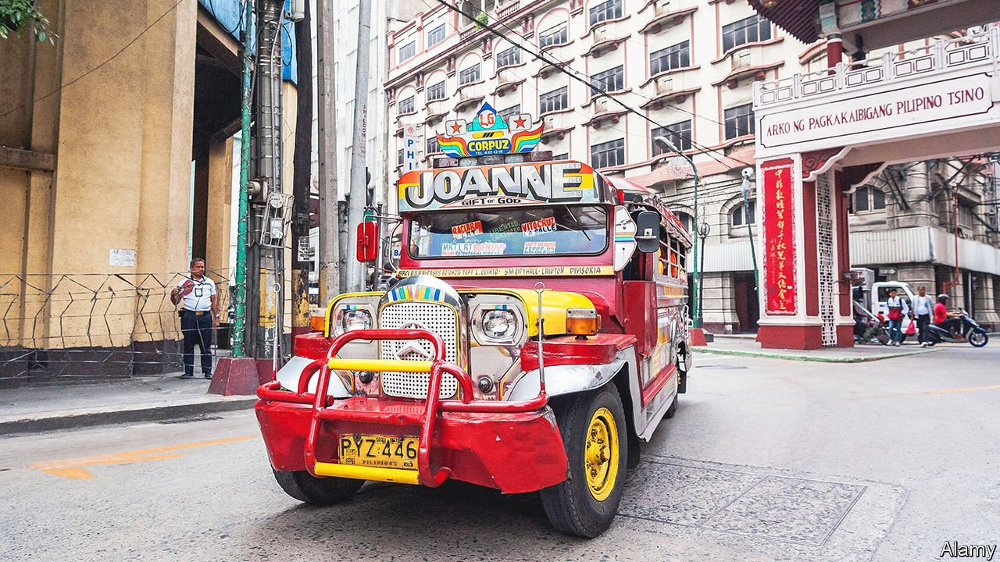

###### Not so fast

# The jeepneys of the Philippines refuse to pull over 

##### Plans for better transport are idling 

 

> Apr 30th 2022 

THE JEEPNEYS of the Philippines are at once a national treasure and a dirty menace. When American troops went home in 1946, they left behind hundreds of military jeeps. Filipinos fitted them with benches, daubed them with gaudy illustrations and began charging commuters for lifts around town. The originals have now mostly been scrapped, but jerry-rigged replicas remain the most common way for people without cars to navigate big cities. They outnumber buses roughly ten to one.

This is far from ideal. Ancient diesel engines sputter beneath most jeepneys’ garish bodywork. Transport of all kinds produces close to one-third of the Philippines’ energy-related carbon emissions. By one estimate jeepneys cough out 15% of all the pollution from road vehicles. Riders must often scurry into the street to clamber into the back of one. Jeepney passengers are said to be ten times more likely to experience a road accident than someone in a private car.


The government would like to see them zoom off into the sunset. In 2017 it decreed that most jeepney drivers would be given three years to swap their bangers for cleaner, safer vehicles that look suspiciously like minibuses. They were promised cheap loans to help buy these machines, which are supposed to come with CCTV and Wi-Fi and which were, at the time, predicted to cost about 1.5m pesos ($28,700) each. But jeepney drivers and operators honked furiously. They said the plans would saddle them with debt while also pushing up fares.

In the years since then the project has trundled ever further off course. By July 2019 it was being reported that only about 2% of old jeepneys had been upgraded. Not long after that covid-19 began battering drivers’ livelihoods, providing the government with an excuse not to start punishing slowcoaches. In March it declined once again to put its foot down. It said it would start offering jeepney drivers one-year permits allowing them to keep their jaunty jalopies on the road.

Unless authorities plan to issue endless extensions, they will probably have to conjure up new carrots and sticks. Eric, a jeepney driver in Manila, speaks for many when he says he cannot ever imagine swapping his bright red vehicle for a spiffy new bus. The souped-up replacements have ended up costing more than was expected. And the 300-400 pesos he earns each day is already too little to get by on. The clanking trucks occasionally break down. But he says they are much easier than the newfangled ones to fix.

