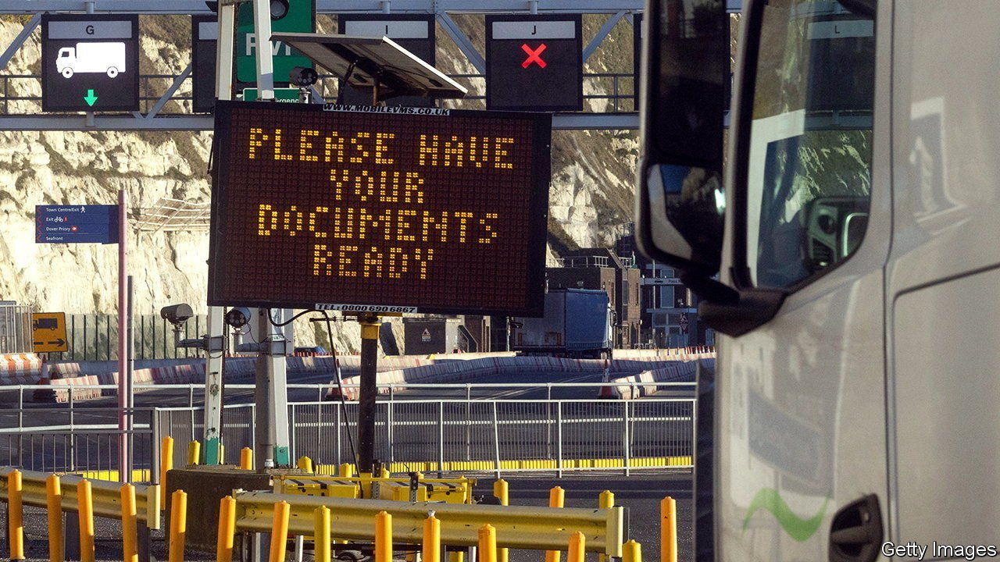
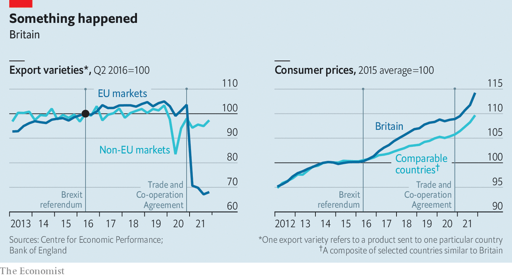

###### Quantifying the pain

# Brexit has clobbered smaller businesses 

##### It has raised prices in Britain, too 

 

> Apr 30th 2022 

BREXIT WAS always going to be a bother. The question was how much of one it would be. Although industries like financial services have not suffered the disaster some predicted, it is not hard to find aggravated business-owners complaining that leaving the EU has brought baffling bureaucracy, higher costs and frustrating delays. A flurry of new studies quantifies the pain.

One paper by the Centre for Economic Performance at the London School of Economics finds that Britain’s departure from the single market at the end of 2020 led to only a temporary dip in its exports to the EU relative to its sales elsewhere. But when they look at “trade ties”, or the range of products traded with different member states, they find a plunge of 30% (see left-hand chart). The drop is concentrated in lighter trade flows to dinkier countries. That looks suspiciously like smaller exporters giving up.

 


Another study, published by the UK in a Changing Europe, a think-tank, explores the effects of new barriers on the trade that did continue. Faced with higher costs when crossing Britain’s borders with the EU, businesses raised their prices. The authors compare products like fresh pork or tomatoes, which are mostly imported from the EU, with products like pineapples, which come from more exotic climes. They find that by September 2021 Brexit had lifted food prices by 6% relative to the years before December 2019. (A mooted government proposal to cut food tariffs might help, though removing non-tariff barriers matters more for imports from the EU.)


Comparing Britain’s economic performance with that of similar countries suggests a broader problem. Catherine Mann of the Bank of England has pointed out that by the end of 2021 consumer prices were around 4% higher than in otherwise comparable economies that did not experience Brexit (see right-hand chart). As the cost of living soars, a difference of this magnitude really matters.

For more coverage of matters relating to Brexit, visit our 

