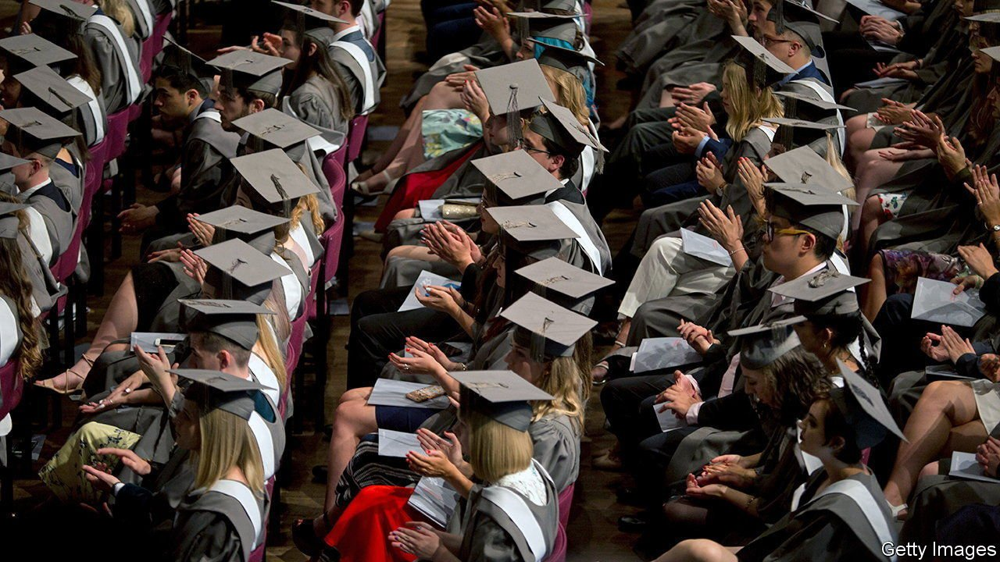
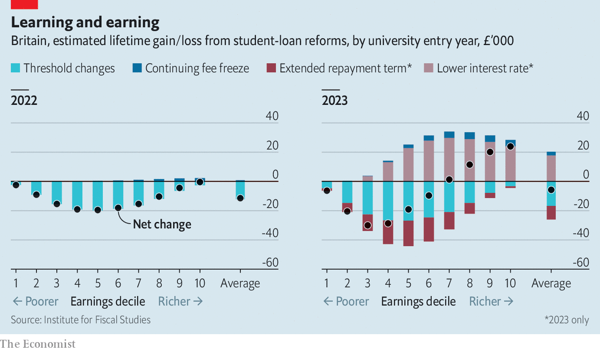

###### Higher education

# Britain’s student-finance system is being overhauled, again 

##### The biggest reform since 2012 will see lower and middle earners pay more, and higher earners less 

 

> Apr 30th 2022 

MORE THAN a million English students take out a student loan each year. But for the past decade the term “student loan” has been a misnomer. For most, the agreement works more like a graduate tax with an expiry date. Graduates pay 9% of their earnings above a certain threshold (currently £27,295, or $34,695, a year) towards repaying their debt. Anything still owing after 30 years is written off.

From September 2023 this system is set to change. The Department for Education (DfE) announced a suite of reforms earlier this year. They range from the eye-catching (forgiving the debt after 40 years rather than 30) to the wonkish (lowering the earnings threshold and changing the way it is indexed). Taken together, they amount to the biggest overhaul of student finance since tuition fees were tripled in 2012. Ben Waltmann of the Institute for Fiscal Studies, a think-tank, estimates that under the new system, nearly three-quarters of graduates will repay their debt in full, up from only a quarter under the old one.


For the cohort starting university next year, the changes will mean a big redistribution of who pays what towards higher education (see right-hand chart). Less punitive interest rates for higher earners mean that those in the top decile of lifetime earnings can expect to pay back £25,000 less than under the current arrangement. Meanwhile, the extended repayment term and the lower earnings threshold mean that lower and middle earners will pay more: around £30,000 more for those in the third income decile.

The reforms have much to recommend them. There is some evidence that the prospect of taking on debt has a deterrent effect on people from poorer backgrounds who are considering going to university. But the earnings threshold continues to protect people from repayments until they are pocketing a certain wage. Taxpayers will save £2.8bn for each university cohort. Incentives change in good ways: encouraging students to pick subjects that will increase their lifetime earnings is in both their and the economy’s interests.

 


But the changes fail to fix some big shortcomings in the current set-up. Mr Waltmann points out that maintenance support, loans to help pay for living costs, is now falling fast in real terms. Payments are based on old forecasts of retail price index (RPI) inflation that underestimated how quickly the index would rise. He calculates that students from the poorest families will receive £100 a month less than they would have done had their support been linked to actual RPI inflation. At the same time, interest rates for existing borrowers are set to soar in September. Although the DfE must cap these in line with commercial rates, it typically does so with a six-month delay. For higher earners, that implies half a year of paying 12% interest, nearly double the commercial rate.

Worse, as well as changing the rules for future students, the reforms also rewrite repayment terms for the roughly 3.5m people who have taken out loans since 2012. A frozen earnings threshold will increase their monthly repayments from this September, just as the rising cost of living really starts to bite. Linking this threshold in the future to the RPI, a flawed measure of inflation that is set to be reformed, bakes in further uncertainty. These changes do not just hurt existing borrowers in every earnings decile (see left-hand chart), but also risk deterring future students. Why take out a loan if the terms can change whenever the government wants? ■

