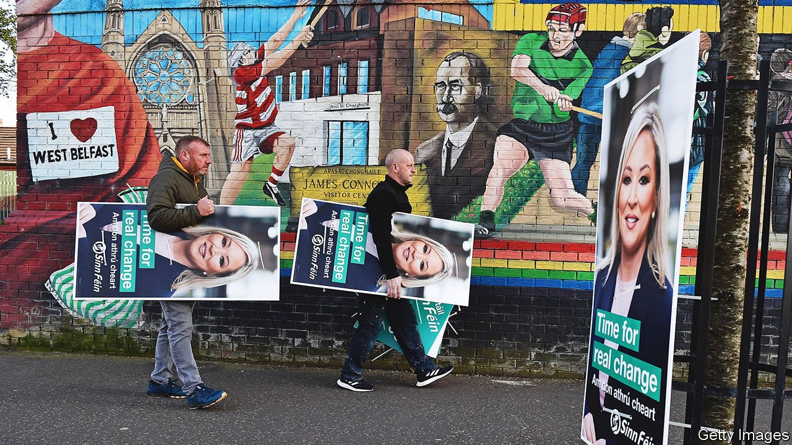
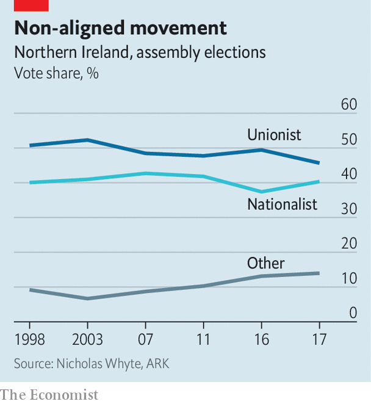

###### Placards, paralysis and a protocol

# Nationalists are set for a historic win in Northern Ireland's vote 

##### The Good Friday Agreement is under increasing strain 

 

> Apr 30th 2022 

THE PUNDITS and the psephologists are all gearing up. On May 5th voters in England, Scotland and Wales will go to the polls in local elections: a bad result for the Conservatives could stoke unease among Tory MPs about Boris Johnson’s  after his . But another election taking place that day is likely to prove more significant. For voters in Northern Ireland could choose as the biggest party one that does .

For the past 101 years, a pro-British (or unionist) party has won every election to Stormont, the province’s governing assembly. And for the past 19 years the Democratic Unionist Party (DUP) has always been the victor. If the polls are accurate, that is about to change.


Sinn Féin, for decades the political wing of the Irish Republican Army (IRA), is projected to achieve a historic victory. That does not mean Irish reunification is on the immediate agenda. But it will add to the , and may provoke a fresh crisis in Britain’s relationship with the European Union.

Sinn Féin is not a shoo-in for first place. Fear of defeat is the DUP’s greatest hope of victory: the party’s campaign centres on the atavistic message that if unionist voters do not endorse it, then they will get a Sinn Féin First Minister of Northern Ireland. Although the posts of first and deputy first minister are joint and equal in law—one cannot so much as order a pizza in their ministerial role without the other’s permission—the prospect of victory for a party that still lauds IRA terrorists appals many unionists.

Michelle O’Neill, Sinn Féin’s Stormont leader, has played down talk of a victory presaging a referendum on Irish reunification. Instead the party has focused its campaigning on issues such as the cost of living, in order to avoid incentivising unionist voters to turn out. And the same polls which have Sinn Féin on course for victory show that is only because it is losing support at a slower rate than the DUP. Sinn Féin could become the biggest party at the same time as its share of the vote shrinks.

In those circumstances, there would be little pressure on the British government to call a referendum on Irish unity. Under the Good Friday Agreement, which in 1998 ended 30 years of bloody sectarian strife, a plebiscite must be held if it appears likely that the Northern Irish electorate would vote to leave the United Kingdom.

Yet the past six years have shown how far off unity may be. An unpopular Brexit, years of unionist incompetence, a prime minister who manages to unite voters of all stripes in their dislike of him, and a growing Catholic population amount to the most propitious circumstances possible for nationalism. But advocates of unity have only marginally shifted the dial in their favour: the longest-running poll on the question showed that 27% supported immediate unity in 2002, and 30% supported it in 2020. Enthusiasm for reunification south of the border is hard to detect.

Nonetheless, a Sinn Féin victory would have practical as well as symbolic implications. Under the terms of the Good Friday Agreement, either of the two main parties can veto an administration being formed. The DUP has refused to say whether it would participate in government if Sinn Féin wins. Jim Wells, a former DUP minister, has said publicly that the party should refuse to share power with Sinn Féin if it were to get the post of first minister. Such a decision would not just be undemocratic but idiotic: it would almost certainly boost republican support.

Even if the DUP pulls off an improbable victory, however, the province may not get a government. That is because Northern Ireland now has two disputed borders, not one. A crucial part of Mr Johnson’s Brexit divorce deal was the , an agreement that the province would stay in the EU’s single market for goods and in its customs union. The protocol avoided checks at the Irish land border but created a new Irish Sea border, which makes trade with Britain more difficult and has left many unionists believing that ties to “the mainland” are being severed.

In February the DUP brought down the devolved government in protest at the protocol. It says it will not return to the executive until the sea border is removed. The British government, which dislikes the protocol for many reasons, has been making noises about unilateral legislation to dismantle bits of it. That would not only precipitate a bitter clash with the EU but could see Sinn Féin, which strongly supports the protocol, itself refuse to enter government in protest.

The province has been in this position before: for three of the past five years, it has had no government. But according to Ann Watt of Pivotal, a think-tank, a period without an executive “will inevitably make life harder for individuals and families here in Northern Ireland—with the most vulnerable people disproportionately affected”.

Moreover, the underlying strains in Northern Irish politics are intensifying. The least confrontational path to getting rid of the Irish Sea border seems likely to disappear as a result of the elections. The Brexit deal explicitly provides for a Stormont vote in 2024 on whether to keep the Irish Sea border; that vote will be decided by assembly members who are elected on May 5th. Whether the DUP clings on as the largest party or not, it is very unlikely that unionists will win a majority in Stormont.

If unionists think they have lost their chance to vote down the protocol, a more militant approach may prevail. A year ago serious rioting erupted in several parts of Northern Ireland; paramilitaries in balaclavas openly taught children born long after the Good Friday Agreement how to make petrol bombs. The violence subsided as unionist leaders said politics could remove the sea border, but its threat lingers.

 


One reason why unionism is unlikely to win a majority in the upcoming election is the growth in voters who shun the labels of “nationalist” or “unionist”. Northern Ireland is no longer a polity divided by one sectarian line, but rather a society of three minorities—unionists, nationalists and the non-aligned (see chart). That sits very awkwardly with political structures designed with only two tribes in mind: the ballots of centrist assembly members in effect do not count in key votes, for example. At some point, the Good Friday Agreement will have to be amended, a process which will be deeply contentious.

When accepting his Nobel prize in literature three years before the agreement was signed, the Northern Irish poet Seamus Heaney lamented “the dolorous circumstances of my native place”. The sorrow then wrought by daily murder has been replaced by the sorrow of political failure, and that is progress. But the forthcoming elections are likely to underline the brittleness of the province’s politics. And brittle things tend to break. ■

