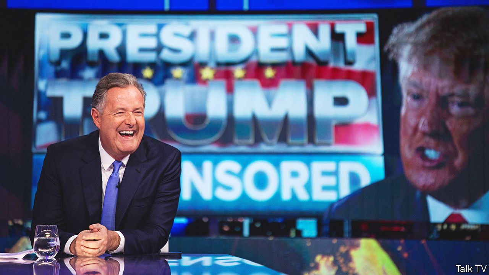

###### All mouth. Any trousers?

# Piers Morgan is the face of TalkTV 

##### Rupert Murdoch’s latest venture wants to shake up the news in Britain 

 

> Apr 30th 2022 

IT WAS A somewhat trying night for fans of understatement. On his first prime-time show on TalkTV, a broadcast and streaming channel that launched on April 25th, Piers Morgan declared: “As Nelson Mandela might have said, it’s been a long walk to freedom of speech!” His opening-night interviewee, Donald Trump, may be the only person in the world who can make Mr Morgan look bashful. But the presenter has not been hired for his command of euphemisms. His job is to sock it to Britain’s existing news broadcasters.

TalkTV is the latest addition to Rupert Murdoch’s media empire. In 2018 his bid to take full control of Sky, a European pay-TV giant, failed, leaving the tycoon with no stake in a British broadcaster for the first time in decades. He considered investing in GB News, a right-wing news channel which began broadcasting in June 2021. GB News has avoided clashes with Ofcom, the broadcasting regulator which enforces rules on impartiality, but it has largely flopped in the ratings.


The lukewarm reception for GB News might seem like a bad signal for another talking-heads channel. But TalkTV has some important advantages. The first is the sheer volume of journalism that News UK, the British arm of News Corp, already produces. As well as TalkRadio (a phone-in station whose shows are being simulcast on the new channel), its athletic sibling TalkSport and the higher-brow Times Radio, the firm publishes newspapers including the Times and the Sun. “The journalistic talent that is already inside the building in News UK can be deployed in ever more ways,” says Douglas McCabe of Enders Analysis, a research firm.

Second, TalkTV is focusing heavily on online platforms. Presenters sound off to camera, creating viral content alongside which the channel hopes to sell advertising. A shift to social platforms has helped LBC, TalkRadio’s biggest commercial rival. Videos of its presenters and guests travel much further on social media than audio clips do, helping to make it Britain’s fastest-growing talk-radio station.

In Mr Morgan, TalkTV has a third big asset. The presenter has a knack for spectacle. An average of 317,000 people watched his interview with Mr Trump (more will have seen it online). That is double the number who tuned in to the BBC’s news channel at the same time, and almost a third more than watched the launch of GB News. Nic Newman of the Reuters Institute for the Study of Journalism at Oxford University notes that although viewers often tell surveys that they value impartiality in news, the success of stations such as LBC shows the importance of entertainment, too. If TalkTV can get the mix right, it has a shot at persuading Britons to abandon more restrained news channels. ■

