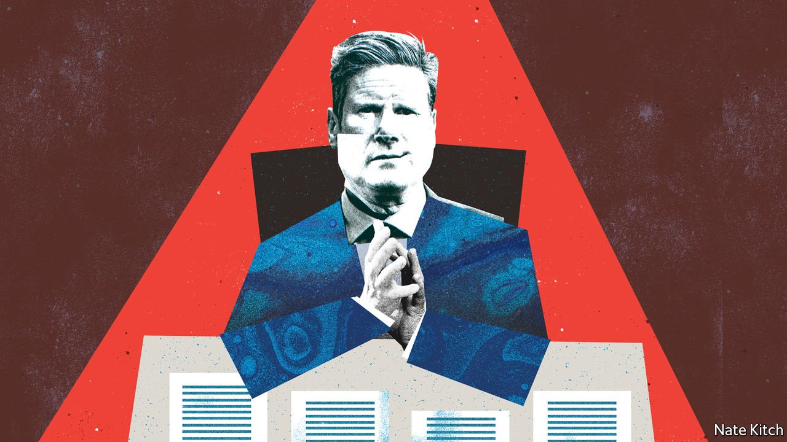

###### Bagehot

# Sir Keir Starmer, the cynical leader 

##### A critical biography paints the Labour leader as ruthless. He should take the compliment 

 

> Apr 28th 2022 

FOR A MAN who could be prime minister, Sir Keir Starmer enjoys a peculiar reputation as a political naïf. The Labour leader was elected as an MP only in 2015, after a decorated career as a human-rights barrister and a stint as the director of public prosecutions. By 2020 he was party leader. To his critics, he has the air of a hobbyist who had reached the top of one profession and fancied a go at another, and who ended up as a potential prime minister due to circumstance rather than skill. An enjoyably hostile new biography of Sir Keir by Oliver Eagleton, an editor at the New Left Review, a socialist journal, offers an alternative view.

In “The Starmer Project”, the political naïf turns into a bequiffed Machiavelli. On this telling, Sir Keir undermined Jeremy Corbyn, his hard-left predecessor, as part of a long-term plan to install himself as Labour leader. He campaigned for that job on a platform of carrying on with Mr Corbyn’s policies. Then, once in power, Sir Keir organised a ruthless purge of the left-wingers who had taken control of the party machinery. In Mr Eagleton’s version of events, Sir Keir is politically rapacious and rather cynical. He could well be offended. But he should take it as a compliment.


For starters, allegations of plotting protect against Boris Johnson’s charge that the Labour leader is cut from the same cloth as his predecessor. Displaying a weak grasp of Britain’s tailoring heritage, the prime minister has labelled Sir Keir as a “Corbynista in a smart Islington suit”. Sir Keir did, after all, spend three years in Mr Corbyn’s shadow cabinet, overseeing Labour’s Brexit policy. To his defenders, Sir Keir had no choice but to serve. Brexit was an existential question at the time; duty called. In Mr Eagleton’s telling, however, Sir Keir was a wrecker. Agent Starmer tried to undermine Mr Corbyn’s team from within, pushing the party towards supporting a second referendum primarily to position himself as a potential leader of the party.

Convenience rather than conviction is the better explanation, and the better alibi, for Sir Keir’s stint under Mr Corbyn. The next leader of Labour was always likely to be someone who had ostensibly been loyal to the leftie leader. Although a tranche of Labour members were hard-core believers, the bulk were moderate social democrats who liked Mr Corbyn’s proposals of higher public spending and more public ownership. Anyone who had spent the previous five years attacking Mr Corbyn would have had no chance of succeeding him. Standing on a Corbynite platform of higher taxes on the very rich and public ownership of utilities, Sir Keir sauntered to victory.

Upon winning power, however, Sir Keir ditched the bulk of this programme. More than that, he set about ridding the party of the left-wingers who had taken over its apparatus. He even removed the whip from Mr Corbyn, his old boss, after the former leader played down the rise of anti-Semitism on his watch. Chasing lefties out of the party is performative as well as practical. Others on the Labour benches avoided serving Mr Corbyn; an element of overcompensation from Sir Keir was required. Mr Eagleton’s portrayal of Sir Keir as a blood-soaked Trot-slayer is rather useful.

Cynicism is not the only possible explanation for Sir Keir’s political volte-face. One unflattering theory for his flexible political positions is that he has been “cuckooed”. Cuckooing happens when wrong ’uns take over the flat of a vulnerable person, turning it into a drug den or a brothel. In this telling, something similar has happened to Sir Keir, whose shadow cabinet and advisers are now drawn from the right of the party. He is reduced to the role of a hapless pensioner trying to sleep while holdovers from the New Labour era blast “Things Can Only Get Better” at 3am.

The cynical explanation puts Sir Keir in a much less feeble light. Grumblings about his leadership emerged during 2021. Labour had a lousy set of local-election results last year; were hammered in a by-election in Hartlepool, a poor coastal town in northern England; and clung onto Batley and Spen in west Yorkshire by only a slim margin. Opponents, particularly on the right of the party, were circling. Sir Keir changed tack in a bid to stay alive. He brought in people from the party’s right, such as Yvette Cooper, and turfed out long-standing advisers. Survival sometimes requires a dose of cynicism.

An appreciation of the Labour leader’s ruthless side may also win over his remaining doubters. Critics of his are found across the whole party. Although the left see him as a malevolent wrecker, the right sees Sir Keir as someone who lacks the right political instincts. But politics is a results business. “If you’re so smart, why are you so poor?” runs one Russian proverb. “If you’re so good at politics, why are you not in power?” applies in Westminster. Sir Keir’s path of reluctant support of Mr Corbyn, to be ditched once in power, was an option open to all Labour’s pretenders from the right. But others did not have the nous to seize it.

A backhanded compliment

By doing down Sir Keir, therefore, Mr Eagleton has done him a favour. This is not the first time Corbynites have found themselves bigging up their enemies. When Theresa May was at her lowest ebb, Corbynites were among her few defenders. It must have taken a political genius to defeat Mr Corbyn in the 2017 election, ran their logic then. There was some truth to this. Mrs May’s strategy of targeting Leave-voting seats across the Midlands and the North was broadly right; Mr Johnson followed it closely in the next election and won a stonking majority.

Likewise, the idea that Sir Keir is a cynical mastermind is a more comforting one for Corbynites than the possibility that the former Labour leader was manifestly unsuited to the role. But it is also a more reassuring tale for Sir Keir’s supporters. A cynical Labour leader is one who owes his position to his own cunning rather than circumstance. He is also one that stands a better chance of becoming prime minister. ■

Read more from Bagehot, our columnist on British politics: (Apr 23rd) (Apr 16th) (Apr 7th)

