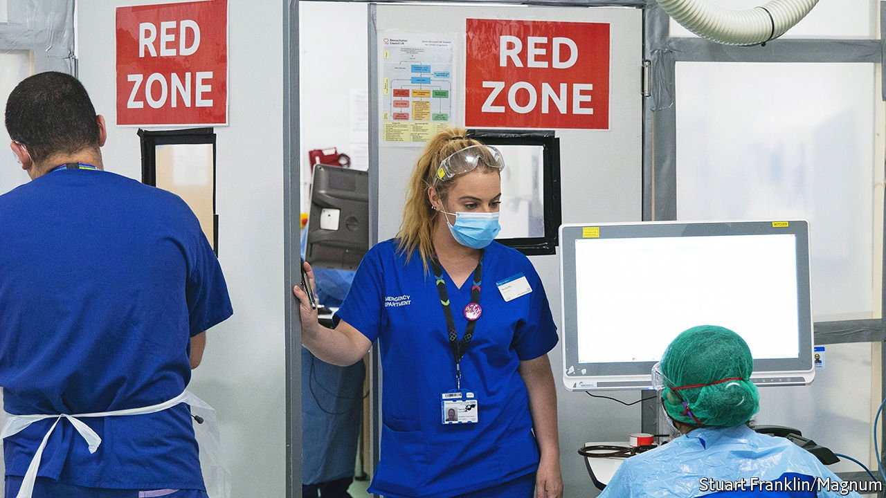
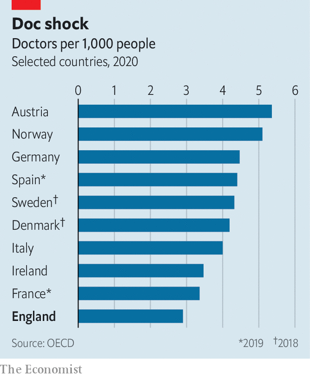

###### When the applause fades

# The NHS is in seriously poor shape 

##### Britons are starting to criticise an organisation they used to clap for 

 

> Apr 28th 2022 

MANY DIAGNOSES have been offered for the malaise racking the National Health Service (NHS). Like lots of 74-year-olds, its vital signs are poor. It has a backlog of 6.2m people on waiting lists. There were 110,000 unfilled hospital and community-care posts in December—a figure that included 8,000 doctors and almost 40,000 nurses. The number of people waiting over 12 hours for admission in A&amp;E is around ten times higher than it was pre-pandemic. As Kevin O’Kane, a consultant in acute medicine, says: “The situation is bad and it’s about to get worse.”

The national mood towards the NHS is souring. “Our NHS” has long had a tender—perhaps too tender—place in British hearts. Britons danced for it in the Olympics; clapped for it in the pandemic; painted rainbows for it everywhere.


An almost religious reluctance to criticise the NHS is now giving way to more audible grumbles. Data from the National Centre for Social Research show that between 2020 and 2021 overall satisfaction with the NHS fell by 17 percentage points, to 36%—an unprecedented drop. Two recent scandals—one over woeful maternity care, another over an epilepsy drug that caused birth defects—have not helped.

There are both immediate and underlying causes for the NHS’s condition. Of the immediate ones, covid-19 continues to complicate the treatment of patients while also depleting numbers of staff. Burnout is a big issue: a survey conducted last year for the British Medical Association (BMA), which represents doctors,  found that a fifth of health-care workers were considering another career. The situation for those who are still left is “intolerable”, says David Wrigley, deputy chair of the BMA council.

 


A pandemic is bound to put bodies under stress. But it causes a lot more stress to bodies that are already weak and unfit. And the NHS has been unfit for years, in large part because of poor workforce planning. Even before the pandemic, Britain was light on medics (see chart). In OECD countries in the EU, the average number of doctors per 1,000 patients is 3.7. Austria has 5.4. England has 2.9. As Jeremy Hunt, a Conservative MP who is a former health secretary and current head of the health and social care committee, sees it, doctor shortages are “the biggest single challenge facing the NHS now”.

To understand how bad the government’s control of the NHS workforce is, consider its reservoir of doctors. The government more or less knows the current level of this reservoir but neither monitors the pressure in the pipelines that feed it nor the volume needed in future. It has little idea how many doctors it will need next year, let alone in ten. Its workforce planning is, says Dr Wrigley, “non-existent”.

Meanwhile, older and experienced doctors are seeping out of the system with particularly alarming rapidity. One in ten senior doctors are expected to retire in the next 18 months. This is partly due to the difficulty of working as a doctor when older. It is a physically and mentally demanding job. Some things—such as going back to sleep after a 2am phone call—become harder with age.

Yet the NHS operates a one-size-fits-no-one approach to planning medical careers, so a doctor who is 60 is expected to do the same work as one who is 40. Many cannot, or will not. Older doctors are also leaving for financial reasons: a kink in the pensions system means that doctors can lose thousands of pounds in benefits by continuing to work beyond 60. Many may simply hang up their stethoscopes.

A host of factors led the NHS to this mess, but one of the biggest is political. The timescales of doctors and politicians do not mesh well when it comes to workforce planning. “Because it takes seven years to train a doctor and ten years to train a GP,” says Mr Hunt, “it is never a priority for health secretaries or chancellors in spending reviews.” By the time new doctors come onstream “neither of them are expected to be in their current post.”

The slow process of training new doctors means it is too late to fill the reservoir up now. But the government could try to stop existing doctors from leaking away. Changing pension rules so they do not punish people who keep working would help. So would a cleverer approach to career planning: greybeards could be used to train new recruits, for example.

The opacity of the pipeline of future doctors must also be tackled. A coalition of over 100 organisations, including the BMA, has written to the government asking it to require independent estimates of how many health-care workers are being trained and how many are needed. Officials, says Dr Wrigley, “are just ignoring it”. Meanwhile, the patience of patients wears thin. The sound of applause fades. ■

Dig deeper

All our stories relating to the pandemic can be found on our . You can also find trackers showing ,  and the virus’s spread across .

