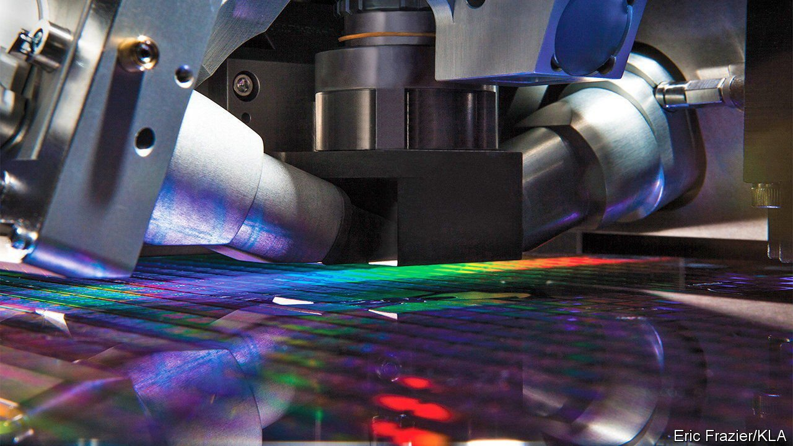
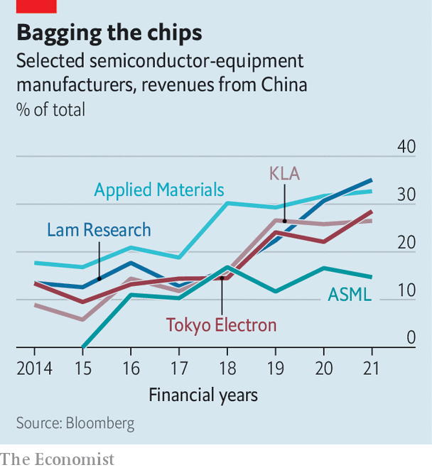

###### Crossing the chokepoint

# America has a plan to throttle Chinese chipmakers 

##### It will deny them tools to do the job 

 

> Apr 30th 2022 

MAKING CHIPS is complex work. Semiconductor manufacturers such as Intel, Samsung and TSMC themselves rely on machine tools built by an array of firms that are far from household names. The equipment sold by Applied Materials, Tokyo Electron, ASML, KLA and Lam Research is irreplaceable in the manufacture of the microscopic calculating machines that power the digital economy. A supply crunch, coming after years of ructions between America and China over control of technology, has made governments around the world more aware of the strategic importance of chipmaking. The significance of the kit used to make chips is now being recognised, too.

Such tools handle the complex processes of scratching billions of electric circuits into a silicon wafer. Those circuits shuttle electrons to do the calculations that display this article on a screen, plot your route across town or allow your fingerprint to unlock your phone. They must be perfect. KLA makes measurement tools which are essentially electron microscopes on steroids, scanning each part of a finished chip automatically for defects and errors. Some Lam Research tools are designed to etch patterns in a silicon wafer by firing beams of individual atoms at its surface. Applied Materials builds machines which can deposit films of material that are merely a few atoms thick.

 


The Chinese government’s efforts to develop a large and advanced semiconductor industry at home using these mind-boggling technologies have led to a rapid shift in the source of the revenues for the firms making it over the past five years. In 2014 the five main toolmakers sold gear worth $3.3bn, 10% of the global market, to China. Today the country is their largest market by a significant margin, making up a quarter of global revenues (see chart). Of the $23bn in sales for Applied Materials, the largest equipment-maker, during its latest fiscal year, $7.5bn came from China. It accounts for over a third of Lam Research’s revenues of $14.6bn, the largest share of any big toolmaker (though the firm notes that some portion of Chinese sales are made to multinational firms that operate there).


This new reliance has created political and commercial problems, particularly for the trio of American toolmakers: Applied Materials, KLA and Lam Research. The Chinese government has thrown hundreds of billions of dollars at domestic chipmakers. Because each of the American trio is dominant at a different step of the process, the unavoidable conclusion is that America’s most advanced technology is furthering China’s economic goals. There is strong bipartisan agreement in Washington that this is unacceptable.

America’s government has long sought solutions to this uncomfortable problem. In December 2020 it placed SMIC, China’s leading chipmaker, on an export blacklist. Any American company wishing to sell products to SMIC had to apply for a licence. But tools have kept flowing to the Chinese firm, in part because America acted alone. The Chinese government’s lavish subsidies have instead started finding their way to non-American competitors. Applied Materials noted that this might help other firms as, in effect, shutting it out of China “could result in our losing technology leadership relative to our international competitors”.

The problem is becoming more acute. SEMI, the global semiconductor-tooling trade body, announced on April 12th that worldwide industry revenues from China grew by 58% in 2021, to $29.6bn, cementing its place as the world’s largest market. Political pressure is rising. In March two Republican lawmakers wrote to America’s Department of Commerce demanding a tightening of export controls on chip technology going to China, specifically mentioning chipmaking equipment.

China’s appetite for chipmaking tools is also causing commercial difficulties for non-Chinese chipmakers, depriving them of equipment and hence the capacity to manufacture chips. On April 14th C.C. Wei, the boss of TSMC, said the Taiwanese firm had encountered an unexpected “tool delivery problem” that threatened its ability to make enough chips. Though he did not blame China, chip-industry insiders say it is the likely cause. TSMC has warned Apple and Qualcomm, two of its largest customers, that it may not be able to meet their demand in 2023 and 2024, according to two independent sources.

Over the past four months the American toolmakers have started working with the government, through Akin Gump, a firm of lawyers and lobbyists based in Washington, DC, to find a way round the problem. The toolmakers formed the Coalition of Semiconductor Equipment Manufacturers late last year to further that aim, using Akin Gump to represent them. Lawyers have been poring over the products of Applied Materials, Lam Research and KLA in an attempt to identify workable export controls under which less advanced pieces of equipment that are not used for cutting-edge manufacturing might still be sold to China, while more advanced tools would be prohibited. That would allow the toolmakers to retain some portion of their Chinese revenues.

Efforts to figure out where to draw the line continue. Akin Gump has been lobbying cabinet members and legislative leaders on behalf of the coalition, and is in ongoing discussions with both the Biden administration and members of Congress. “The plan is being driven by the Biden administration,” the Coalition said in a statement on April 25th.

The proposal hinges on getting America’s allies—in particular Japan and the Netherlands, home to Tokyo Electron and ASML—to impose the same export controls on their toolmakers. The chances of this have increased since Russia’s assault on Ukraine. Officials around the world have been regularly putting their heads together to understand the effect America’s bans on trade with Russia will have on their countries. That has created channels through which the complex task of shutting China out of advanced chipmaking, a far trickier task than curbing sales of oil or weapons, might take place.

The plan may yet fall apart. China is unlikely to accept it meekly. Hawks in Washington may push for harder restrictions. Defining what equipment can continue to be exported to China may prove too difficult. But if it works, Chinese chipmakers would need decades to catch up with the West—and America would have met its goals of suppressing Chinese semiconductor development while causing minimal harm to its own industry. ■

For more expert analysis of the biggest stories in economics, business and markets, , our weekly newsletter.

