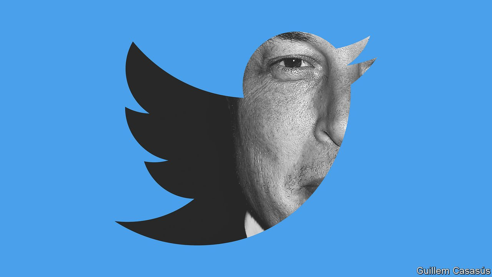
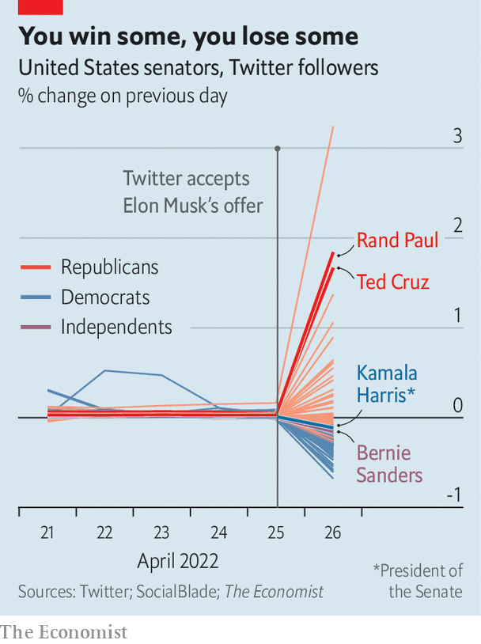

###### Twitter

# Elon Musk is taking Twitter’s “public square” private 

##### The billionaire promises to make online speech freer. That is harder than it sounds 

 

> Apr 30th 2022 

ELON MUSK, the world’s richest man, has described Twitter as the “de facto public town square”. On April 25th he struck a deal to take it private. Mr Musk, the boss of companies including Tesla, a carmaker, and SpaceX, a rocket firm, put together an all-cash offer worth about $44bn, stumping up the bulk of the financing himself in the form of $21bn in equity and a $12.5bn loan against his shares in Tesla. It amounts to one of the largest buy-outs in history. If it is a big deal in business terms, it could be bigger still in what it means for the future of online speech.

Twitter isn’t an obviously attractive business. With 217m daily users it is an order of magnitude smaller than Facebook, the world’s largest social network, and has slipped well behind the likes of Instagram, TikTok and Snapchat. Its share price has bumped along for years. It is like a modern-day Craigslist, writes Benedict Evans, a tech analyst: “Coasting on network effects, building nothing much, and getting unbundled piece by piece.”


But Mr Musk isn’t interested in Twitter as a business. “I don’t care about the economics at all,” he told a TED conference earlier this month. “This is just my strong, intuitive sense that having a public platform that is maximally trusted and broadly inclusive is extremely important to the future of civilisation.”

His willingness to spend a chunk of his fortune on making Twitter more “inclusive” follows a period in which it has tightened its content moderation. A decade ago Twitter executives dubbed the company “the free-speech wing of the free-speech party”. But the presidency of Donald Trump and the covid-19 pandemic persuaded Twitter (and most other social networks) that free speech had drawbacks. Mr Trump was eventually banned from Twitter, as well as Facebook, YouTube and others, after the Capitol riot of January 2021. Twitter began to label and block what it judged to be misinformation about covid and other subjects. In the first half of 2021 it removed 5.9m pieces of content, up from 1.9m two years earlier. In the same period 1.2m accounts were suspended, an increase from 700,000.

Mr Musk has said that in the name of transparency he will publish Twitter’s code, including its recommendation algorithm. He proposes to authenticate all users, which might help to reduce anonymous trolling, and vows to “defeat the spam bots”. He has mooted the idea of relying less on advertising, which provides 90% of Twitter’s revenue, and more on subscriptions, which would mean the firm could worry less about advertisers taking flight from contentious content.

Most controversially among users, he has said he will be “very cautious with permanent bans”, preferring “time-outs”. This suggests a reprieve for blocked politicians such as Mr Trump, as advocated by groups including the American Civil Liberties Union, which counts Mr Musk as one of its largest donors. Mr Trump said this week that he would never return to Twitter, but many doubt he could resist; he has posted only one message to his own little-used Twitter rival, Truth Social, since its glitch-beset launch in February.

There is lots of scepticism, not least among Twitter users, about Mr Musk’s professed desire to safeguard the “future of civilisation”. But wide-eyed idealism runs through his businesses. SpaceX, founded 20 years ago with money made from his early involvement in PayPal, a cash-transfer service, has the goal of “enabling people to live on other planets”. He insists that making electric cars is not just a $1trn business but an act of “philanthropy” to counter climate change. Even the Boring Company, a tunnelling venture, is on a mission to “solve traffic” and “transform cities”.

The way Mr Musk runs his other businesses suggests that he may try to answer the content-moderation problem with automation. Tesla’s manufacturing processes are more automated than any other big carmaker. Social networks have found that artificial intelligence (AI) is good at spotting some banned content, particularly images. But it is bad at understanding context and irony, particularly in foreign languages (over 80% of Twitter’s users are outside America). Facebook’s bots once removed a post referring to “Indian Savages”, not realising it was a direct quote from the Declaration of Independence; it now employs 15,000 human reviewers to set the robots straight. If Mr Musk leans too hard on AI he will encounter similar problems.

An impish streak has helped Mr Musk to sell fast cars and spaceships, and to stir up interest in “meme” stocks and cryptocurrencies, such as GameStop and Dogecoin. It might cause more problems when he is entrusted with the public square. Mr Musk’s talk of reinstating banned tweeters appals many on the left, as does his impatience with what he calls “woke” culture (“The woke mind virus is making Netflix unwatchable,” he tweeted earlier this month). A recent poll in America by YouGov found that whereas 54% of Republicans thought that Mr Musk buying Twitter would be good for society, only 7% of Democrats agreed.

Twitter’s employees may be among the doubters. Mr Musk’s libertarian worldview was forged in the Silicon Valley of the late 1990s, but today’s Valley is a different place. Twitter leans left even by tech standards: it was the first social network to censor Mr Trump, adding labels to his inaccurate tweets before other networks followed suit. If Twitter swings libertarian under Mr Musk, some employees might leave. He seems to be encouraging a clear-out, tweeting criticism of senior executives. He is likely to trim headcount: its 7,500 employees generated average revenues of $677,000 last year, whereas those at Facebook generated $1.6m, points out Ben Thompson of Stratechery, a newsletter.

 


More important is what users will make of the more relaxed approach to moderation that Mr Musk promises. The political mix already seems to be shifting: since the buy-out was announced, Republican politicians have gained followers while Democrats have lost them (see chart). Ordinary users may not like the results of looser moderation. “By ‘free speech’, I simply mean that which matches the law,” Mr Musk tweeted the day after the deal was done. That would imply giving the green light to racist abuse, for instance, which is legal in some countries but not most users’ idea of fun. Other social networks that began with the aim of allowing anything legal, such as Parler and Gettr, eventually tightened censorship after being deluged with abusive language and porn.

If Twitter were to take a purist line on free speech, the immediate winners might therefore be its more censorious rivals, suggests Evelyn Douek, an expert on online speech at Harvard Law School. Until now, the main social networks have set roughly similar content-moderation policies, each reluctant to be an outlier. “You can imagine a Twitter with Trump back on its platform just being in the headlines all day, every day, while the other platforms sat back and ate their popcorn,” she says.

Mr Musk has never seemed to mind being in the headlines. Even so, he may find it harder than he expects to do away with moderation. Twitter relies on the co-operation of other companies within the tech “stack”, which could be withdrawn. Its mobile app is distributed by Apple’s and Google’s app stores; both suspended Parler after the Capitol riot. Even its presence on the web is conditional. Amazon kicked Parler off its web-hosting platform after discovering posts encouraging violence, which broke its terms of service.

Governments are also tightening laws on online speech. Twitter fielded 43,000 content-removal requests based on local laws in first half of 2021, over double the number two years earlier. Stricter laws are being drafted in Europe. The easy passing of Twitter into the grip of one rich man may prompt harder thought about regulation in America.

Much will depend on whether Mr Musk can stick to his own principles. Social networks face a conflict of interest when the people setting moderation policies are also in charge of growth, notes Ms Douek. Would Mr Musk’s approach to free speech be swayed by his other interests? Tesla hopes to expand in China, whose state media are given prominent warning labels by Twitter. “Did the Chinese government just gain a bit of leverage over the town square?” tweeted Jeff Bezos, the founder of Amazon and owner of the Washington Post. Mr Bezos later said he expected “complexity in China for Tesla, rather than censorship at Twitter”. Investors seemed to agree: Tesla’s share price has fallen by over a tenth since news of the Twitter deal broke.

Mr Musk insists that as the platform’s owner he will be even-handed. “I hope that even my worst critics remain on Twitter, because that is what free speech means,” he tweeted on April 25th, shortly before the company’s board accepted his offer. Some users had other ideas: on the same day, one trending topic was “Trump’s Twitter”. ■

For more expert analysis of the biggest stories in economics, business and markets, , our weekly newsletter.

