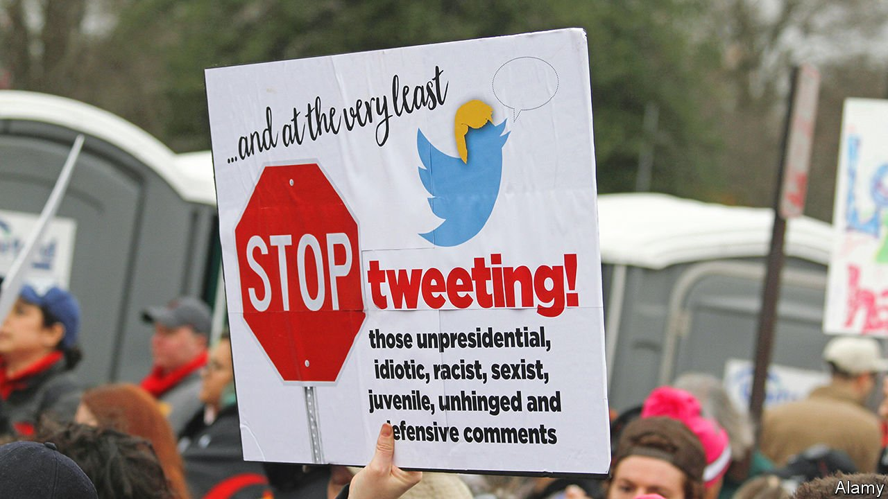

###### Moderating power

# Free-speech idealism will clash with laws—and reality 

##### Elon Musk’s Twitter challenges 

 

> Apr 30th 2022 

RESTORING THE supremacy of America’s First Amendment on Twitter seems priority number one for Elon Musk. Inconveniently, his acquisition of Twitter comes as several countries are passing laws to regulate how social-media firms should moderate content.

The European Union’s Digital Services Act (DSA), which was agreed on April 23rd, will do most to stymie Mr Musk’s plans to turn Twitter back into a place where almost anything goes. “Be it cars or social media, any company operating in Europe needs to comply with our rules—regardless of their shareholding,” Thierry Breton, the EU’s commissioner for the internal market, warned (on Twitter, naturally) hours after the buy-out was announced.


Bureaucrats in Brussels will not now tell Twitter and other social-media firms which type of speech they should take down, explains Julian Jaursch of SNV, a think-tank based in Berlin. Instead, the thrust of the DSA, which is set to apply fully on January 1st 2024, is to push services to systematise and strengthen their content moderation. For instance, Twitter will have to be more transparent over how it polices its platform, follow regulators’ advice on how to improve things, provide a way for users to flag bad content easily and give vetted researchers access to key data. Repeated violations can lead to hefty fines: up to 6% of global annual sales.

Surprisingly, given Britain’s long tradition of protecting free speech, its Online Safety Bill, which was recently introduced in Parliament, goes further. Details still need to be hammered out but the bill will require internet platforms, among other things, to go after not only illegal content, such as child pornography, but “legal but harmful” abuses such as racism or bullying. Fines are higher, too: up to 10% of global revenues.

Other countries, including Australia and India, have recently passed their versions of such laws. Even in America there is a big debate about how to reform Section 230, the provision in the Communications Decency Act that shields online services from liability for content published on their platforms. Yet it is unlikely to result in legislation in the foreseeable future. Democrats want stricter rules whereas Republicans fear censorship—and Congress is paralysed.

Yet even without all these laws, Mr Musk may soon come to realise some content moderation is needed. After years of debate and experiment, even a few free-speech advocates argue that, while tricky, if done well it “actually enables more free speech”, in the words of Mike Masnick of Techdirt, a blog. “What content moderation does,” he recently wrote, “is create spaces where more people can feel free to talk.”

For more expert analysis of the biggest stories in economics, business and markets, , our weekly newsletter.

