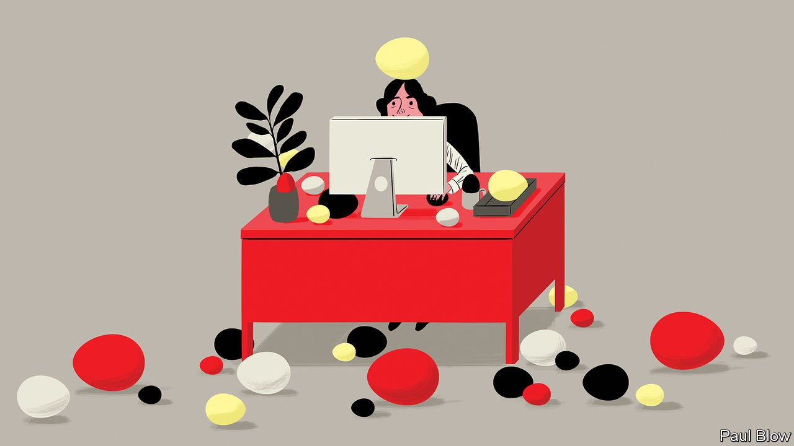

###### Bartleby

# The case for Easter eggs and other treats 

##### Irreverence can foster loyalty rather than weaken it 

 

> Apr 30th 2022 

EVER ACTUALLY read a terms-and-conditions document? WordPress, a service for building websites whose clients include the White House and Disney, thinks anyone who has deserves congratulations. Its terms of service are the usual endless scroll of legalese, until you reach section 14, on disclaimers. Buried in the verbiage about warranties and non-infringement is a short, odd sentence: “If you’re reading this, here’s a treat.” Click on the link, and you see a picture of some appetising Texas brisket. Suitably revived, you can then move on to the stuff about jurisdictions and applicable law.

Coming across an Easter egg, the name given to unexpected messages or features hidden somewhere in a product, is not like seeing funny advertising or following a humorous corporate social-media account. Easter eggs are winks, not gags; asides rather than stand-up. A new paper on their use in software, by Matthew Lakier and Daniel Vogel of the University of Waterloo in Canada, describes various motivations for them, from rewarding users’ curiosity and acknowledging the work of developers to building hype and recruiting employees. But their defining characteristic is that they are playful.


On Google’s search engine, treats famously abound: if you search for the word “askew”, for example, the results page is somewhat off-kilter. Tesla cars are jampacked with references to pop culture: entering 007 into a text box on the car’s console, for example, will change the image of the car to one used by James Bond in “The Spy Who Loved Me”. Tapping repeatedly on the software version number in the settings menu of an Android phone will usually open up a game (on version 11, the game is unlocked by repeatedly turning a dial that goes all the way up to that number, an in-joke nestled within an in-joke).

Not everyone likes playfulness in their products. Microsoft got rid of Easter eggs from its software in 2002, when it launched an initiative called Trustworthy Computing. It worried that they might introduce vulnerabilities, prompt questions among users about what else might be lurking in its code, or simply get people asking why its engineers did not have anything better to do. “It’s about trust. It’s about being professional,” explained a blog by one of its developers in 2005.

Obviously, playfulness has limits, particularly when applied to products that must not go wrong or to services whose reputation rests on sobriety. You probably don’t want engineers at Airbus or Boeing to spend too much time on giggles. The idea of a frisky auditor sounds more like a fetish than a recipe for commercial success. Giving rein to employees’ creativity has risks: jokes can easily backfire. But Easter eggs do not have to be embedded in code to have an impact: playfulness is a mindset which can show up in design choices or tweaks to wording. And in many contexts, irreverence can foster loyalty rather than weaken it.

Making references that rely on users’ knowledge of a product is a way of adding to a sense of community. Hit a broken page on the Marvel website and you’ll be taken to one of a series of quirky 404 pages; one shows Captain America grimacing and the tagline “HYDRA is currently attacking this page!” Elon Musk routinely uses playfulness to signal his anti-establishment credentials to his army of fans: by including the number “420” in his recent offer price for Twitter, he appeared to be making a reference to marijuana. (If you find this funny, you’ll be thrilled to know that Tesla vehicles can also make fart noises.)

In-jokes can be used to reinforce brands. While readers of the New Yorker wait for their app to load, messages like “Captioning cartoons” and “Checking facts” appear at the bottom of the screen. On an iPhone’s web browser, Apple uses circular-rimmed glasses as the icon for its reading-list feature, in an apparent tribute to Steve Jobs.

Showing playfulness is above all a way of bestowing humanity on companies and their products. Slack, a messaging platform, offers users a chance to pick various notification sounds. The explanation for the one marked “hummus” is that a British employee said this word in a way that tickled colleagues: it is her voice you can hear.

There is no utility at all to this feature, or to knowing the story behind it. But far from eroding trust, the decision to include this sound in the product creates a sense that a group of actual humans is behind it. Playfulness may sound unprofessional. It can be seriously useful.

Read more from Bartleby, our columnist on management and work:

Startups for the modern workplace (Apr 23rd)


