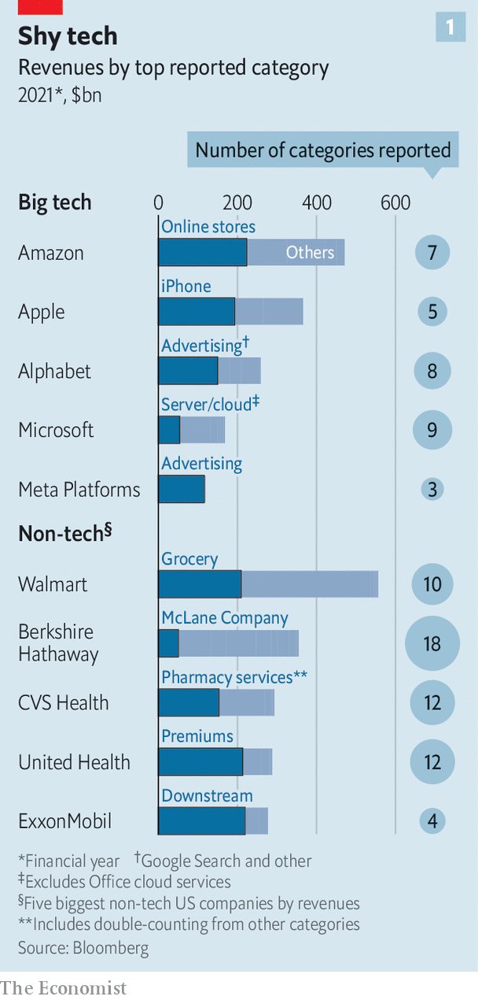
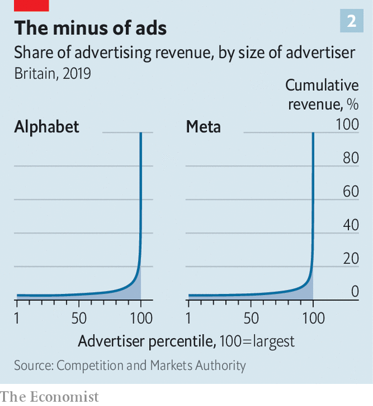
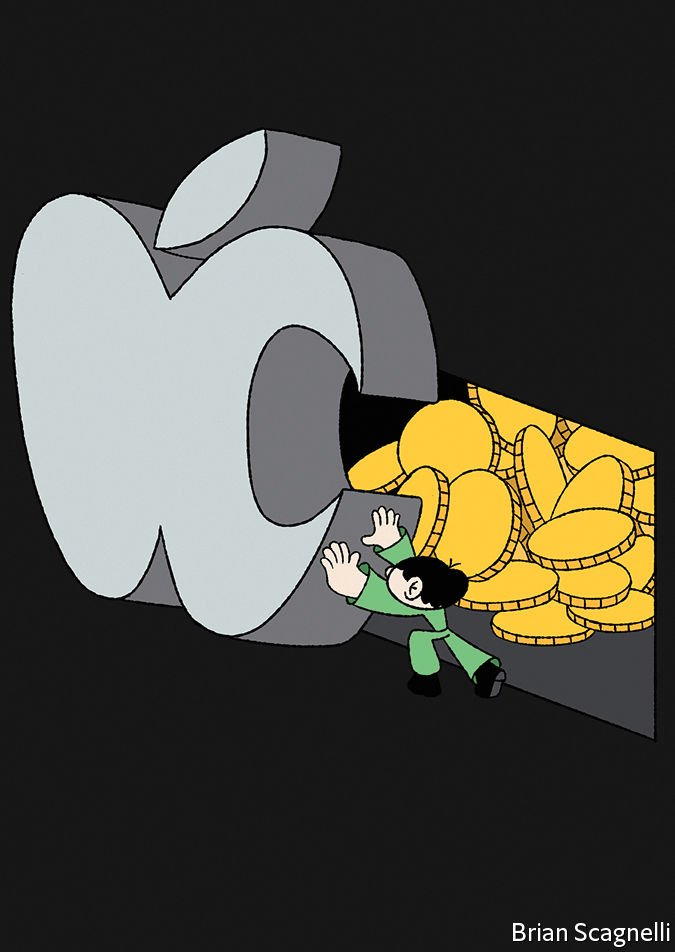

###### Lifting the silicon veil

# The secrets of big tech 

##### We dig inside the finances of Apple, Amazon and others 

 

> Apr 30th 2022 

AMERICA’S TECH giants make ungodly amounts of money. In 2021 the combined revenue of Alphabet, Amazon, Apple,  and Microsoft reached $1.4trn. These riches come from a wide and constantly expanding set of sources, from phones and pharmaceuticals to video-streaming and virtual assistants. Analysts expect the tech quintet’s combined sales to surpass $340bn in the first three months of 2022, around 7% more than in the same period last year.

In a quarterly ritual that kicked off on April 26th, when the big five started reporting their latest earnings, the staggering headline numbers again hit headlines. Alphabet unveiled revenues of $68bn, up by 23% compared with a year ago, though slowing advertising growth saw net profit dip to $16.4bn. On the same day Microsoft announced revenues of $49.4bn, up by 18%, and net profits of $16.7bn. A day later Meta revealed sales of $27.9bn with net profits of $7.5bn. Amazon and Apple reported after The Economist was published.


 are understandably eager to trumpet these impressive figures, as well as their diverse offerings. They are considerably more coy about how much many of their products and services actually make. Annual reports and other public disclosures tend to lump large revenue streams together and describe them in the vaguest terms. Last year, for example, the five giants’ sales were split out into 32 business segments in total. That compares with 56 segments for America’s five highest-earning non-tech firms.

 


Apple breaks its sales into five slices; Meta into only three (see chart 1). The category that Alphabet labels as “Google Other’‘ made $28bn in revenue last year. It includes Google’s app store, sales of its  and other devices, and subscriptions from YouTube, a subsidiary. Last year YouTube’s advertising revenue, which Alphabet first revealed only in 2020, reached $29bn. That means that in 2021 Google Other and YouTube’s ad business each generated more money than four-fifths of the companies in the S&amp;P 500 index of the biggest American firms.

The opacity makes business sense. Keeping rivals in the dark helps ensure that they will not try to replicate a prized business unit and eat into its margins. Andy Jassy, Amazon’s boss, has lamented the prospect of breaking out his firm’s financials because they contain “useful competitive information”.

Annoyingly for the tech barons, the veil of secrecy is getting thinner. Regulators, lawmakers and investors see it as a problem, and are calling for more transparency about everything from how big tech’s payments platforms work to the amount of carbon the companies belch out. And new sources of information are emerging, from brokers’ reports, hedge-fund analyses and, most revealing, antitrust court cases brought by would-be competitors and competition regulators around the world. All these are bringing to light details about the inner workings of big tech.

To understand it all, The Economist has rifled through court documents, internal emails, analyst notes and leaked files about Alphabet, Amazon, Apple and Meta (Microsoft has managed to avoid antitrust scrutiny this time around, so secret information about its finances is scarcer). What emerges is a picture of big tech in which the titans appear more vulnerable than their ostensible omnipotence suggests. Their secretive profit pools are indeed deep. But the firms’ finance secrets betray weaknesses, too. Three stand out: a high concentration of profits, waning customer loyalty and the sheer sums at risk from assorted antitrust actions.

Start with the profit pools. The biggest of these tend to be transparent. The iPhone remains Apple’s profit engine, Amazon rakes in most of its money from cloud computing, and Alphabet and Meta couldn’t survive without online advertising. The firms are less forthcoming when it comes to disclosing details about their smaller but fast-growing units.

Perhaps the biggest untrumpeted sources of profits for Alphabet and Apple are their app stores. The firms take a commission on all in-app spending on these platforms, usually of up to 30% (though in a bid to appease regulators, they are increasingly offering lower rates for small developers and those whose apps rely on subscriptions). The revenue streams are middling. In 2019 they were around $11bn for Google, according to one case brought against it in America by a group of state attorneys-general. Analysts estimate that for Apple’s store they were $25bn last year.

Because the costs of maintaining the app stores are low, however, the profit margins are vast. The operating margin for Apple’s app store has been estimated at 78%, according to one case brought against the firm by Epic Games, a video-games maker. For Google the figure is 62%. That compares with an operating margin of 35% for Apple’s overall business and of 31% for Alphabet’s business as a whole (which continues to rely on advertising for revenues).

The app stores are booming. Revenues from related commissions for Google and Apple roughly doubled between 2017 and 2020, according to the Competition and Markets Authority (CMA), Britain’s trustbusting agency. In 2020 Google’s store had 800,000-900,000 developers offering 2.5m-3m apps. That made it slightly bigger than Apple’s, which was home to 500,000-600,000 developers and 1.8m apps. There is no sign of the growth slowing down or margins shrinking, according to Apple’s Epic case and the CMA probe. The gross margin on Google’s app store has ticked up by a few percentage points in recent years.

In Apple’s annual report its app-store revenues are in a category called “services”, which made $68bn in sales last year, or 19% of Apple’s total. But the app store is not the most profitable subset of Apple’s services. Though the exact figure is unknown, the gross margin on Apple’s search-advertising segment is even larger than on its app emporium, the CMA reckons. That, according to the regulator, is down to a deal struck between Apple and Google. The terms mean that Google search is the default option on most Apple devices. In exchange, Google gives Apple somewhere between $8bn and $12bn a year (2-3% of Apple’s total revenue). This arrangement costs Apple close to nothing, so it is nearly all profit.

Amazon and Meta are (a bit) less secretive about the sources of revenues and profits. Despite its rebranding and , Meta isn’t shy about admitting that it continues to make 97% of revenues from online advertising. Amazon is happy to disclose revenues of its controversial Marketplace, where third-party vendors sell their wares, paying the equivalent of 19% of those sales for the privilege (up from 11% in 2017) and competing with Amazon’s own retail business. Marketplace contributed $103bn to Amazon’s top line in 2021, a six-fold increase from 2015 and 22% of the firm’s total.

But it took digging by analysts to estimate that Instagram accounted for $42bn of Meta’s revenues last year, nearly two-fifths of the total and up from a reported $20bn, or a quarter of the total, in 2019. The photo-sharing app’s role in the social-media empire’s prospects has risen dramatically, in other words. And a lawsuit brought by the attorney-general of the District of Columbia that revealed Marketplace’s profit margins to be 20%, four times higher than those of Amazon’s own retail business (the case does not specify whether the margins in question were gross, net or operating).

Fair game

All this makes for plenty of deep profit pools. Look closer, though, and they are surprisingly narrow. In Apple’s app store, for example, games account for 70% of all revenues, according to documents uncovered during the Epic court battle. Most of this comes from in-app purchases, such as wacky accessories for avatars or virtual currencies. In 2017, 6% of app-store game customers accounted for 88% of the store’s game sales. Those heavy users spent, on average, more than $750 each year.

The Epic trial also revealed that the top 1% of Apple gamers in terms of spending generated 64% of sales and splurged an average of $2,694 annually. Internally these super-spenders are known as “whales”, like their casino equivalents. An investigation by the CMA found a similar pattern at Google’s app store. In 2020 around 90% of the store’s British sales came from less than 5% of its apps. Once again spending on in-app features in games made up the vast majority of revenue.

 


Spending is concentrated in the online ad industry, too. Another CMA probe looked at data on British advertisers who spent a combined £7bn ($8.9bn) in 2019 on Google Ads, an ad-buying tool aimed at small businesses. The top 5-10% of advertisers by spending made up more than 85% of revenue for Google Ads. The highest-spending sectors were retail, finance and travel. A similar exercise showed even greater concentration at Facebook. The top 5-10% of the social network’s advertisers made up more than 90% of revenue (see chart 2). Retail, entertainment and consumer-goods firms splurged most.

Concentration is also present at the level of “impressions”, as each incident of an advert appearing on a user’s screen is known in the business. That was one finding of internal research by Google, which was unearthed as part of a case bought against the tech giant by another group of American state attorneys-general. The study found that in America 20% of all impressions produce 80% of web publishers’ ad revenue. High-value impressions are ones aimed at users likely to make a purchase. Google referred to this phenomenon internally as “cookie concentration”.

Besides a heavy reliance on a few big profit generators, another undisclosed weakness is customer churn. Tech giants’ customers are often assumed to be devoted to their products and services—or even hooked. The companies do not challenge this assumption in public, because it conveys the sense of captive markets, which are beloved of investors. In fact, their markets may not be quite so captive.

The Epic case revealed that roughly 20% of iPhone users who bought a new phone in 2019 and 2020 switched to another smartphone. Leaked documents from Meta show that fewer teenagers are signing up to Facebook and those that do are spending less time on it. Even Instagram, Meta’s youth-friendlier platform, is losing out to rivals. A leaked internal report from March last year found that teenagers were spending more than twice as much time on TikTok, a hipper short-video app.

Young people are not the only customers beginning to retreat from the platforms. So are young companies. Last year was a bonanza for startups. Global venture-capital funding reached $621bn, more than double the previous year’s total. According to a report by Bridgewater Associates, the world’s largest hedge fund, of all the money invested in early-stage companies about a fifth is spent on cloud services, a market dominated by Alphabet, Amazon and Microsoft. Another two-fifths goes on marketing, which in the digital realm is dominated by Alphabet, Meta and, increasingly, Amazon. Bridgewater estimates that, all told, around 10% of the total revenue of Alphabet, Amazon and Meta is derived from the startup ecosystem. That is the equivalent of $84bn each year.

That flow of money may be ebbing. Fears about rising inflation, Russia’s war in Ukraine and the chance of a recession has sent the share prices of tech firms tumbling. The NASDAQ, a tech-heavy index, has fallen by 20% from its peak in November. Falls in public markets are filtering down to the startup world. On March 24th Instacart, a grocery-delivery firm, cut its own valuation by 38%. Lower valuations will in turn make it harder for firms to raise capital. Investors say they expect to see startups tightening their belts in the coming months. That means less spending on the cloud and ads.

What do all these vulnerabilities add up to? In the worst-case scenario, where the toughest-talking regulators in America, Britain and the EU get their way, the answer is an awful lot. Europe poses the biggest threat. The Digital Markets Act (DMA) is a sweeping new set of EU rules designed to rein in big tech that was finalised last month. It will only affect some business units and is targeted at tech’s European operations. Bernstein, a broker, finds that Alphabet, Apple, Amazon and Meta make $267bn of revenue, about a fifth of their combined total, in Europe. A back-of-the-envelope calculation by The Economist suggests the DMA puts perhaps 40% of the four firms’ European sales at risk.

 


Globally, Alphabet is the most exposed, with nearly 90% of European revenues (equivalent to 27% of its global revenues) in danger. In America Google’s search monopoly is being targeted in a case brought by a team of state attorneys-general. The Department of Justice is thinking about following suit. That puts American search revenue of $70bn, a quarter of Alphabet’s total, at risk of antitrust action. If Alphabet reduced its commission on in-app payments from 30% to 11%—the share agreed in a deal between Google and Spotify on March 23rd—American app-store revenues would plummet from $11bn to $4bn. Together these actions could imperil perhaps $150bn of Alphabet’s revenue, or about 60% of its global total.

Many appy returns

Apple’s worst-case exposure is smaller but still significant. If trustbusters put a stop to its sweetheart search deal with Google, that would imperil $8bn-12bn a year. Should Apple follow Alphabet’s lead and slash app-store commissions, or be forced to do so by new laws, its app-related earnings would also drop, from about $25bn to $9bn. Apple’s total exposure would be roughly $35bn, or a tenth of global revenue. Amazon stands to lose up to $77bn per year, or 16% of global revenue, if it is barred from mixing its own retail operations with those of third parties on Marketplace.

Some lawmakers and regulators have been murmuring about breaking up Amazon altogether, into a retailer and a cloud-computing provider, for example. The rump Amazon would either be deprived of its e-commerce sales (about 70% of current revenues) or its cloud profits (about three-quarters of its profits). The same voices are calling to split Meta. If America’s Federal Trade Commission got its way and forced the social-media conglomerate to hive off Instagram and WhatsApp, the company could lose $42bn in revenues from Instagram and another $2bn from WhatsApp—or two-fifths of its total.

All told, if everything went against big tech, perhaps $330bn in revenues would be at risk, or about a quarter of the total for Alphabet, Amazon, Apple and Meta. That is before including the two antitrust bills making their way through America’s Congress. Among other things, these aim to stop platform owners, such as app stores and search engines, giving preferential treatment to their own products. The financial impact of such rules is hazy but could, as in Europe, be substantial.

This catastrophic case for big tech is unlikely to materialise. Many attempts to check the power of the platforms have gone nowhere. The current crop is likely to be watered down and could take years to take effect. But a few successful tech-bashing efforts could make a meaningful dent in the firms’ prospects. And by lifting the veil on tech titans’ secret finances, they are already alerting challengers to where exactly margins are ripest for eating into. ■

For more expert analysis of the biggest stories in economics, business and markets, , our weekly newsletter.

