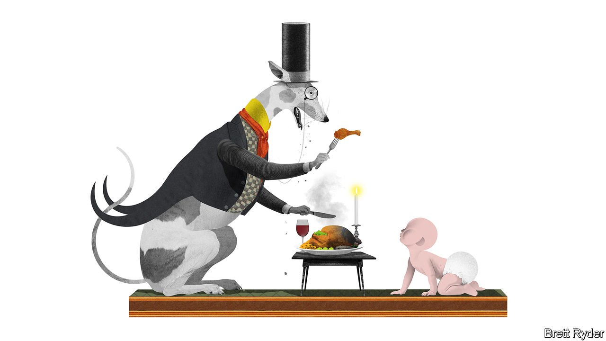

###### Schumpeter

# The weird ways companies are coping with inflation 

##### Consumers are barely yet aware of what is hitting them 

 

> Apr 30th 2022 

INFLATION IS MAKING up for lost time. A word that many thought had gone the way of peroxide hair and trench coats in the early 1980s is now back on almost every CEO’s lips as they run through a barrage of compounding shocks—war, commodity crisis, supply-chain disruption and labour shortages—in their companies’ first-quarter results. From December to March, almost three-quarters of firms in the S&amp;P 500 mentioned inflation in earnings calls, according to FactSet, a data gatherer. Such is the novelty, it runs the risk of making such turgid occasions almost riveting.

In rich countries, producer prices are surging at their fastest rate in 40 years. That sounds bad. On the ground some say it feels awful. Thierry Piéton, chief financial officer of Renault, said the French carmaker initially predicted raw-material costs would double this year. Now it thinks they will triple. Elon Musk says Tesla’s suppliers are requesting 20-30% increases in parts for electric cars compared to this time last year. Others talk of five-fold increases in the costs of sending containers between Europe and Asia, a dearth of truck drivers in America, and a scramble for everything from corn syrup to coffee beans and lithium.


Amid such a maelstrom, the perils of getting inflation wrong are obvious. You only need to look at Netflix, trying to raise prices in the midst of a brutally expensive streaming war, to get a sense of the risks involved. Yet in general, some of the world’s best-known companies are coping. After years of negligible increases, they have managed to push up prices without alienating their consumers. How long they can continue to do so is one of the biggest questions in business today.

In some cases, as Mark Schneider, boss of Nestlé, the world’s biggest food company, puts it, the public understands that “something has to give.” War, after all, is on the TV, and the pandemic is still fresh in people’s minds. Inflation is less alien by the day. In other cases, pricing is done more sneakily: offering premium products to those who are still able to splash out, or cutting costs for those for whom affordability is the overriding concern. Many of the biggest firms do both.

The immediate advantage goes to those with the strongest brands and market shares. That gives them more flexibility to raise prices. Coca-Cola, with almost half of the world’s $180bn fizzy-drinks market, used price and volume increases to deliver bumper earnings, which one analyst described as a “masterclass in pricing power.” Nestlé, which has barely increased prices for years, raised them by 5.2% year on year in the first quarter, its biggest increase since 2008. There may be more to come, it reckons. Mr Musk said Tesla’s price increases were high enough to cover the full amount of cost increases he expects this year. Yet still the vehicles continue to fly out the door.

Such firms benefit from another factor associated with brand power: premiumisation, or their ability to raise the cost of already pricey products. The trend appears to be holding fast. In Nestlé’s case there are, as yet, few signs that well-heeled consumers are trading down from, say, Nespresso pods to Starbucks capsules to (heaven forbid) spoonfuls of Nescafé.

Pet owners are the most bounteous. Nestlé’s Purina pet-care division, with telltale products like “Fancy Feast”, achieved the largest price increases across all categories during the quarter. Parents are far more parsimonious; they are much less willing to pay a high price for baby formula—though Kimberly-Clark, another consumer-goods company, has high hopes for premiumisation of nappies in China. As Michael Hsu, its CEO, put it, “the value per baby is less than half of what it is in developed markets like the United States”. Consumers in rich countries are also better able to cope with price rises than those in poorer ones. Firms like Coca-Cola offer better-packaged premium products in America and Europe, and more value-conscious ones in emerging markets.

So much for the haves. What about the have-nots? If firms can’t raise prices, why not shrink the products they sell instead. This tactic, baptised in Britain in 2013 as shrinkflation, dates back a lot further. Hershey’s, an American confectioner, proudly recalls how in the 1950s it responded to fluctuations in cocoa-bean prices by regularly changing the weight of the bar, rather than the five-cent price. No one admits to shrinkflation these days. But they are rebranding it in ways that are cool, thrifty—and in some cases even environmentally virtuous.

Renault, whose executives describe Dacia, a subsidiary making its cheapest cars, as an “everyday-low-price sort of brand”—somewhat like a soap powder—is hot on the trend. It is slashing the number of different parts across its models; that means more leverage with suppliers since fewer parts are bought but in larger volumes. Likewise, there’s plenty of talk among snack producers about reducing packaging sizes of cheap products, not just to cut costs but to save on waste. Coca-Cola is selling drinks by the cupful in India. In Latin America it is expanding its use of refillable bottles. In America’s south-west, it is piloting a scheme for use of returnable glass bottles. Rather like hotels asking guests to use fewer towels to spare the environment, it will surely be good for the bottom line, too.

Elastoplast

The good news is that consumers have, by and large, taken the inflationary shock in their stride so far. As chief executives have repeated in recent weeks, the sensitivity of shoppers to rising prices, or what they (and economists) call price elasticity, is not as bad as they had feared. But it is still only early days. Many consumers may not know yet how convulsive an inflationary environment can be. If prices continue to increase, and outpace growth in incomes, eventually the shock will sink in. Then the biggest question will not be how price-elastic people are, but whether spending snaps altogether. ■


Read more from Schumpeter, our columnist on global business: (Apr 23rd) (Apr 16th) (Apr 9th)

