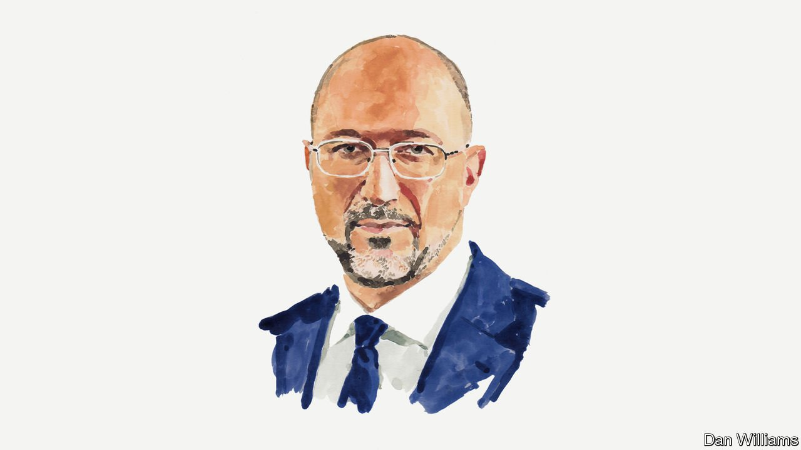

###### Russia and Ukraine

# Ukraine’s prime minister says reconstruction planning must start now 

##### Denys Shmyhal calls for a recovery fund for Ukraine 

 

> Apr 30th 2022 

BEFORE RUSSIA’S invasion, Ukraine’s economy had been expected to experience an upswing this year. In 2021 the country’s GDP amounted to $200bn, the highest in its history, in spite of Russia’s occupation of Crimea and parts of the east of the country. Citizens’ incomes had also been growing. In short, Ukraine was changing and rapidly becoming a prosperous and democratic European country.

On February 24th Vladimir Putin and his Russian army decided to wipe out those gains, along with so much else. Our country’s transformation and its leaning towards the West were wrecking the imperial ambitions of the Kremlin. During the first six weeks of the war, the total damage to Ukraine’s economy exceeded $500bn. According to government estimates, this figure could increase in the long run to $1trn, or five times last year’s GDP. In 2022 alone GDP may drop by 30-50%. Tens of thousands of Ukrainians have been killed, while millions have been forced to flee to western Ukraine or abroad. 


Very early in his military gamble, Mr Putin will have realised that the Ukrainian people were going to offer substantial resistance. That is why Russia has changed its tactics and is now doing everything to destroy Ukraine’s economy and throw our nation back to the 19th century. All our sea ports are blocked and it was through them that Ukraine exported more than 70% of all our cargo. Two of our largest metallurgical enterprises—Illich Iron &amp; Steel Works and Azovstal in Mariupol—have been destroyed. Nationwide more than 7,000 residential buildings have been damaged or obliterated. 

The invasion is also important because of the broader economic shock to the world economy. Last year Ukraine was the second-largest grain supplier to the European Union, accounting for 14% of the EU’s grain imports. It was also the world’s largest exporter of sunflower oil, with a share of some 47% of global supply. So Russia’s aggression threatens to spark a global food-supply crisis. It could also affect many other industries, such as the tech world. Ukraine’s two leading suppliers of neon, which produce half the world’s supply of a crucial ingredient for making chips, have had to stop operations because of the Russian assault. That is yet another reason why we emphasise that victory for Ukraine is in the best interest of the whole world. How the country rebuilds will be a crucial part of this. 

We estimate that full-scale recovery will cost around $600bn. For now there are 14 government groups that have been set up to count precisely all the destruction done by the Russian invasion. This will be not only the harm done to infrastructure, but also environmental damage and business losses. 

The Ukrainian government has already created a recovery fund for long-term reconstruction. In our opinion, this recovery fund can be a one-stop solution for reconstruction. It will reduce logistical and administrative costs and we encourage our international partners to channel everything though this fund. 

The restoration of the country’s infrastructure is the obvious place to start. We estimate that total damage in this area may already be more than $100bn. In addition, tens of thousands of Ukrainians have lost their homes, which will need rebuilding. This construction must take place according to modern European standards.

We don’t just want to rebuild roads, bridges or water mains. We plan to build a completely new economy. First of all this will mean reshaping old government institutions. With the help of the international community, Ukraine hopes to move quickly to join the EU. This means that our legislation will be built on European principles. Ukraine has already fulfilled 63% of the terms of the EU’s “association agreement”. We can definitely implement the other 37% in the next two years. 

We also understand that the threat from Russia will not be completely gone in the near future. Nor will the need to strengthen our military, energy and food security. These three sectors will definitely be prioritised by our government. 

According to World Bank data our military expenditure in 2020 was more than 4% of GDP. This number will grow significantly. Our government plans to increase state investment in the military-industrial complex and provide private defence companies special help in order to boost arms production both for the Ukrainian military and for export abroad. 

The energy sector has also experienced billions of dollars’ worth of damage. In 2021 Ukraine was among the countries that heeded the EU’s call for implementation of its Green Deal. In our recovery we will continue to follow this. We will prioritise help for nuclear, hydro, solar and wind-energy plants. Fair transformation of coal regions will continue. Energy independence for Ukraine is impossible without a significant increase in gas production. According to government planning, investment from state-owned and private companies can help to ensure such independence in three to five years. 

There are three possible sources of finance for the recovery fund. One is Russian assets, now frozen in the West, which are believed to total at least $300bn. A team of lawyers from the Ukrainian government is already working with foreign governments to make sure these assets can be released and put to use in rebuilding our country after the war.

Second, Ukraine hopes to receive grants and soft loans from Western countries and international organisations. The sectors in need of reconstruction can attract investment from some of the world’s largest companies. We hope that our push for accession to the EU will persuade private investors that Ukraine is an excellent place to be involved in reconstruction. We expect that in June 2022 the European Commission will recommend Ukraine for membership and that in two years Ukraine will be a member state. 

The third source will be our own government, our own businesses and the Ukrainian people themselves. We have shown that we are ready to die for our freedom and we know that we will eventually win this war. But victory on the battlefield is only half of the objective. The other half of the victory is to rebuild Ukraine and make it a modern and prosperous European country. We are committed and ready for this, and we ask that the world joins with us in this noble endeavour.

_______________

Denys Shmyhal is the prime minister of Ukraine.

Read more of our recent coverage of the 

