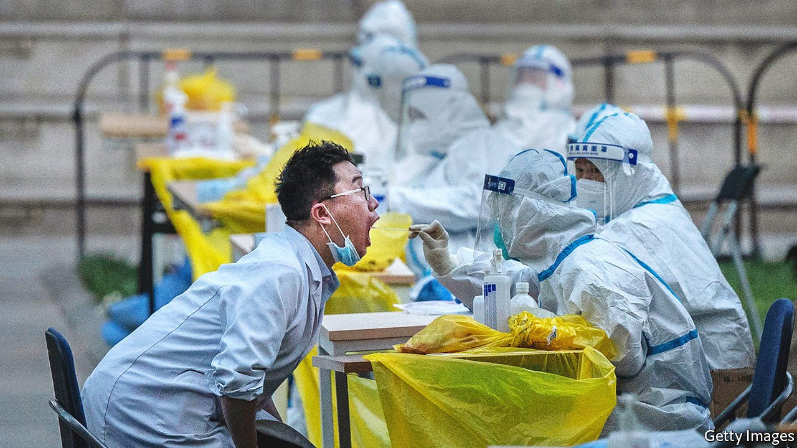

###### Covid hits the capital

# China claims Beijing is the true test of its pandemic policy 

##### Never mind all that chaos in Shanghai 

 

> Apr 30th 2022 

IF CHINA’S PUBLIC-HEALTH policies were decided by the people of Shanghai, the country would abandon its “zero-covid” strategy, which uses mass testing and strict lockdowns to crush the virus. The city’s 25m residents, among whom are some of China’s richest and most influential people, have  about the grim weeks of lockdown they have endured. But Beijing is where China’s covid strategy is devised. For now, the mood is rather different in the capital.

Beijing’s 22m residents responded with wary resignation to news that the Omicron variant had been spreading stealthily in the capital for days. On April 27th mass testing revealed more than 150 infections. The next day many schools went online. Some neighbourhoods were sealed off. But after an initial flurry of panic-buying, shops quickly restocked. Pensioners could be seen in parks, enjoying the smoggy spring sunshine. Local pride, and a sense of privilege born of proximity to power, help to explain why some Beijingers sound confident that they will escape the harsh, chaotic lockdowns imposed on Shanghai.


Many of Beijing’s residents have a measure of disdain for Shanghai, the country’s more Western-oriented commercial hub. The Shanghainese are “unreasonable troublemakers”; their officials deserve blame for not locking down fast enough, says a typical resident of the capital. Censorship and propaganda have helped shape such feelings. Shanghai’s suffering is glossed over in news reports. Angry outbursts by the city’s residents on social media are quickly erased by state censors.

Officials in Beijing seem to regard Shanghai as a rare exception to their zero-covid success story—China has had a lower death rate from the virus than any big country and stronger economic growth. It is certainly not taken as a lesson that the policy needs to change. Rather, officials in Shanghai are chided for being too loose and moving too slowly. The central government has pushed for more testing and stricter lockdowns. Many residents recently found green fences outside their compounds, to seal them in.

Officials elsewhere are taking note. Those in Baotou, a mining hub in Inner Mongolia, recently locked down the entire city after finding just two cases.

Other countries, including some of China’s neighbours, pursued a similar approach to the virus initially. But most of them have abandoned the zero-covid strategy, conceding that the highly transmissible Omicron variant rendered it impractical. They have instead focused resources on getting vulnerable people vaccinated and caring for the sick. Some of China’s leading doctors and scientists have urged their country to do the same.

The single biggest barrier to a Chinese exit strategy from the zero-covid policy is the large number of over-60s who have not received two doses and a booster. That is the minimum level of inoculation needed to provide a high degree of protection against serious illness or death when using Chinese-made vaccines, which are the only shots approved by party chiefs. But Beijing’s authorities continue to use gentle inducements, rather than force, to nudge old people to accept vaccinations.

Zero-covid measures are distracting from that effort. As the first round of mass testing began in Beijing, all was oddly quiet at a blue tent erected as a vaccine station for old people. Health workers had all been diverted to help with the testing. That disappointed Song Wenxian, a spry 85-year-old who had come to the tent in search of a second shot. Her family, though, has no plans to vaccinate her husband, who is 86 and suffers from mild dementia. “He can’t walk and he doesn’t go out. So we’re not getting him one,” Ms Song said. Beijing’s elite status provides reassurance. “I think the leaders pay closer attention to Beijing,” Ms Song suggested.

China’s supreme leader, Xi Jinping, seems to believe that the right mix of science, perseverance and party spirit will lead to a successful containment of the virus. On April 25th he visited Renmin University in Beijing, sitting in on political-ideology classes, speaking about “red heritage” and basking in shouts of loyalty to the party from unmasked students. Foreign diplomats in Beijing worry that he is allowing politics to get in the way of good policy. So do critics of the government.

Some point to Shanghai, where Zhang Wenhong, a prominent doctor advising the city on its covid response, used to say that measures should not be overly disruptive to business or normal life. Recently, though, he has been overshadowed by appointees like Ye Caide, a practitioner of traditional Chinese medicine who has gone from working at a community health centre in Beijing to overseeing Shanghai on a national pandemic-control team. Mr Ye, who has won several awards from the party for heroic volunteering, told state media that Shanghai’s covid controls should be tightened, for example by installing electronic sensors and seals on people’s doors. If this is how China is going to choose its “experts”, one netizen quipped, “we won’t get out of lockdown even in the next life.”

The number of infections in Shanghai is dropping at last. But the costs of the state’s anti-covid measures are becoming clearer. Foreigners are leaving en masse. Many analysts have revised down their forecasts for economic growth this year. Investors have ditched Chinese securities at a record rate, putting pressure on the yuan (see Finance section).

The mood is relatively upbeat in the capital, though. A worker at a massage shop in Beijing shrugged off questions about whether he was stocking up on provisions. “We Chinese people don’t worry about a crisis until it hits,” he said, nursing a cigarette. “You have to believe in the party and the state, right?” Many of Shanghai’s residents once felt similarly. ■

Dig deeper

All our stories relating to the pandemic can be found on our . You can also find trackers showing ,  and the virus’s spread across .

